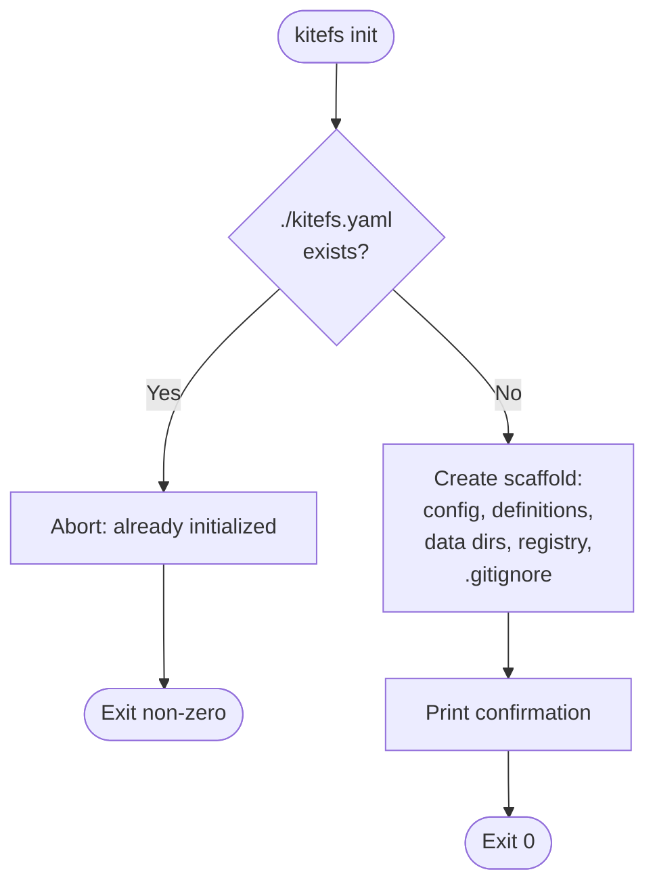
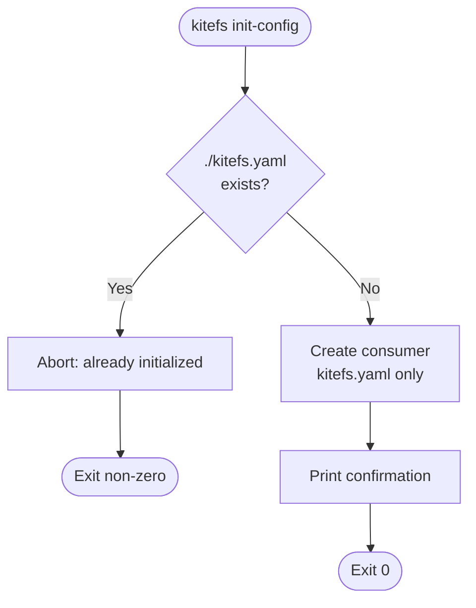
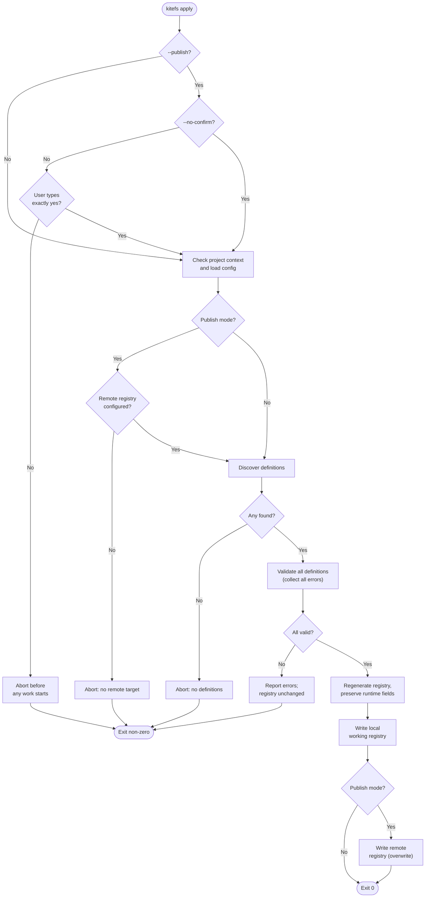
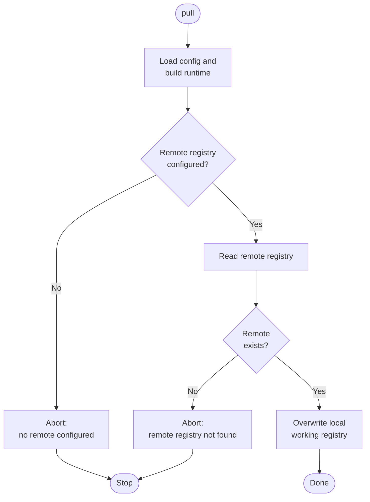
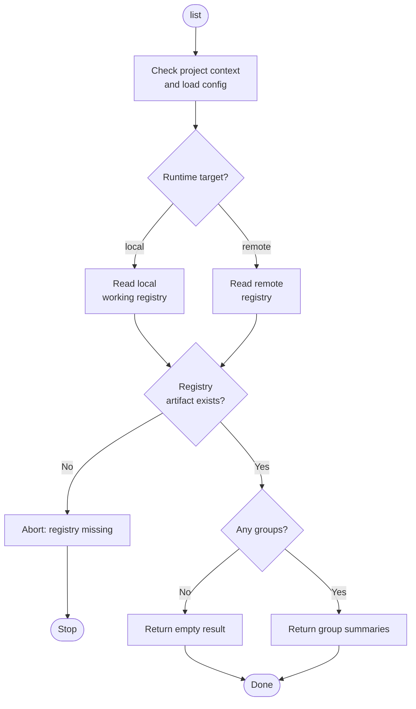
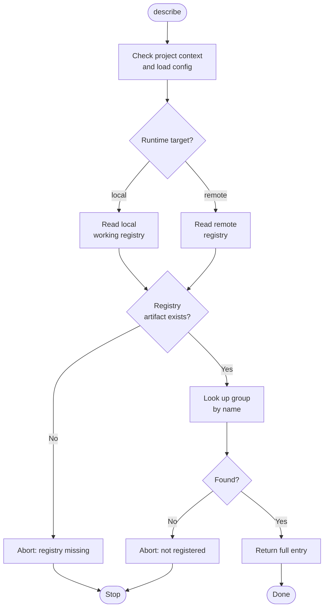
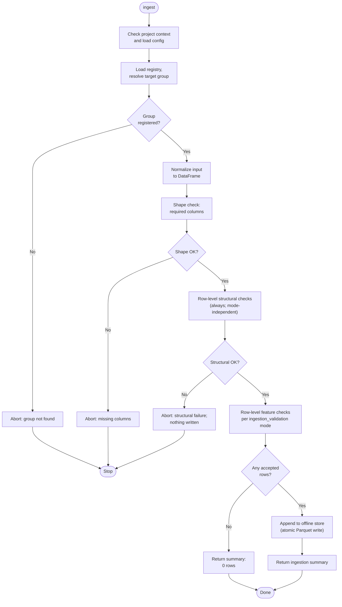
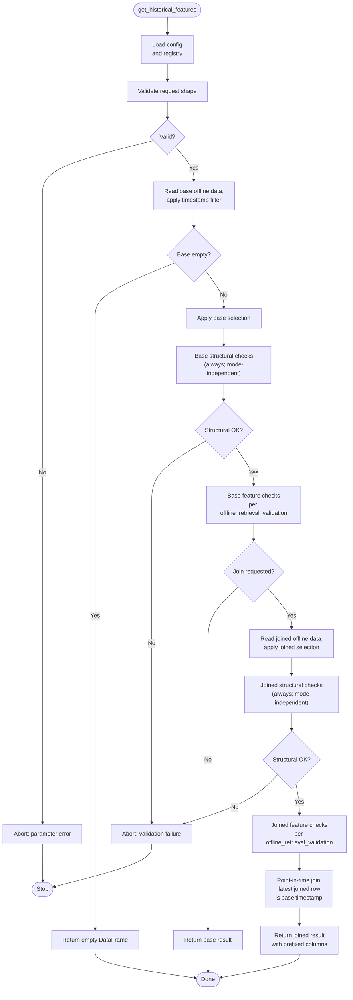
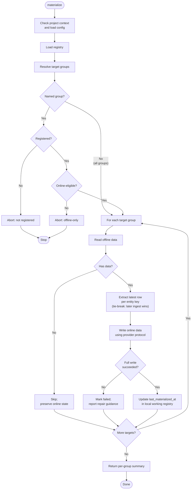
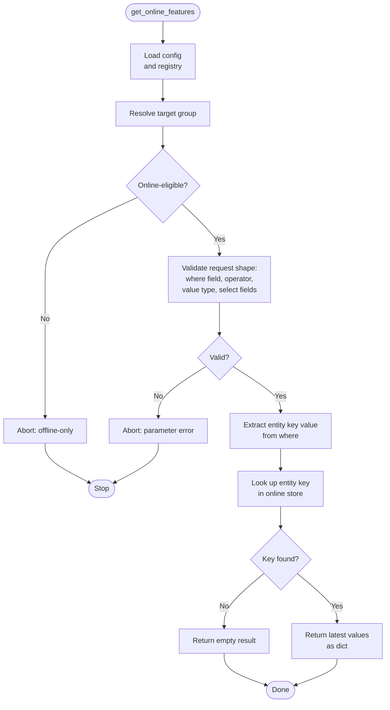

# System Behavior

## Purpose

This file explains how each user-facing KiteFS operation works end-to-end, at the phase level. It owns operation flows and the common runtime rules they share.

## Owns

- End-to-end behavior of each operation: `init`, `init-config`, `apply` including `apply --publish`, `pull`, `list`, `describe`, `ingest`, `get_historical_features`, `materialize`, `get_online_features`.
- Common runtime rules: project root discovery, configuration loading, provider selection, datetime handling, CLI error boundary.
- Mermaid flow diagrams for each operation showing phases and major decision points.

## Does Not Own

- Detailed acceptance criteria → [02-product-requirements.md](02-product-requirements.md).
- Internal class or module structure → [04-architecture.md](04-architecture.md).
- Storage schemas, file layouts, registry format → [05-data-and-storage-contracts.md](05-data-and-storage-contracts.md).
- SDK signatures, CLI syntax, option names, exception classes → [06-api-and-cli-contracts.md](06-api-and-cli-contracts.md).

## Content

This file describes operation phases, state changes, and returned results. It does not repeat detailed acceptance criteria. When a flow says "validate request" or "report errors", the exact rules live in the owner files linked above.

---

## Common Rules

These rules apply unless an operation says otherwise.

### Project Root Discovery

KiteFS treats the current working directory as the project root. It does not search parent directories.

- `init` and `init-config` create `./kitefs.yaml` and fail if it already exists.
- Every other operation requires `./kitefs.yaml` before SDK work starts. For `apply --publish` without `--no-confirm`, the confirmation prompt runs first, **before** the `./kitefs.yaml` check; if the user declines, no project-root check is performed.

### Configuration Loading Sequence

SDK-backed operations load configuration before registry, offline store, or online store access:

1. Treat the current working directory as the project root.
2. Read and parse `./kitefs.yaml`.
3. Validate fixed literal fields (such as remote store backend types) before interpolation.
4. Apply environment variable interpolation and overrides to configurable fields.
5. Validate the fully resolved configuration.
6. Build the provider and core runtime components from the validated configuration.

Missing and invalid configuration are distinct failures. Missing configuration points to project initialization. Invalid configuration identifies the offending setting ([FR-CFG-001](02-product-requirements.md#fr-cfg-001--project-configuration)).

### Provider Selection

The active runtime target comes from configuration. Supported values are `local` and `remote` ([FR-CFG-001](02-product-requirements.md#fr-cfg-001--project-configuration)). The provider is built once at startup and passed to registry, offline store, and online store components. Core logic uses the provider boundary, not direct filesystem, S3, SQLite, or DynamoDB calls ([FR-PROV-001](02-product-requirements.md#fr-prov-001--provider-boundary)).

| Runtime target | Offline store    | Online store | Registry location                                                                                            |
| -------------- | ---------------- | ------------ | ------------------------------------------------------------------------------------------------------------ |
| `local`        | Local filesystem | SQLite       | `./feature_store/registry.json`                                                                              |
| `remote`       | S3               | DynamoDB     | Configured remote location (see [CON-007](02-product-requirements.md#con-007--local-and-aws-providers-only)) |

Remote store `type` fields are validation guards, not runtime backend selectors. Configuration loading validates these fields as fixed literal values before provider construction. When an operation needs a specific remote store and the corresponding `type` field is missing or unsupported, configuration validation fails before any store-level work begins. The exact supported values are defined in [06-api-and-cli-contracts.md](06-api-and-cli-contracts.md#fixed-remote-store-types).

### Per-Operation Configuration Validation

Each operation checks only the stores and settings it needs ([FR-CFG-004](02-product-requirements.md#fr-cfg-004--per-operation-configuration-validation)). For example, a registry-only operation does not fail because the offline store is misconfigured.

### UTC Datetime Handling

All datetime checks use the UTC rule in [CON-006](02-product-requirements.md#con-006--utc-only-datetimes). KiteFS does not convert between time zones. This applies to event timestamp values written to and read from any store, datetime feature values, datetime expectation values declared through `Expect, event timestamp filter values in `get_historical_features`, and datetime values returned by online retrieval.

### Common Failure Handling

The table below is not repeated in each operation section.

| Failure class                            | Default handling                                                                                       |
| ---------------------------------------- | ------------------------------------------------------------------------------------------------------ |
| Missing `./kitefs.yaml`                  | Stop before SDK work and suggest initialization.                                                       |
| Invalid configuration                    | Stop and identify the setting.                                                                         |
| Required store or setting is unavailable | Stop before operation-specific work and identify the missing capability.                               |
| Provider read or write fails             | Fail the operation. Operation-specific rollback or partial-success rules are stated where they differ. |
| Missing or invalid remote credentials    | Fail without leaking secret values; identify the affected store when known.                            |

### CLI Error Boundary

The CLI is the outermost user-facing error boundary:

- Successful commands exit with code `0`.
- Failed commands exit with a non-zero code.
- Expected user errors render as plain text on stderr with operation context.
- Python tracebacks are not shown for normal user errors.

---

## `kitefs init`

Creates a producer project scaffold. This is CLI-only and does not load the SDK runtime.

**Behavior:**

1. Check for `./kitefs.yaml` in the current directory.
2. If absent, create the scaffold:
   - `kitefs.yaml` with `runtime.target: local` as default.
   - `./feature_store/definitions/` with one example feature group definition.
   - Managed offline and online data directories at fixed conventional paths defined in [05-data-and-storage-contracts.md](05-data-and-storage-contracts.md). These paths are not configurable and are not written to `kitefs.yaml` (see [FR-CFG-001](02-product-requirements.md#fr-cfg-001--project-configuration), [FR-CLI-003](02-product-requirements.md#fr-cli-003--project-initialization)).
   - An empty registry file at `./feature_store/registry.json`.
   - `.gitignore` entries for managed data directories and the local registry file.
3. Print a confirmation summary.

**Operation-specific outcomes:**

| Condition                      | Outcome                                        |
| ------------------------------ | ---------------------------------------------- |
| `./kitefs.yaml` already exists | Exit non-zero. No files are overwritten.       |
| Scaffold creation fails        | Exit non-zero. No partial scaffold is exposed. |

---

## `kitefs init-config`

Creates a consumer-only configuration for projects that read a remote registry and online store. This is CLI-only and does not load the SDK runtime.

**Behavior:**

1. Check for `./kitefs.yaml` in the current directory.
2. If absent, create `kitefs.yaml` only, with:
   - `runtime.target: remote` as default.
   - A consumer `remote` section template with placeholders for `registry.bucket`, `online_store.dynamodb_table_prefix`, and other required fields; no offline store. The user must edit these placeholders before the first `list`, `describe`, or `get_online_features` call.
3. Do not create definitions, data directories, examples, or `.gitignore` entries.
4. Print a confirmation summary.

**Operation-specific outcomes:**

| Condition                      | Outcome                                      |
| ------------------------------ | -------------------------------------------- |
| `./kitefs.yaml` already exists | Exit non-zero. No files are overwritten.     |
| Config creation fails          | Exit non-zero. No partial config is exposed. |

---

## `kitefs apply`

Regenerates the registry from current feature definitions. Plain `apply` writes the local working registry. `apply --publish` also overwrites the configured remote registry ([FR-REG-003](02-product-requirements.md#fr-reg-003--registry-generation)).

**Behavior:**

1. If `--publish` is passed and `--no-confirm` is not passed, ask for explicit confirmation. Continue only if the user types exactly `yes`.
2. Load project configuration.
3. If `--publish` is passed, resolve the configured remote registry location; abort if not configured.
4. Discover feature group objects in `./feature_store/definitions/` ([FR-REG-002](02-product-requirements.md#fr-reg-002--definition-discovery)).
   - Discovery imports each `.py` file under `definitions/` and inspects module-level attributes with `isinstance(attr, FeatureGroup)`. Any module-level object whose type is a feature group is collected, regardless of variable name. No decorators, naming conventions, or registration calls are required.
   - Files outside `./feature_store/definitions/` are not scanned.
5. Validate the full discovered set; collect all errors before deciding.
6. Abort without registry changes if no definitions are found or validation fails.
7. Regenerate the registry, preserving runtime-managed fields (e.g. `last_materialized_at`) for groups that still exist, and update `applied_at` to the current UTC time for each registered group ([FR-REG-001](02-product-requirements.md#fr-reg-001--registry-as-derived-artifact)).
8. Write the local working registry.
9. If `--publish` is passed, write the same content to the remote registry location as a full overwrite.
10. Report the result.

**Operation-specific outcomes:**

| Condition                                         | Outcome                                                                              |
| ------------------------------------------------- | ------------------------------------------------------------------------------------ |
| Publish confirmation is not exact `yes`           | Exit non-zero before configuration loading, discovery, validation, or writes.        |
| Remote registry is not configured in publish mode | No registry is changed.                                                              |
| No definitions are discovered                     | Registry unchanged; report that at least one group is needed.                        |
| Any definition is invalid                         | Report all discovered definition errors together; registry unchanged.                |
| Local registry write fails                        | Previous local registry remains; remote registry is not changed.                     |
| Remote registry write fails in publish mode       | Operation fails; local working registry may already contain the regenerated content. |

---

## `pull` _(Should Have — post-MVP)_

Reads the configured remote registry and overwrites the local working registry ([FR-REG-005](02-product-requirements.md#fr-reg-005--remote-registry-pull)). Pull is post-MVP for both SDK and CLI; when shipped, it is destructive to local state.

**Behavior:**

1. Load configuration and build the runtime.
2. Confirm the remote registry is configured; abort if not.
3. Read the registry from the configured remote location; abort if it does not exist.
4. Overwrite the local working registry.
5. Report success.

**Operation-specific outcomes:**

| Condition                            | Outcome                                                            |
| ------------------------------------ | ------------------------------------------------------------------ |
| Remote registry is not configured    | Operation fails.                                                   |
| Remote registry does not exist       | Operation fails; message suggests running `apply --publish` first. |
| Local registry cannot be overwritten | Operation fails. Previous local content is preserved.              |

---

## `list`

Returns registered feature group summaries from the registry selected by the current runtime target ([FR-REG-004](02-product-requirements.md#fr-reg-004--registry-discovery-list-and-describe)):

- `runtime.target: local` → reads the local working registry.
- `runtime.target: remote` → reads the configured remote registry directly. No prior pull required.

**Behavior:**

1. Load project configuration.
2. Read the registry for the active runtime target; fail if the registry artifact is missing or unreachable.
3. Return an empty result if no groups are registered.
4. Otherwise return summary metadata for each group.

**Operation-specific outcomes:**

| Condition                                | Outcome                                                                                                                                                                                                                   |
| ---------------------------------------- | ------------------------------------------------------------------------------------------------------------------------------------------------------------------------------------------------------------------------- |
| Registry artifact missing or unreachable | Operation fails with an actionable error identifying the expected location. On `local` target the message suggests running `init` and `apply`; on `remote` target it suggests a producer running `apply --publish` first. |

An existing but empty registry returns an empty result, not an error.

---

## `describe`

Returns one full registry entry from the registry selected by the current runtime target.

**Behavior:**

1. Load project configuration.
2. Read the registry for the active runtime target; fail if the registry artifact is missing or unreachable.
3. Look up the requested group by exact name.
4. Fail if the group is not found.
5. Otherwise return the full registry entry.

**Operation-specific outcomes:**

| Condition                                | Outcome                                                                                                                                                                                                                   |
| ---------------------------------------- | ------------------------------------------------------------------------------------------------------------------------------------------------------------------------------------------------------------------------- |
| Registry artifact missing or unreachable | Operation fails with an actionable error identifying the expected location. On `local` target the message suggests running `init` and `apply`; on `remote` target it suggests a producer running `apply --publish` first. |
| Group is not registered                  | Operation fails and suggests valid names when available.                                                                                                                                                                  |

---

## `ingest`

Appends prepared feature data to the offline store for one registered feature group ([FR-ING-001](02-product-requirements.md#fr-ing-001--offline-ingestion)).

**Behavior:**

1. Load project configuration.
2. Load the registry and resolve the target feature group; abort if not found.
3. Normalize the input into a DataFrame.
4. Shape check (column-level): required structural columns and declared feature columns are present in the input. Columns that are not part of the target group's declaration are ignored — they are not validated and are not written ([FR-ING-001](02-product-requirements.md#fr-ing-001--offline-ingestion)). Row values are not inspected at this stage.
5. Row-level structural checks: presence of entity key, event timestamp, and join key values; type compatibility with the declaration; UTC for datetime values ([FR-VAL-001](02-product-requirements.md#fr-val-001--data-validation)). These checks run in **every** `ingestion_validation` mode; failure rejects the entire operation and writes nothing.
6. Row-level feature checks: declared types and feature expectations on feature fields run according to the group's `ingestion_validation` mode (`ERROR`, `FILTER`, or `NONE`).
7. If no rows are accepted, return a zero-row summary.
8. Write accepted rows as append-only Parquet ([FR-ING-002](02-product-requirements.md#fr-ing-002--append-only-writes), [NFR-REL-001](02-product-requirements.md#nfr-rel-001--atomic-offline-file-writes)).
9. Return an ingestion summary with accepted row count and validation report when produced.

**Operation-specific outcomes:**

| Condition                                          | Outcome                                                         |
| -------------------------------------------------- | --------------------------------------------------------------- |
| Target group is not registered                     | No data is written.                                             |
| Input cannot be normalized                         | No data is written.                                             |
| Required structural or feature columns are missing | No data is written.                                             |
| Validation rejects the batch                       | No data is written; return the validation report when produced. |
| Validation filters all rows                        | Return a zero-row summary.                                      |
| Offline write fails                                | No partial Parquet file is exposed.                             |

---

## `get_historical_features`

Reads historical offline data. The base feature group drives output rows. An optional join produces a point-in-time correct result ([FR-OFF-002](02-product-requirements.md#fr-off-002--historical-feature-retrieval), [FR-OFF-003](02-product-requirements.md#fr-off-003--point-in-time-correct-joins)).

**Behavior:**

1. Load configuration and the registry.
2. Validate request shape before reading data: `select` is required and its shape must match the presence or absence of join. Without join, select must be a flat list of feature field names or `["*"]`. With join, select must be a dict keyed by feature group name, where each value is a list of feature field names or `["*"]`. Validate groups, selected fields, timestamp filters, and join shape.
3. Read base offline data; apply the event-timestamp filter.
4. If the base result is empty, return an empty DataFrame with the expected schema.
5. Apply base field selection. Run row-level structural checks on the base result (always; mode-independent under [FR-VAL-001](02-product-requirements.md#fr-val-001--data-validation)); structural failure aborts the operation. Then run row-level feature checks per the base group's `offline_retrieval_validation` mode.
6. If no join is requested, return the base result.
7. Otherwise read the joined group's offline data and apply joined field selection. Run row-level structural checks on the joined result (always; mode-independent); structural failure aborts the operation. Then run row-level feature checks per the joined group's own `offline_retrieval_validation` mode.
8. Perform the point-in-time join: for each base row, select the most recent joined row whose event timestamp is ≤ the base row's. Joined columns are prefixed with the joined group name; base columns are unprefixed.
9. Return the joined result.

**Operation-specific outcomes:**

| Condition                            | Outcome                                                              |
| ------------------------------------ | -------------------------------------------------------------------- |
| Request shape is invalid             | No offline data is read.                                             |
| Base validation rejects the result   | Operation fails with validation report.                              |
| Joined validation rejects the result | Operation fails with validation report.                              |
| Either side filters rows             | Rows are excluded independently before the final result is returned. |

---

## `materialize`

Builds the online store from offline data for one named online-eligible group or for all online-eligible groups. Materialization does not run feature-level validation ([FR-MAT-001](02-product-requirements.md#fr-mat-001--materialize-online-eligible-groups), [NFR-REL-002](02-product-requirements.md#nfr-rel-002--online-materialization-failure-handling)).

**Behavior:**

1. Load project configuration.
2. Load the registry.
3. Resolve target groups:
   - Named group: abort with `FeatureGroupNotFoundError` if not registered, or `FeatureGroupNotMaterializableError` if registered but offline-only. These are request-validation aborts before the processing loop.
   - All groups: take all registered online-eligible groups. Offline-only groups are **excluded from the target set** and **do not appear in the summary**.
4. For each target:
   - Read all offline data for the group.
   - If no offline data exists, **report the group as skipped in the summary**; the existing online state is preserved.
   - Otherwise, extract the latest row per entity key by event timestamp. When two offline rows share the same entity key and the same event timestamp, the **later-ingested row wins**; "later-ingested" is determined by the offline partition's ingest sequence (file write order) ([FR-MAT-001](02-product-requirements.md#fr-mat-001--materialize-online-eligible-groups)).
   - Write all latest rows to the online store using the selected provider's write protocol.
   - If the provider reports full write success, update `last_materialized_at` in the **local working registry**. This applies in both runtime targets; users must `apply --publish` to propagate the new value to the remote registry, consistent with [FR-REG-003](02-product-requirements.md#fr-reg-003--registry-generation).
   - If the provider reports failure, mark the group failed and leave `last_materialized_at` unchanged.
5. In all-groups runs, a per-group failure does not roll back already-successful groups and does not stop the run.
6. Return a per-group summary (succeeded, skipped, failed). The same summary shape is returned for both named-group and all-groups runs.

**Operation-specific outcomes:**

Request-validation failures (missing group, offline-only named group) abort before the processing loop. All other outcomes appear in the returned summary.

| Condition                                    | Outcome                                                                                                                                                         |
| -------------------------------------------- | --------------------------------------------------------------------------------------------------------------------------------------------------------------- |
| Named group is missing or offline-only       | Abort with an exception. No target is materialized.                                                                                                             |
| All-groups run has no online-eligible groups | Return an empty summary.                                                                                                                                        |
| Target has no offline data                   | Skip the group and preserve existing online state.                                                                                                              |
| SQLite write fails                           | Mark that group failed; the prior committed online state remains visible, and `last_materialized_at` is unchanged.                                              |
| DynamoDB write fails                         | Mark that group failed; items written in earlier batches may be visible, `last_materialized_at` is unchanged, and re-running materialization repairs the group. |
| One target fails in an all-groups run        | Mark that group failed and continue with other groups.                                                                                                          |

---

## `get_online_features`

Retrieves stored online feature values for one entity key ([FR-ONL-002](02-product-requirements.md#fr-onl-002--single-entity-online--retrieval)). Online retrieval does not run feature validation.

**Behavior:**

1. Load configuration and the registry.
2. Confirm the target group exists and is configured for online serving; abort otherwise.
3. Validate the request shape: `select` is required and must be a list of feature field names or `["*"]`; `where` must contain exactly one entry whose field name matches the group's registered entity key, the operator must be `eq`, the value must be a single literal type-compatible with the entity key dtype, and selected fields must be registered features of the group.
4. Extract the entity key value from the validated `where` and look it up in the online store.
5. Return the matched record as a dictionary on hit, or an empty result on miss (an empty result is not an error).

**Operation-specific outcomes:**

| Condition                                                                                | Outcome                 |
| ---------------------------------------------------------------------------------------- | ----------------------- |
| Group is missing or offline-only                                                         | Operation fails.        |
| `where` field is not the entity key, operator is not `eq`, or value type is incompatible | Operation fails.        |
| Selected field is not registered or invalid                                              | Operation fails.        |
| No online row or item exists for the entity key                                          | Return an empty result. |

Batch online retrieval ([FR-ONL-003](02-product-requirements.md#fr-onl-003--batch-online-retrieval), Could Have) is out of MVP scope and is not covered by this flow.
