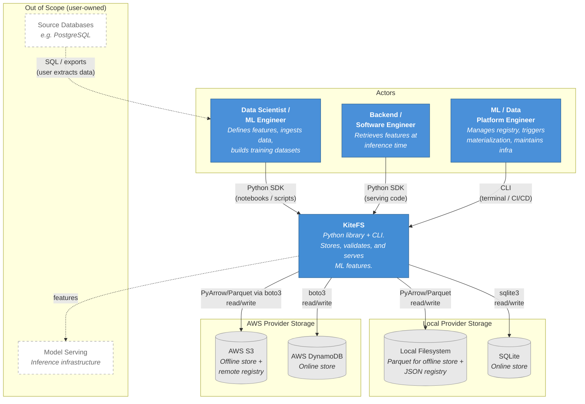
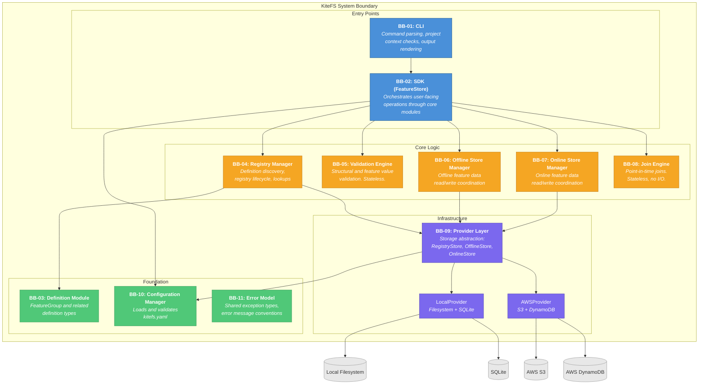

# Architecture

## Purpose

This file defines the static shape of the KiteFS system. It owns structural design decisions, building blocks, dependency direction, the provider abstraction boundary, cross-cutting concerns, and the packaging model.

## Owns

- Architectural design principles (AP-X).
- System context (Level 1) and building blocks (Level 2) views.
- Building block (BB-XX) definitions, responsibilities, and collaborations.
- Dependency direction and layering rules.
- Provider abstraction boundary, including its sub-interface decomposition.
- Cross-cutting concerns: error model and datetime handling.
- Packaging model and source layout.
- Architectural decision recording convention.

## Does Not Own

- Operation step-by-step behavior. See [03-system-behavior.md](03-system-behavior.md).
- Storage formats, schemas, layouts, partition rules, and type mapping. See [05-data-and-storage-contracts.md](05-data-and-storage-contracts.md).
- Public SDK signatures, CLI command syntax, exception class names, and provider method contracts. See [06-api-and-cli-contracts.md](06-api-and-cli-contracts.md).
- Implementation sequencing and milestone planning. See [07-implementation-plan.md](07-implementation-plan.md).

## Content

KiteFS is a Python feature store library. It stores, validates, retrieves, materializes, discovers, and serves feature values through a Python SDK and CLI.

KiteFS does not compute features, run pipelines, host models, or run as a service. Users prepare feature values with their own tools, then pass those values to KiteFS.

---

## Architectural Design Principles

Every architectural decision in KiteFS should trace back to one or more of these principles. They are the load-bearing constraints — changes here ripple through the rest of the system.

| ID | Principle | Statement | Architectural Consequence |
| --- | --- | --- | --- |
| AP-1 | Library-First Distribution | KiteFS is a pip-installable Python library, not a deployed service. | No server, daemon, container runtime, or network service layer. All interaction happens through an in-process SDK and a local CLI ([CON-002](02-product-requirements.md#con-002--pip-installable-library), [CON-005](02-product-requirements.md#con-005--no-server-or-daemon)). |
| AP-2 | Literal Architecture (Store, Don't Compute) | KiteFS stores and serves feature values. It does not compute them. | Feature computation, orchestration, SQL execution, DAG scheduling, and transformation logic stay outside the system boundary. Users compute features with their own tools and write the results to KiteFS ([NG-1](00-project-context.md#non-goals)). |
| AP-3 | Provider-Abstracted Storage | Core logic is decoupled from concrete storage backends through a single provider boundary. | Core modules depend on storage interfaces, never on filesystem, S3, SQLite, DynamoDB, or vendor SDKs directly. Adding a backend requires implementing the boundary, not editing core ([FR-PROV-001](02-product-requirements.md#fr-prov-001--provider-boundary)). |
| AP-4 | Definitions as Code, Registry as Derived Artifact | Feature groups are authored as Python objects; the registry is compiled from them. | Source definitions are the reviewed source of truth. The registry is a deterministic artifact produced from definitions plus runtime-managed metadata, gitignored locally, and never edited by hand. Remote promotion happens through publish ([FR-REG-001](02-product-requirements.md#fr-reg-001--registry-as-derived-artifact)). |
| AP-5 | Validate at Every Gate | Validation is built into the architecture at configured quality gates. | The validation engine is a first-class building block, not an external add-on. Operation-specific gate behavior is owned by [03-system-behavior.md](03-system-behavior.md) and [FR-VAL-001](02-product-requirements.md#fr-val-001--data-validation). |
| AP-6 | Point-in-Time Correctness by Default | Historical joins must not leak future feature values. | The join engine is a dedicated building block, and historical retrieval uses the event timestamp as the temporal anchor ([FR-OFF-003](02-product-requirements.md#fr-off-003--point-in-time-correct-joins)). |
| AP-7 | Explicit Failure with Actionable Errors | Every user-facing failure identifies what went wrong and what to do next. | A single error taxonomy is shared across SDK and CLI. The CLI is the outermost error boundary; raw tracebacks are not shown for normal user errors ([03-system-behavior.md § CLI Error Boundary](03-system-behavior.md#cli-error-boundary)). |
| AP-8 | Single-Developer Sustainability | The system must stay buildable, testable, and maintainable by one engineer. | Favor explicit user-triggered operations, simple local state, minimal dependencies, stateless core utilities where possible, and small module boundaries with single responsibilities. |

---

## System Context

The Level 1 view shows KiteFS as one system in its environment.



KiteFS sits between user-owned feature computation and user-owned model serving. Data scientists and ML engineers usually reach for the Python SDK from notebooks and scripts. Backend engineers call the same SDK from serving code. ML and data platform engineers usually drive the CLI from a terminal or CI/CD.

Source databases stay outside the KiteFS boundary: users extract, compute, and prepare feature values before passing them in. Model serving systems also stay outside the boundary; KiteFS supplies stored feature values but does not host models or run inference.

## Actors

| Actor | Primary Interface | Relationship to KiteFS |
| --- | --- | --- |
| Data Scientist / ML Engineer | Python SDK | Defines feature groups, ingests precomputed feature data, and retrieves training datasets. |
| Backend / Software Engineer | Python SDK | Retrieves materialized feature values from inference-time application code. |
| ML / Data Platform Engineer | CLI and configuration | Initializes projects, configures providers, manages registry workflows, and coordinates operational use. |

Project-level persona definitions live in [00-project-context.md](00-project-context.md#personas).

## External Systems

| System | Role | Boundary |
| --- | --- | --- |
| Local filesystem | Local offline store and local registry storage. | Accessed through the local provider. Physical layout in [05-data-and-storage-contracts.md](05-data-and-storage-contracts.md). |
| SQLite | Local online store. | Accessed through the local provider. Table schema in [05-data-and-storage-contracts.md](05-data-and-storage-contracts.md). |
| AWS S3 | Remote offline store and remote registry storage. | Accessed through the AWS provider. Bucket design in [05-data-and-storage-contracts.md](05-data-and-storage-contracts.md). |
| AWS DynamoDB | Remote online store. | Accessed through the AWS provider. Per-group table design in [05-data-and-storage-contracts.md](05-data-and-storage-contracts.md). |
| Source databases | User-owned inputs for feature computation. | Not accessed by KiteFS directly. |
| Model serving infrastructure | User-owned consumers of online features. | Not hosted or managed by KiteFS. |

## System Boundary

KiteFS owns feature management. Structurally, that means the system includes:

- Feature definition types and metadata structures.
- A registry artifact derived from source definitions.
- Offline and online store managers.
- A validation engine for configured quality gates.
- A join engine for point-in-time historical joins.
- A provider layer composed of registry, offline, and online store interfaces, with local and AWS implementations.
- A Python SDK and CLI built on the same core modules.
- A configuration manager for project and provider settings.
- A shared error taxonomy.

KiteFS does not own:

- Feature computation, transformations, SQL queries, DAGs, or schedules.
- Streaming ingestion infrastructure.
- Model training, model hosting, or inference services.
- A web UI for feature discovery.
- A KiteFS-specific authentication or authorization layer.
- Feature drift detection or statistical monitoring.
- Non-AWS cloud providers in the MVP.

Detailed goals and non-goals live in [00-project-context.md](00-project-context.md). Testable requirements live in [02-product-requirements.md](02-product-requirements.md).

---

## Building Blocks

The Level 2 view shows the major modules inside the KiteFS system boundary.



Arrows point from a module to the module it depends on. Storage-specific details stay behind BB-09. BB-05 and BB-08 are stateless core utilities: they receive inputs from callers and perform no I/O. BB-11 is referenced by every other block, but those arrows are omitted to avoid visual noise — exception types and error message conventions are foundational vocabulary, not runtime dependencies to reason about.

## Building Block Responsibilities

| ID | Building Block | Responsibility |
| --- | --- | --- |
| BB-01 | CLI | Parses command-line input, checks project context, delegates SDK-backed work to BB-02, renders user-facing output, and acts as the outermost error boundary. |
| BB-02 | SDK (`FeatureStore`) | User-facing Python orchestrator. Wires configuration, provider, registry, validation, store managers, and joins into the public workflow surface. Contains no provider-specific code. |
| BB-03 | Definition Module | Provides `FeatureGroup`, `EntityKey`, `EventTimestamp`, `Feature`, `Expect`, `JoinKey`, `Metadata`, and related enums for source definitions and schema metadata. |
| BB-04 | Registry Manager | Discovers feature definitions, validates their structure as a set, maintains the registry artifact, and answers registry lookups for the active runtime target. |
| BB-05 | Validation Engine | Performs stateless structural checks and feature-value checks against registered feature definitions. Returns validation reports; never reads or writes storage. |
| BB-06 | Offline Store Manager | Coordinates offline feature data reads, writes, and event-timestamp filtering. Delegates physical I/O to BB-09's `OfflineStore` interface. |
| BB-07 | Online Store Manager | Coordinates latest-per-entity online materialization writes and key-based reads. Delegates physical I/O and provider-specific failure handling to BB-09's `OnlineStore` interface. |
| BB-08 | Join Engine | Performs point-in-time correct joins between in-memory datasets. Stateless and storage-agnostic. |
| BB-09 | Provider Layer | Defines three storage interfaces (`RegistryStore`, `OfflineStore`, `OnlineStore`) plus a `Provider` factory that supplies a coherent set. Ships `LocalProvider` and `AWSProvider`. |
| BB-10 | Configuration Manager | Loads, validates, and exposes project and provider configuration from `kitefs.yaml`, including environment variable interpolation and runtime-target override. |
| BB-11 | Error Model | Defines the shared exception hierarchy and error message conventions. Imported by every other block. |

## Building Block — Operation Matrix

This matrix shows which blocks participate in each operation defined in [03-system-behavior.md](03-system-behavior.md). It serves as a sanity check on the decomposition: if an operation touches blocks that should not be coupled, the design is wrong.

| Operation | BB-01 | BB-02 | BB-03 | BB-04 | BB-05 | BB-06 | BB-07 | BB-08 | BB-09 | BB-10 |
| --- | :-: | :-: | :-: | :-: | :-: | :-: | :-: | :-: | :-: | :-: |
| `init` | O | | | | | | | | | |
| `init-config` | O | | | | | | | | | |
| `apply` (and `--publish`) | I | O | O | O | | | | | O | O |
| `pull` *(post-MVP)* | | O | | O | | | | | O | O |
| `list` / `describe` | I | O | | O | | | | | O | O |
| `ingest` | I | O | | O | O | O | | | O | O |
| `get_historical_features` | | O | | O | O | O | | O | O | O |
| `materialize` | I | O | | O | | O | O | | O | O |
| `get_online_features` | | O | | O | | | O | | O | O |

Legend: O = used in the operation. I = used only when the operation is invoked through the CLI. Blank = not used. BB-11 (error model) applies to every operation and is omitted from the table for readability.

Two observations follow from the matrix and should remain true as the system evolves:

- **BB-05 and BB-08 never appear together in serving paths.** Validation and joins are training-time concerns. Online retrieval stays narrow on purpose, which is what keeps it cheap.
- **BB-06 and BB-07 always sit between BB-02 and BB-09 for their respective stores.** The SDK does not bypass the managers to talk to the provider. This rule is what makes append-only writes ([FR-ING-002](02-product-requirements.md#fr-ing-002--append-only-writes)) and online materialization failure handling ([NFR-REL-002](02-product-requirements.md#nfr-rel-002--online-materialization-failure-handling)) enforceable in one place.

---

## Dependency Direction

Dependencies flow through four layers. Each layer may depend only on layers below it.

| Layer | Building Blocks | Dependency Rule |
| --- | --- | --- |
| Entry Points | BB-01 CLI, BB-02 SDK | May call core modules. Do not own domain logic or provider-specific code. |
| Core Logic | BB-04 Registry Manager, BB-05 Validation Engine, BB-06 Offline Store Manager, BB-07 Online Store Manager, BB-08 Join Engine | Express KiteFS behavior. Depend on foundation types and, when storage is needed, on the provider boundary. |
| Infrastructure | BB-09 Provider Layer | Owns concrete storage integration and provider-specific dependencies. |
| Foundation | BB-03 Definition Module, BB-10 Configuration Manager, BB-11 Error Model | Low-level shared building blocks. Do not depend on higher layers. |

Direct dependencies:

- BB-01 depends on BB-02 for all SDK-backed work; BB-01 depends on BB-11 for error rendering.
- BB-02 depends on BB-04, BB-05, BB-06, BB-07, BB-08, and BB-10.
- BB-04 depends on BB-03 for definition types and BB-09 (`RegistryStore`).
- BB-06 depends on BB-09 (`OfflineStore`).
- BB-07 depends on BB-09 (`OnlineStore`).
- BB-09 depends on BB-10 for provider configuration.
- All blocks may depend on BB-11 (error handling is foundational vocabulary).
- BB-03, BB-05, BB-08, BB-10, and BB-11 have no other intra-KiteFS dependencies.

**Forbidden:**

- Circular dependencies of any kind.
- Provider-specific imports (`boto3`, `sqlite3`, `s3fs`, etc.) outside provider implementations.
- BB-01 calling core modules directly without going through BB-02.
- Core modules importing one another bidirectionally (BB-06 and BB-07 are siblings; neither imports the other).

---

## Provider Abstraction Boundary

BB-09 is the only formal pluggability boundary in the MVP architecture. Core modules ask the provider layer to handle storage, and the active provider decides how that request maps to local or AWS infrastructure.

### Three Interfaces, One Provider

The provider boundary is decomposed into three sibling interfaces because the three storage areas have genuinely different access patterns. Bundling them as one fat interface would obscure those differences and make provider implementations harder to reason about.

| Interface | Storage Area | Access Pattern | Local Implementation | AWS Implementation |
| --- | --- | --- | --- | --- |
| `RegistryStore` | Registry artifact | Whole-document read and overwrite. | Local JSON file at `./feature_store/registry.json`. | JSON object in S3 at a configured key. |
| `OfflineStore` | Offline feature data | Append-only Parquet writes; partition-scoped reads with timestamp filtering. | Local Parquet files under a managed directory. | Parquet objects in S3. |
| `OnlineStore` | Online feature data | Provider-specific latest-row materialization writes; keyed point lookups. | SQLite table per group. | Per-group DynamoDB tables. |

A `Provider` is the factory that returns a coherent triple of these interfaces for the active runtime target. Core modules request the specific interface they need — they never receive provider-specific clients or branch on the active runtime target. The local and AWS providers are configured and constructed by BB-10 and BB-09 together; the SDK only sees the interfaces.

The full provider ABC, exact method names, parameters, return types, and exceptions belong to [06-api-and-cli-contracts.md](06-api-and-cli-contracts.md). Registry, Parquet, SQLite, DynamoDB, file naming, partition rules, and type mapping details belong to [05-data-and-storage-contracts.md](05-data-and-storage-contracts.md).

### What Stays Out of Core

Core modules do not import `boto3`, `botocore`, `sqlite3`, `s3fs`, or any client library used by a provider. They do not branch on `runtime.target` and do not pass through provider-specific options. Anything backend-specific lives behind BB-09.

---

## Cross-Cutting Concerns

A small number of concerns appear in every operation. Locating them here prevents them from being reinvented per module.

### Error Model

KiteFS exposes a single exception hierarchy from BB-11, used uniformly by SDK and CLI. The CLI is the outermost user-facing error boundary ([03-system-behavior.md - CLI Error Boundary](03-system-behavior.md#cli-error-boundary)):

- Expected user errors render as plain text on stderr with operation context and a non-zero exit code.
- Python tracebacks are not shown for expected user errors.
- Unexpected errors fall through with their traceback so they are not silently swallowed.

All user-facing errors meet the "actionable error" standard from [02-product-requirements.md - Conventions](02-product-requirements.md#conventions): they identify the affected group, field, record, or setting when known, and they say what to do next. Exact class names and inheritance live in [06-api-and-cli-contracts.md](06-api-and-cli-contracts.md).

---

## Packaging Model

KiteFS is distributed as one Python package.

| Topic | Model |
| --- | --- |
| Package name | `kitefs` |
| Core install | `pip install kitefs` |
| AWS install | `pip install kitefs[aws]` |
| CLI entry point | `kitefs`, registered through the package console script configuration. |
| Python version | Python 3.12 or higher, per [CON-001](02-product-requirements.md#con-001--python-312). |
| Distribution style | One pip-installable library package. No companion service is required for the local provider. |

The source package uses a `src/kitefs/` layout. Exact file names may evolve during implementation, but the package should keep the architectural areas visible:

```text

```

Core dependencies are shared by the base package. Provider-specific dependencies (notably `boto3`) are installed through the `[aws]` extra and imported only inside the AWS provider implementation. Importing the base package on a machine without the AWS extras must not fail.
