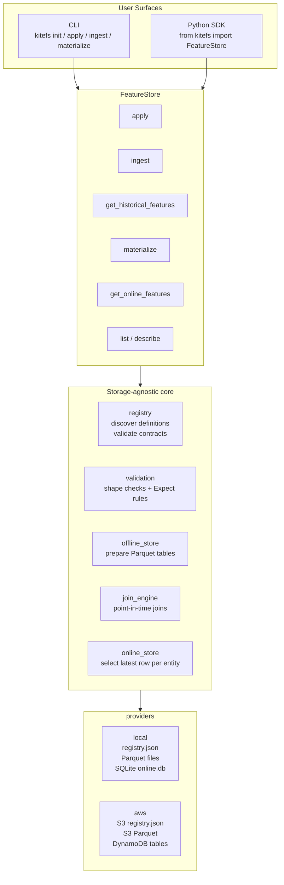

# Getting Started with KiteFS

KiteFS is a Python feature store library for teams that want a simple, library-first way to manage precomputed ML features. You define feature groups as Python code, validate incoming feature data, store historical rows as Parquet, retrieve point-in-time-correct training datasets, and materialize the latest values for online predictions.

There is no KiteFS server to deploy. A project uses a `kitefs.yaml` file, a local or remote runtime target, and either the Python SDK or the `kitefs` CLI.

This guide uses a Turkish real-estate price recommendation scenario:

- **Phase 1 - Train and publish**: start locally, define feature groups, ingest data, retrieve a training dataset, train a model, then publish the feature store to AWS.
- **Phase 2 - Serve predictions**: a FastAPI backend reads online features from AWS and combines them with listing data to return a price recommendation. A React frontend only talks to the backend.
- **Phase 3 - Retrain after one month**: ingest the next month of data, refresh online features, retrieve a rolling training window from S3, retrain, and serve updated predictions.

By the end, you will know the core KiteFS workflow and the feature-store ideas behind it: entity keys, event timestamps, offline storage, online storage, point-in-time joins, validation, and materialization.

---

## Table of Contents

- [Architecture Overview](#architecture-overview)
- [Reference Use Case](#reference-use-case)
- [The Three Projects](#the-three-projects)
- [Phase 1: Initial Training and Remote Publishing](#phase-1-initial-training-and-remote-publishing)
  - [1.1 Producer Project Setup](#11-producer-project-setup)
  - [1.2 Define Feature Groups](#12-define-feature-groups)
  - [1.3 Apply and Inspect the Registry](#13-apply-and-inspect-the-registry)
  - [1.4 Prepare and Ingest Data](#14-prepare-and-ingest-data)
  - [1.5 Explore the Local Feature Store](#15-explore-the-local-feature-store)
  - [1.6 Build a Training Dataset and Train the Model](#16-build-a-training-dataset-and-train-the-model)
  - [1.7 Switch to Remote and Publish](#17-switch-to-remote-and-publish)
  - [1.8 Materialize to the Remote Online Store](#18-materialize-to-the-remote-online-store)
- [Phase 2: Live Inference and Real-Time Serving](#phase-2-live-inference-and-real-time-serving)
  - [2.1 Consumer Project Setup](#21-consumer-project-setup)
  - [2.2 FastAPI Backend: Read Online Features](#22-fastapi-backend-read-online-features)
  - [2.3 React Frontend: Send Listing Inputs](#23-react-frontend-send-listing-inputs)
- [Phase 3: Retraining Loop](#phase-3-retraining-loop)
  - [3.1 Ingest the New Month](#31-ingest-the-new-month)
  - [3.2 Refresh the Online Store](#32-refresh-the-online-store)
  - [3.3 Retrieve the Rolling Training Window](#33-retrieve-the-rolling-training-window)
  - [3.4 Retrain and Deploy the Model](#34-retrain-and-deploy-the-model)
  - [3.5 Serve an Updated Prediction](#35-serve-an-updated-prediction)
- [Appendix: MVP Limitations](#appendix-mvp-limitations)

---

## Architecture Overview

The SDK and CLI are thin user surfaces over the same core flow. `FeatureStore()` reads `./kitefs.yaml`, resolves the runtime target, and builds one provider for that target. If the target is `local`, KiteFS uses files and SQLite. If the target is `remote`, KiteFS uses S3 and DynamoDB.



Two ideas matter throughout the guide:

- A `FeatureStore` instance is bound to exactly one target for its lifetime. Change `KITEFS_RUNTIME_TARGET` or `kitefs.yaml`, then create a new `FeatureStore()`.
- KiteFS stores feature data, not raw application tables and not model artifacts. You prepare rows, KiteFS validates and stores them, then you retrieve them for training or serving.

---

## Reference Use Case

A real-estate platform operates in Turkey, across Istanbul and Ankara. Sellers create house listings. When a listing sells, the application records `sold_at`.

The product goal is to recommend a realistic sale price when a user creates or updates a listing.

KiteFS helps with the feature lifecycle:

- Store listing-level training features for sold listings.
- Store town-level monthly market aggregates.
- Retrieve training data without leaking future market information.
- Serve the latest market aggregate for real-time prediction.

### Source Tables

The application has been active since January 2025. In January 2026, the team wants to launch price recommendations trained on previous sold listings.

**`towns`**

| id  | name     | city     |
| --- | -------- | -------- |
| 1   | Kadikoy  | Istanbul |
| 2   | Besiktas | Istanbul |
| 3   | Tuzla    | Istanbul |
| 4   | Cankaya  | Ankara   |
| 5   | Kecioren | Ankara   |
| 6   | Mamak    | Ankara   |

**`listings`** sample

| id   | town_id | net_area | number_of_rooms | build_year | asking_price | sold_at             |
| ---- | ------- | -------- | --------------- | ---------- | ------------ | ------------------- |
| 1001 | 2       | 75       | 2               | 2020       | 2400000.00   | 2025-03-15 11:00:00 |
| 1002 | 1       | 130      | 3               | 2015       | 3600000.00   | 2025-04-05 14:00:00 |
| 1003 | 6       | 85       | 2               | 2002       | 1120000.00   | 2025-03-18 14:30:00 |
| 1004 | 4       | 110      | 3               | 2010       | 2250000.00   | 2025-05-22 16:00:00 |
| 1005 | 3       | 140      | 4               | 2008       | 2200000.00   | 2025-06-11 10:15:00 |
| 1006 | 5       | 95       | 2               | 2017       | 1500000.00   | 2025-07-03 13:45:00 |
| 1007 | 2       | 60       | 1               | 2019       | 1980000.00   | 2025-08-20 09:30:00 |
| 1008 | 1       | 105      | 3               | 2000       | 3000000.00   | 2025-09-14 15:00:00 |
| 1009 | 4       | 120      | 3               | 2012       | 2550000.00   | NULL                |
| 1010 | 3       | 90       | 2               | 2016       | 1340000.00   | 2025-01-20 17:00:00 |

Only sold listings are used. In this example, `asking_price` is treated as the final sold price when `sold_at IS NOT NULL`. Active listing `1009` is excluded.

### Feature Groups

A feature group is a named schema for a set of related feature rows. Each group has:

- an **entity key**: the thing the row describes, such as `listing_id` or `town_id`;
- an **event timestamp**: when the row became true or available;
- one or more feature columns;
- a storage target: offline only, or offline plus online.

For this scenario:

| Feature Group          | Storage            | Entity Key   | Event Timestamp   | Purpose                                           |
| ---------------------- | ------------------ | ------------ | ----------------- | ------------------------------------------------- |
| `listing_features`     | Offline only       | `listing_id` | `sold_at`         | Training rows for sold listings.                  |
| `town_market_features` | Offline and online | `town_id`    | `event_timestamp` | Monthly town aggregates for training and serving. |

The model will train on `net_area`, `number_of_rooms`, `build_year`, and `town_market_features_avg_price_per_sqm`. The label is `sold_price`.

---

## The Three Projects

This guide uses three projects because real systems usually separate feature production from feature consumption.

**Training project**

A notebook or scripts project owned by data/ML engineers. It defines feature groups, ingests prepared data, retrieves training datasets, trains the model, and materializes online features.

**Backend project**

A FastAPI service. It does not define or ingest features. It reads the remote online store, combines online market features with request inputs, and returns a prediction.

**Frontend project**

A React listing form. It sends listing attributes to the backend and displays the returned recommended price. KiteFS is not used in the browser.

---

## Phase 1: Initial Training and Remote Publishing

Phase 1 starts on your machine. Use local storage first because it is faster to learn, inspect, and debug. After the local workflow is working, switch the same project to the remote target and publish to AWS.

### 1.1 Producer Project Setup

Install KiteFS in the training project environment.

```bash
pip install kitefs
```

For AWS/S3/DynamoDB support, install the AWS extra:

```bash
pip install 'kitefs[aws]'
```

KiteFS requires Python 3.12+.

Create the producer project structure from the training project root:

```bash
kitefs init
```

`kitefs init` has no arguments and no options. It creates:

```text
./kitefs.yaml
./feature_store/
    definitions/
        town_market_features.py
    registry.json
    data/
        offline_store/
        online_store/
./.gitignore
```

The generated feature definition is an example. In this guide, you will replace it.

The generated `kitefs.yaml` starts with a local-first target:

```yaml
version: 1

project:
  name: "kitefs_featurestore_project"

runtime:
  target: "${KITEFS_RUNTIME_TARGET:-local}"

remote:
  region: "${KITEFS_AWS_REGION:-eu-central-1}"
  registry:
    type: aws_s3
    bucket: "${KITEFS_REMOTE_REGISTRY_S3_BUCKET:-}"
    s3_prefix: "${KITEFS_REMOTE_REGISTRY_S3_PREFIX:-kitefs}"
  offline_store:
    type: aws_s3
    bucket: "${KITEFS_REMOTE_OFFLINE_S3_BUCKET:-}"
    s3_prefix: "${KITEFS_REMOTE_OFFLINE_S3_PREFIX:-kitefs}"
  online_store:
    type: aws_dynamodb
    dynamodb_table_prefix: "${KITEFS_REMOTE_ONLINE_DYNAMODB_TABLE_PREFIX:-kitefs_}"
```

For now, leave `runtime.target` as `local`. Local KiteFS writes under `feature_store/data/` and keeps the registry at `feature_store/registry.json`.

Behind the scenes, the target is resolved when `FeatureStore()` is constructed. If you change environment variables or edit `kitefs.yaml`, create a new `FeatureStore()` instance.

### 1.2 Define Feature Groups

Delete the generated example definition and create two files in `feature_store/definitions/`.

`listing_features` is offline-only. It is used to build training datasets, but the backend never needs to look up a listing by `listing_id` at prediction time.

```python
# feature_store/definitions/listing_features.py

from kitefs import (
    EntityKey,
    EventTimestamp,
    Expect,
    Feature,
    FeatureGroup,
    FeatureType,
    JoinKey,
    Metadata,
    StorageTarget,
    ValidationMode,
)

listing_features = FeatureGroup(
    name="listing_features",
    storage_target=StorageTarget.OFFLINE,
    entity_key=EntityKey(name="listing_id", dtype=FeatureType.INTEGER),
    event_timestamp=EventTimestamp(name="sold_at"),
    features=[
        Feature(name="net_area", dtype=FeatureType.INTEGER, expect=Expect().not_null().gt(0)),
        Feature(name="number_of_rooms", dtype=FeatureType.INTEGER, expect=Expect().not_null().gt(0)),
        Feature(name="build_year", dtype=FeatureType.INTEGER, expect=Expect().not_null().gte(1900).lte(2030)),
        Feature(name="sold_price", dtype=FeatureType.FLOAT, expect=Expect().not_null().gt(0)),
    ],
    join_keys=[
        JoinKey(
            name="town_id",
            dtype=FeatureType.INTEGER,
            referenced_group="town_market_features",
        )
    ],
    ingestion_validation=ValidationMode.ERROR,
    offline_retrieval_validation=ValidationMode.NONE,
    metadata=Metadata(
        description="Historical sold listing attributes and prices",
        owner="data-science-team",
        tags={"domain": "real-estate", "cadence": "monthly"},
    ),
)
```

`town_market_features` is both offline and online. Offline rows are needed for training joins. The latest row per town is also materialized for real-time serving.

```python
# feature_store/definitions/town_market_features.py

from kitefs import (
    EntityKey,
    EventTimestamp,
    Expect,
    Feature,
    FeatureGroup,
    FeatureType,
    Metadata,
    StorageTarget,
    ValidationMode,
)

town_market_features = FeatureGroup(
    name="town_market_features",
    storage_target=StorageTarget.OFFLINE_AND_ONLINE,
    entity_key=EntityKey(name="town_id", dtype=FeatureType.INTEGER),
    event_timestamp=EventTimestamp(name="event_timestamp"),
    features=[
        Feature(
            name="avg_price_per_sqm",
            dtype=FeatureType.FLOAT,
            expect=Expect().not_null().gt(0),
        )
    ],
    ingestion_validation=ValidationMode.ERROR,
    offline_retrieval_validation=ValidationMode.NONE,
    metadata=Metadata(
        description="Monthly town-level market aggregate",
        owner="data-science-team",
        tags={"domain": "real-estate", "cadence": "monthly"},
    ),
)
```

Why these definitions matter:

- `EntityKey` controls how rows are identified. Online lookups use exactly this key.
- `EventTimestamp` is the time anchor for partitioning and point-in-time joins.
- `StorageTarget.OFFLINE` means historical storage only.
- `StorageTarget.OFFLINE_AND_ONLINE` means historical storage plus a latest-value online store.
- `Expect` rules are data quality checks. They run according to the group's validation mode.

Supported feature types are `STRING`, `INTEGER`, `FLOAT`, and `DATETIME`. Entity keys and join keys must be `STRING` or `INTEGER`. `EventTimestamp` is always `DATETIME`.

Supported `Expect` checks are:

```python
Expect().not_null()
Expect().gt(value)
Expect().gte(value)
Expect().lt(value)
Expect().lte(value)
Expect().is_in(["allowed", "values"])
```

### 1.3 Apply and Inspect the Registry

Applying definitions compiles Python feature-group objects into a registry document. The registry is the contract that later operations use. In local mode, the registry lives at `feature_store/registry.json`.

Both the SDK and the CLI read `./kitefs.yaml` from the current working directory. In this section, run the Python snippet from the training project root, and run the CLI commands from that same directory, the one that contains `kitefs.yaml` and `feature_store/definitions/`. If you later move the snippet into a file such as `scripts/apply_and_inspect.py`, the important detail is still where you start the process: KiteFS resolves `./kitefs.yaml` and `./feature_store/` from the current working directory, not from the script file's location.

Use the SDK from the training project root:

```python
from kitefs import FeatureStore

store = FeatureStore()
result = store.apply()

print(result.registered_groups)  # ['listing_features', 'town_market_features']
print(result.published)          # False
```

`apply` SDK parameters:

```python
store.apply(*, publish: bool = False)
```

It returns `ApplyResult(registered_groups, published)`.

The CLI alternative is:

```bash
kitefs apply
```

CLI parameters:

```text
kitefs apply [--publish] [--no-confirm] [--format text|json]
```

- `--publish` also writes the registry to the configured remote registry.
- `--no-confirm` skips the publish confirmation prompt.
- `--format json` prints machine-readable output.

After `apply`, you can inspect the registered groups. `list_feature_groups()` gives a short summary for each feature group, while `describe_feature_group(name)` shows the full schema for one group, including validation settings and materialization metadata.

Inspect what was registered:

```python
summaries = store.list_feature_groups()
for summary in summaries:
    print(summary.name, summary.entity_key, summary.storage_target.value, summary.feature_count)
    # listing_features listing_id OFFLINE 4
    # town_market_features town_id OFFLINE_AND_ONLINE 1

market = store.describe_feature_group("town_market_features")
print(market.name)
print(market.entity_key.name)
print(market.event_timestamp.name)
print(market.features[0].name)
print(market.last_materialized_at)
# town_market_features
# town_id
# event_timestamp
# avg_price_per_sqm
# None
```

The CLI commands show the same information in terminal-friendly text form: `kitefs list` prints a summary table, and `kitefs describe GROUP_NAME` prints a labeled schema view. Use `--format json` when you want to script against the output.

CLI alternatives:

```bash
kitefs list
kitefs list --format json
kitefs list --format json --output groups.json

kitefs describe town_market_features
kitefs describe town_market_features --format json
```

Behind the scenes, `apply` discovers every `FeatureGroup` instance in `feature_store/definitions/*.py`, validates cross-definition rules such as join references, and writes the registry atomically.

Run `apply` again whenever you change a definition. `last_materialized_at` is preserved when possible.

### 1.4 Prepare and Ingest Data

KiteFS does not query PostgreSQL for you, and it does not compute aggregates inside the feature store. Assume your data pipeline runs SQL like the queries below against your application database, prepares the final feature rows, and saves them as `.parquet` or `.csv` files.

Ingestion is the step where KiteFS takes those prepared feature rows, validates them against the registered feature-group contract, and writes the accepted rows to the offline store in a layout that can later be scanned efficiently for historical retrieval. In a real project, teams usually iterate on SQL, notebooks, exploratory analysis, and feature engineering before this step. In this guide, we assume that work is already done and these are the feature rows we want to store.

A typical workflow to prepare feature dataset might be as follows. For `listing_features`, extract sold listings:

```sql
SELECT
    l.id              AS listing_id,
    l.town_id         AS town_id,
    l.net_area        AS net_area,
    l.number_of_rooms AS number_of_rooms,
    l.build_year      AS build_year,
    l.asking_price    AS sold_price,
    l.sold_at         AS sold_at
FROM listings l
WHERE l.sold_at IS NOT NULL;
```

For `town_market_features`, compute one row per town per month. The event timestamp is the first moment of the next month because that is when the previous month's aggregate becomes available.

```sql
-- January 2025 aggregate, available on 2025-02-01.
SELECT
    l.town_id                        AS town_id,
    AVG(l.asking_price / l.net_area) AS avg_price_per_sqm,
    '2025-02-01 00:00:00'::timestamp AS event_timestamp
FROM listings l
WHERE l.sold_at IS NOT NULL
  AND l.sold_at >= '2025-01-01 00:00:00'
  AND l.sold_at <  '2025-02-01 00:00:00'
GROUP BY l.town_id;
```

This timestamp choice prevents leakage. A listing sold on `2025-01-20` must not use a January aggregate published on `2025-02-01`.

Save the prepared results as `.parquet` or `.csv` files:

```text
data/listing_features.parquet
data/town_market_features.parquet
```

For example, the saved files might look like this.

**`data/listing_features.parquet`** sample

| listing_id | town_id | net_area | number_of_rooms | build_year | sold_price | sold_at             |
| ---------- | ------- | -------- | --------------- | ---------- | ---------- | ------------------- |
| 1001       | 2       | 75       | 2               | 2020       | 2400000.00 | 2025-03-15 11:00:00 |
| 1002       | 1       | 130      | 3               | 2015       | 3600000.00 | 2025-04-05 14:00:00 |
| 1004       | 4       | 110      | 3               | 2010       | 2250000.00 | 2025-05-22 16:00:00 |
| 1008       | 1       | 105      | 3               | 2000       | 3000000.00 | 2025-09-14 15:00:00 |

**`data/town_market_features.parquet`** sample

| town_id | avg_price_per_sqm | event_timestamp     |
| ------- | ----------------- | ------------------- |
| 1       | 27400.0           | 2025-02-01 00:00:00 |
| 2       | 30150.0           | 2025-02-01 00:00:00 |
| 1       | 28100.0           | 2025-03-01 00:00:00 |
| 2       | 30920.0           | 2025-03-01 00:00:00 |

Ingest with the SDK. Here we use both supported input styles on purpose: we load one file into a pandas DataFrame first, and we pass the other as a file path directly.

```python
import pandas as pd

from kitefs import FeatureStore

store = FeatureStore()
town_market_df = pd.read_parquet("data/town_market_features.parquet")

store.ingest("town_market_features", town_market_df)
result = store.ingest("listing_features", "data/listing_features.parquet")

print(result.feature_group)      # listing_features
print(result.accepted_rows)      # 4
print(result.rejected_rows)      # 0
print(result.written_files)
print(result.validation_report)
```

`ingest` SDK parameters:

```python
store.ingest(
    feature_group: str,
    data: pandas.DataFrame | str | os.PathLike[str],
)
```

The SDK accepts a `pandas.DataFrame`, a `.csv` path, or a `.parquet` path.

These two input styles are only about convenience. Once the data reaches KiteFS, both go through the same schema validation, `Expect` checks, and offline-store write path.

The CLI alternative accepts file paths only:

```bash
kitefs ingest town_market_features data/town_market_features.parquet
kitefs ingest listing_features data/listing_features.parquet
kitefs ingest listing_features data/listing_features.parquet --format json
```

CLI parameters:

```text
kitefs ingest GROUP_NAME PATH [--format text|json]
```

Behind the scenes, KiteFS reads the feature-group schema from the registry, checks required columns and types, applies `Expect` rules according to `ingestion_validation`, and writes accepted rows as partitioned Parquet.

Local storage layout:

```text
feature_store/data/offline_store/
    listing_features/
        year=2025/month=03/ing_20260115T090000_abc123.parquet
    town_market_features/
        year=2025/month=02/ing_20260115T091500_ghi789.parquet
```

This is a Hive-style partition layout: `year=YYYY/month=MM/` comes from each row's event timestamp value, not from the wall-clock time when you run ingestion. That means if you ingest historical rows today, they still land under the historical month they belong to.

Each Parquet file name follows the pattern `ing_<utc-write-timestamp>_<short-id>.parquet`. The `ing_` prefix marks files produced by ingestion, and the timestamp plus short id keeps each write unique. This matters later because historical retrieval can scan only the partitions that match the requested time window instead of reading the whole offline store.

Validation has two layers:

- Structural checks always run: required columns, non-null entity/join/timestamp columns, compatible types, and valid UTC datetimes.
- Feature checks use the group mode: `ERROR`, `FILTER`, or `NONE`.

For this guide, both groups use `ValidationMode.ERROR`, so one bad feature value rejects the ingestion and returns a validation report. `FILTER` would drop failing rows. `NONE` skips feature-level checks, but structural checks still run.

### 1.5 Explore the Local Feature Store

With data ingested locally, you can retrieve historical rows, inspect point-in-time behavior, and materialize online features without touching AWS.

#### Retrieve One Historical Group

Historical retrieval reads from the offline store and returns a pandas DataFrame.

```python
from datetime import datetime

listings = store.get_historical_features(
    from_="listing_features",
    select=["net_area", "number_of_rooms", "build_year", "sold_price"],
    where={
        "sold_at": {
            "gte": datetime(2025, 2, 1),
            "lte": datetime(2025, 12, 31, 23, 59, 59),
        }
    },
)
```

`get_historical_features` SDK parameters:

```python
store.get_historical_features(
    *,
    from_: str,
    select: list[str] | dict[str, list[str]] | None = None,
    join: list[str] | None = None,
    where: dict[str, dict[str, Any]] | None = None,
)
```

There is no CLI command for historical retrieval. This is SDK-only because the result is a DataFrame used in Python workflows.

`select` is required; passing `None` raises `RetrievalParameterError`. It names feature columns. Structural columns are included automatically: entity key, event timestamp, and join keys. Use `select=["*"]` to request every declared feature.

`join` and `where` are optional; omit them when not needed. `where` filters only the base group's event timestamp column. Supported operators are `gt`, `gte`, `lt`, and `lte`. Values must be Python `datetime` objects. Naive datetimes are treated as UTC; non-UTC aware datetimes are rejected.

#### Materialize Locally

Materialization copies, for each entity key, the offline row with the latest event timestamp into the online store. For local mode, the online store is SQLite at `feature_store/data/online_store/online.db`.

```python
result = store.materialize("town_market_features")

print(result.succeeded)
print(result.skipped)
print(result.failed)
```

`materialize` SDK parameters:

```python
store.materialize(feature_group: str | None = None)
```

- Pass a group name to materialize one group.
- Omit the argument to materialize all `OFFLINE_AND_ONLINE` groups.

CLI alternatives:

```bash
kitefs materialize town_market_features
kitefs materialize
kitefs materialize --format json
```

CLI parameters:

```text
kitefs materialize [GROUP_NAME] [--format text|json]
```

For `town_market_features`, materialization keeps the latest `event_timestamp` per `town_id`. After the initial bootstrap, the online store holds the December 2025 aggregate for each town, with `event_timestamp = 2026-01-01`.

A group with `StorageTarget.OFFLINE` cannot be materialized. `store.materialize("listing_features")` raises `FeatureGroupNotMaterializableError`.

#### Read Online Features Locally

Online retrieval is for serving-time lookup: give KiteFS one entity key, get the latest feature values.

```python
market = store.get_online_features(
    from_="town_market_features",
    select=["avg_price_per_sqm"],
    where={"town_id": {"eq": 1}},
)

print(market)
```

`get_online_features` SDK parameters:

```python
store.get_online_features(
    *,
    from_: str,
    select: list[str] | None = None,
    where: dict[str, dict[str, Any]] | None = None,
)
```

Both `select` and `where` are required; passing `None` for either raises `RetrievalParameterError`. Use `select=["*"]` to return all declared features.

There is no CLI command for online retrieval. This is SDK-only because online lookup is usually called from an application service.

The result is a dictionary containing the entity key, event timestamp, and selected features:

```python
from datetime import datetime, UTC

{
    "town_id": 1,
    "event_timestamp": datetime(2026, 1, 1, 0, 0, tzinfo=UTC),
    "avg_price_per_sqm": 29200.0,
}
```

A miss returns `{}`. KiteFS returns an empty dict when the entity key is absent or the group was never materialized.

### 1.6 Build a Training Dataset and Train the Model

You are still on the local runtime target here. That is intentional: for the initial training phase, the local offline store already has everything you need, so there is no benefit in publishing first and then reading the same data back from S3 for this guide. Later in this guide, during the retraining flow, you will retrieve historical features from the remote target.

Now you can create a training dataset by joining listing rows to the market snapshot that existed when each listing sold.

This is a **point-in-time join** (also called an _as-of join_ or _temporal join_): for each listing row, KiteFS picks the most recent market row whose event timestamp is at or before the listing's `sold_at`. This is the main feature-store reason to use event timestamps: training should see only information that was available at prediction time. Future aggregates would make offline metrics look better than real serving behavior.

```python
from datetime import datetime

training_df = store.get_historical_features(
    from_="listing_features",
    join=["town_market_features"],
    select={
        "listing_features": [
            "net_area",
            "number_of_rooms",
            "build_year",
            "sold_price",
        ],
        "town_market_features": ["avg_price_per_sqm"],
    },
    where={
        "sold_at": {
            "gte": datetime(2025, 2, 1),
            "lte": datetime(2025, 12, 31, 23, 59, 59),
        }
    },
)
```

When you use `join`, `select` must be a dictionary keyed by group name. The current KiteFS join engine supports one joined feature group per call.

For each listing row, KiteFS finds the latest market row where:

```text
town_market_features.town_id == listing_features.town_id
and town_market_features.event_timestamp <= listing_features.sold_at
```

Point-in-time join example: listing `1002` sold on `2025-04-05` in town `1`.

| Candidate market row | event_timestamp     | Used?                 |
| -------------------- | ------------------- | --------------------- |
| January snapshot     | 2025-02-01 00:00:00 | Yes                   |
| February snapshot    | 2025-03-01 00:00:00 | Yes                   |
| March snapshot       | 2025-04-01 00:00:00 | Yes, latest valid row |
| April snapshot       | 2025-05-01 00:00:00 | No, future row        |

Joined columns are prefixed with the joined group name. The market feature becomes `town_market_features_avg_price_per_sqm`.

The returned DataFrame contains the selected feature columns plus the structural columns that KiteFS includes automatically:

| listing_id | town_id | sold_at             | net_area | number_of_rooms | build_year | sold_price | town_market_features_avg_price_per_sqm |
| ---------- | ------- | ------------------- | -------- | --------------- | ---------- | ---------- | -------------------------------------- |
| 1001       | 2       | 2025-03-15 11:00:00 | 75       | 2               | 2020       | 2400000.00 | 30920.0                                |
| 1002       | 1       | 2025-04-05 14:00:00 | 130      | 3               | 2015       | 3600000.00 | 28850.0                                |
| 1004       | 4       | 2025-05-22 16:00:00 | 110      | 3               | 2010       | 2250000.00 | 20450.0                                |
| 1008       | 1       | 2025-09-14 15:00:00 | 105      | 3               | 2000       | 3000000.00 | 29540.0                                |

Train the model with the same feature names you will use at serving time:

```python
feature_columns = [
    "net_area",
    "number_of_rooms",
    "build_year",
    "town_market_features_avg_price_per_sqm",
]
label_column = "sold_price"

X = training_df[feature_columns]
y = training_df[label_column]

model.fit(X, y)
```

If your retrieval window includes listings before any market snapshot existed, joined market columns will be null. In this guide the window starts at `2025-02-01`, so the January listing is excluded.

### 1.7 Switch to Remote and Publish

The local workflow proves your definitions, data preparation, validation, retrieval, and training flow. To share features with the backend and other team members, switch the same project to the remote target.

You can configure remote mode with environment variables:

```bash
export KITEFS_RUNTIME_TARGET=remote
export KITEFS_AWS_REGION=eu-central-1
export KITEFS_REMOTE_REGISTRY_S3_BUCKET=company-ml
export KITEFS_REMOTE_REGISTRY_S3_PREFIX=kitefs
export KITEFS_REMOTE_OFFLINE_S3_BUCKET=company-ml
export KITEFS_REMOTE_OFFLINE_S3_PREFIX=kitefs
export KITEFS_REMOTE_ONLINE_DYNAMODB_TABLE_PREFIX=kitefs_
```

Or edit `kitefs.yaml` directly:

```yaml
runtime:
  target: "remote"

remote:
  region: "eu-central-1"
  registry:
    type: aws_s3
    bucket: "company-ml"
    s3_prefix: "kitefs"
  offline_store:
    type: aws_s3
    bucket: "company-ml"
    s3_prefix: "kitefs"
  online_store:
    type: aws_dynamodb
    dynamodb_table_prefix: "kitefs_"
```

If you are working in a Python session, create a new `FeatureStore()` after changing the environment variables or editing `kitefs.yaml`. A `FeatureStore` instance reads its config when it is constructed, so a fresh instance is how the new target is picked up.

If you are using the CLI, no extra Python step is needed. After exporting the new environment variables, running `kitefs apply --publish` is enough because each CLI command starts a fresh process and constructs a fresh `FeatureStore()`.

SDK example:

```python
from kitefs import FeatureStore

store = FeatureStore()  # now target=remote
```

KiteFS uses the standard boto3 credential chain. It does not store AWS credentials.

Producer permissions usually need:

- `s3:GetObject` and `s3:PutObject` on the registry and offline store bucket/prefix;
- `dynamodb:DescribeTable`, `dynamodb:CreateTable`, and `dynamodb:BatchWriteItem` on tables matching the configured prefix.

Publish the registry before remote ingest or retrieval:

```bash
kitefs apply --publish
```

For CI/CD, skip the prompt:

```bash
kitefs apply --publish --no-confirm --format json
```

SDK alternative:

```python
result = store.apply(publish=True)
print(result.published)
```

Why publish? Remote operations read definitions from the S3 registry. If the registry is not published, remote `ingest`, `materialize`, and retrieval calls do not know the feature-group contract.

Now ingest to S3:

```bash
kitefs ingest town_market_features data/town_market_features.parquet
kitefs ingest listing_features data/listing_features.parquet
```

SDK alternative:

```python
store.ingest("town_market_features", "data/town_market_features.parquet")
store.ingest("listing_features", "data/listing_features.parquet")
```

Behind the scenes, the flow is the same as local mode. The provider changes where the registry and Parquet files live:

```text
s3://company-ml/kitefs/registry.json
s3://company-ml/kitefs/data/offline_store/listing_features/year=2025/month=03/...
s3://company-ml/kitefs/data/offline_store/town_market_features/year=2025/month=02/...
```

### 1.8 Materialize to the Remote Online Store

Remote materialization reads historical rows from S3 and writes the latest value per entity key to DynamoDB.

```bash
kitefs materialize town_market_features
```

SDK alternative:

```python
result = store.materialize("town_market_features")
print(result.succeeded)
print(result.failed)
```

For this guide, KiteFS creates or updates:

```text
DynamoDB table: kitefs_town_market_features
Partition key: town_id
Items: one latest row per town_id
```

After this step, the backend can read `avg_price_per_sqm` for a `town_id` without scanning S3 or running an aggregate query.

In the current MVP, `materialize` updates `last_materialized_at` only in the local registry, even when the runtime target is remote. If you want that timestamp visible in the remote registry too, run `kitefs apply --publish` again after materialization.

---

## Phase 2: Live Inference and Real-Time Serving

At this point, the feature producer has published definitions to S3, written offline rows to S3, and materialized online rows to DynamoDB. The backend can be a pure consumer.

### 2.1 Consumer Project Setup

In the FastAPI project root, create a consumer-only config:

```bash
kitefs init-config
```

`kitefs init-config` has no arguments and no options. It creates only `kitefs.yaml`. It does not create definitions, local registry, or local data directories.

The generated consumer config defaults to remote:

```yaml
runtime:
  target: "${KITEFS_RUNTIME_TARGET:-remote}"
```

Set the remote values the consumer needs:

```bash
export KITEFS_RUNTIME_TARGET=remote
export KITEFS_AWS_REGION=eu-central-1
export KITEFS_REMOTE_REGISTRY_S3_BUCKET=company-ml
export KITEFS_REMOTE_REGISTRY_S3_PREFIX=kitefs
export KITEFS_REMOTE_ONLINE_DYNAMODB_TABLE_PREFIX=kitefs_
```

The consumer config includes only `registry` and `online_store` sections. `kitefs list` and `kitefs describe` work against the remote target because they read only the registry from S3. Offline-store variables (`KITEFS_REMOTE_OFFLINE_S3_*`) are not needed here because the consumer config has no `offline_store` section — consumer projects do not ingest data or call `get_historical_features`.

As in section 1.7, you can also edit `kitefs.yaml` directly instead of exporting environment variables. Replace the placeholders with literal values:

```yaml
runtime:
  target: "remote"

remote:
  region: "eu-central-1"
  registry:
    type: aws_s3
    bucket: "company-ml"
    s3_prefix: "kitefs"
  online_store:
    type: aws_dynamodb
    dynamodb_table_prefix: "kitefs_"
```

Consumer permissions can be read-only:

- `s3:GetObject` on the registry;
- `dynamodb:GetItem` on online feature tables.

### 2.2 FastAPI Backend: Read Online Features

The backend receives listing attributes from the frontend, fetches the latest market feature for the town, builds the same feature vector used during training, and returns the model prediction.

```python
# consumer_app/main.py

import joblib
import pandas as pd
from fastapi import FastAPI
from pydantic import BaseModel

from kitefs import FeatureStore


class PriceRequest(BaseModel):
    town_id: int
    net_area: int
    number_of_rooms: int
    build_year: int


FEATURE_COLUMNS = [
    "net_area",
    "number_of_rooms",
    "build_year",
    "town_market_features_avg_price_per_sqm",
]


model = joblib.load("model.pkl")
store = FeatureStore()
app = FastAPI()


@app.post("/recommend-price")
def recommend_price(request: PriceRequest) -> dict[str, float | str]:
    market = store.get_online_features(
        from_="town_market_features",
        select=["avg_price_per_sqm"],
        where={"town_id": {"eq": request.town_id}},
    )

    if not market:
        return {"error": "no market data available for this town"}

    feature_row = pd.DataFrame([
        {
            "net_area": request.net_area,
            "number_of_rooms": request.number_of_rooms,
            "build_year": request.build_year,
            "town_market_features_avg_price_per_sqm": market["avg_price_per_sqm"],
        }
    ])[FEATURE_COLUMNS]

    predicted_price = model.predict(feature_row)[0]
    return {"recommended_price": round(float(predicted_price), 0)}
```

The online lookup is intentionally narrow: one group, one entity key, latest values only. That keeps serving fast and predictable.

The important detail is that the serving-time feature row uses the same feature names and column order as the training dataset in section 1.6. That is the contract KiteFS helps you keep stable across training and serving.

Important serving semantics:

- `get_online_features` returns `{}` on miss.
- It does not run validation on returned values. Validation already happened when rows were ingested.
- There is no CLI equivalent. Applications use the SDK.
- The result includes the online row's event timestamp, which is useful for debugging freshness.

### 2.3 React Frontend: Send Listing Inputs

The React app does not import KiteFS. It only collects listing fields and sends them to the backend:

```json
{
  "town_id": 1,
  "net_area": 105,
  "number_of_rooms": 3,
  "build_year": 2000
}
```

The backend returns:

```json
{
  "recommended_price": 3120000
}
```

From the frontend's point of view, KiteFS is an implementation detail of the backend. This separation is useful: product UI code stays simple, while the backend owns feature lookup and model invocation.

---

## Phase 3: Retraining Loop

One month has passed. January 2026 transactions are complete. The system now needs fresher market features and a model retrained on the latest 12-month window.

The workflow is the same pattern as Phase 1, but remote-first:

1. Ingest January 2026 feature rows to S3.
2. Materialize the latest market aggregates to DynamoDB.
3. Retrieve a rolling training window from S3.
4. Retrain and deploy the model.
5. Serve predictions with the refreshed online store and updated model.

### 3.1 Ingest the New Month

Keep the producer project on `target=remote` and ingest the new files.

Assume the January 2026 parquet files look like this.

**`data/listing_features_jan2026.parquet`** sample

| listing_id | town_id | net_area | number_of_rooms | build_year | sold_price | sold_at             |
| ---------- | ------- | -------- | --------------- | ---------- | ---------- | ------------------- |
| 1101       | 1       | 115      | 3               | 2014       | 3480000.00 | 2026-01-07 13:20:00 |
| 1102       | 2       | 82       | 2               | 2018       | 2575000.00 | 2026-01-12 10:05:00 |
| 1103       | 4       | 125      | 3               | 2011       | 2760000.00 | 2026-01-21 16:40:00 |
| 1104       | 5       | 98       | 2               | 2019       | 1680000.00 | 2026-01-29 11:15:00 |

**`data/town_market_jan2026.parquet`** sample

| town_id | avg_price_per_sqm | event_timestamp     |
| ------- | ----------------- | ------------------- |
| 1       | 30280.0           | 2026-02-01 00:00:00 |
| 2       | 32750.0           | 2026-02-01 00:00:00 |
| 4       | 22640.0           | 2026-02-01 00:00:00 |
| 5       | 17310.0           | 2026-02-01 00:00:00 |

```python
from kitefs import FeatureStore

store = FeatureStore()

store.ingest("listing_features", "data/listing_features_jan2026.parquet")
store.ingest("town_market_features", "data/town_market_jan2026.parquet")
```

CLI alternative:

```bash
kitefs ingest listing_features data/listing_features_jan2026.parquet
kitefs ingest town_market_features data/town_market_jan2026.parquet
```

The January 2026 market aggregate uses `event_timestamp = 2026-02-01 00:00:00`, because the January aggregate becomes available at the start of February.

### 3.2 Refresh the Online Store

Materialize again after ingesting the new market aggregate:

```python
result = store.materialize("town_market_features")
print(result.succeeded)
```

CLI alternative:

```bash
kitefs materialize town_market_features
```

DynamoDB now holds the January 2026 aggregate for each town. The serving path does not need to change; the same backend lookup now returns fresher values.

### 3.3 Retrieve the Rolling Training Window

Retrieve the full 12-month training window from S3 in one SDK call:

```python
from datetime import datetime

training_df = store.get_historical_features(
    from_="listing_features",
    join=["town_market_features"],
    select={
        "listing_features": [
            "net_area",
            "number_of_rooms",
            "build_year",
            "sold_price",
        ],
        "town_market_features": ["avg_price_per_sqm"],
    },
    where={
        "sold_at": {
            "gte": datetime(2025, 2, 1),
            "lte": datetime(2026, 1, 31, 23, 59, 59),
        }
    },
)
```

Because this `FeatureStore()` is remote-bound, the call reads only from S3. KiteFS does not merge local and remote data in one request. The safe pattern is to ingest the new month to remote first, then retrieve the complete training window from remote.

Point-in-time correctness still applies. A January 2026 listing can use the market row with `event_timestamp = 2026-02-01` only if the listing timestamp is on or after that timestamp. If your business wants January listings to use the January aggregate during retraining, make sure the label/event timing reflects when that aggregate would actually have been available. Otherwise, use the previous valid snapshot. This is a modeling decision, and KiteFS enforces the timestamp rule you encode.

### 3.4 Retrain and Deploy the Model

Retraining follows the same pattern as the initial training step: use the same feature names, select the same label column, and fit the model on the refreshed training dataset.

```python
feature_columns = [
    "net_area",
    "number_of_rooms",
    "build_year",
    "town_market_features_avg_price_per_sqm",
]
label_column = "sold_price"

X = training_df[feature_columns]
y = training_df[label_column]

model.fit(X, y)
```

After evaluating the retrained model, save it for the backend:

```python
import joblib

joblib.dump(model, "model.pkl")
```

Deploy the updated model artifact to the FastAPI service using your normal deployment process. KiteFS does not store models; it stores and serves features.

### 3.5 Serve an Updated Prediction

After steps 3.2 and 3.4, the backend code can stay the same:

1. The online store now returns the latest materialized market aggregate.
2. The backend loads the newly deployed model.
3. A user updates listing details in the React app.
4. The frontend sends the same fields to `/recommend-price`.
5. The backend retrieves `avg_price_per_sqm`, builds the feature vector, and returns a new recommendation.

This is the operational loop KiteFS is designed to make routine: new offline feature rows become refreshed online features, retraining uses the same definitions, and serving reads the same feature contract.

---

## Appendix: MVP Limitations

| Situation                                       | Behavior                                                                                      |
| ----------------------------------------------- | --------------------------------------------------------------------------------------------- |
| Working directory matters                       | `FeatureStore()` reads `./kitefs.yaml` from the current working directory.                    |
| Local paths are fixed                           | Local registry and data paths live under `feature_store/`.                                    |
| One runtime target per instance                 | Change config or env vars, then create a new `FeatureStore()`.                                |
| Naive datetimes are UTC                         | Naive datetimes are accepted and treated as UTC.                                              |
| Non-UTC aware datetimes are rejected            | KiteFS does not convert time zones.                                                           |
| Historical `select` is required                 | Use explicit feature names or `select=["*"]`.                                                 |
| Online `where` supports entity equality only    | Use `{entity_key: {"eq": value}}`.                                                            |
| Historical `where` filters event timestamp only | You cannot filter historical retrieval by arbitrary feature columns.                          |
| Joins support one joined group                  | Use one joined group per `get_historical_features` call.                                      |
| Unmatched joins produce nulls                   | If no valid point-in-time row exists, joined columns are null.                                |
| Offline store is append-only                    | Re-ingesting creates more files; no TTL or cleanup is built in.                               |
| Online store keeps latest rows                  | Materialization chooses the latest event timestamp per entity key.                            |
| Models are outside KiteFS                       | Train, save, register, and deploy models with your own ML tooling.                            |
| Online `select` and `where` are required        | Omitting either raises `RetrievalParameterError`. Pass `select=["*"]` to return all features. |
