# Kite Feature Store — Flow Charts

> **Document Purpose:**
> This document provides visual flow charts for each core user-facing operation in KiteFS. Each flow chart traces the complete path from the user entry point through internal modules to the final outcome. These flow charts serve as the **primary source of truth** for understanding how operations work end-to-end.
>
> **Owner:** Fedai Paça
> **Last Updated:** 2026-03-26
> **Status:** Draft

---
## Glossary
- Project Root: The directory containing `kitefs.yaml`.
- Storage Root: The directory KiteFS uses for all managed artifacts (definitions, registry, data). Configured via `storage_root` in `kitefs.yaml`. Default: `./feature_store/` relative to the project root.

---

## 1. CLI

### 1.1. `kitefs init`

Initializes a new KiteFS project. Creates the configuration file, directory structure, empty registry, example definitions, and `.gitignore` entries. This is the only command that does not require an existing KiteFS project — it creates one.

**Entry point:** `kitefs init [path]`
**Delegates to:** N/A (this command creates the project scaffold directly; it does not instantiate FeatureStore)

#### Flow Chart

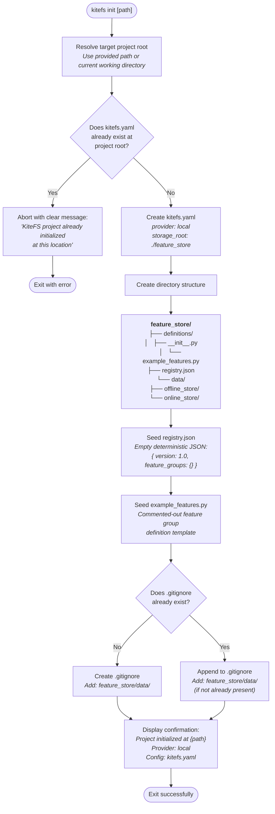
```mermaid
flowchart TD
    START(["kitefs init [path]"]) --> RESOLVE_PATH["Resolve target project root<br><i>Use provided path or current working directory</i>"]

    RESOLVE_PATH --> CHECK_EXISTS{"Does kitefs.yaml<br>already exist at<br>project root?"}

    CHECK_EXISTS -- Yes --> ABORT_EXISTS["Abort with clear message:<br><i>'KiteFS project already initialized<br>at this location'</i>"]
    ABORT_EXISTS --> END_FAIL(["Exit with error"])

    CHECK_EXISTS -- No --> CREATE_CONFIG["Create kitefs.yaml<br><i>provider: local<br>storage_root: ./feature_store</i>"]

    CREATE_CONFIG --> CREATE_DIRS["Create directory structure"]

    CREATE_DIRS --> DIR_DETAIL["<b>feature_store/</b><br>├── definitions/<br>│   ├── __init__.py<br>│   └── example_features.py<br>├── registry.json<br>└── data/<br>    ├── offline_store/<br>    └── online_store/"]

    DIR_DETAIL --> CREATE_REGISTRY["Seed registry.json<br><i>Empty deterministic JSON:<br>{ version: 1.0, feature_groups: {} }</i>"]

    CREATE_REGISTRY --> CREATE_EXAMPLE["Seed example_features.py<br><i>Commented-out feature group<br>definition template</i>"]

    CREATE_EXAMPLE --> CREATE_GITIGNORE{"Does .gitignore<br>already exist?"}

    CREATE_GITIGNORE -- No --> WRITE_GITIGNORE["Create .gitignore<br><i>Add: feature_store/data/</i>"]
    CREATE_GITIGNORE -- Yes --> APPEND_GITIGNORE["Append to .gitignore<br><i>Add: feature_store/data/<br>(if not already present)</i>"]

    WRITE_GITIGNORE --> SUCCESS
    APPEND_GITIGNORE --> SUCCESS

    SUCCESS["Display confirmation:<br><i>Project initialized at {path}<br>Provider: local<br>Config: kitefs.yaml</i>"]

    SUCCESS --> END_OK(["Exit successfully"])
```

#### Key Decisions in This Flow

| Decision                                 | Rationale                                                                                                                                             |
| ---------------------------------------- | ----------------------------------------------------------------------------------------------------------------------------------------------------- |
| Abort if `kitefs.yaml` already exists    | Prevents accidental overwrite of an existing project's configuration and registry. A re-init would destroy registered feature group definitions.      |
| Default provider is `local`              | Zero-config local usage after init.                                                                                                                   |
| `feature_store/data/` is gitignored      | Parquet files (offline store) and SQLite database (online store) are runtime data, not source artifacts. Registry and definitions remain versionable. |
| `registry.json` seeded as empty JSON     | Deterministic format (`sort_keys=True`, `indent=2`) ensures meaningful Git diffs from the first commit.                                               |
| `definitions/` created as Python package | Convention over configuration — provides a standard location for feature group definitions while allowing users to define them anywhere.              |
| Data subdirectories created but empty    | Partition directories and SQLite tables are created lazily on first write. Init only creates the parent structure.                                    |

---

### 1.2. `kitefs apply`

Triggers the apply operation by delegating to `store.apply()`. The CLI is responsible only for resolving the project root and handing off to the SDK — all discovery, validation, and registry generation logic lives in `apply()`.

**Entry point:** `kitefs apply`
**Delegates to:** `store.apply()`

#### Flow Chart

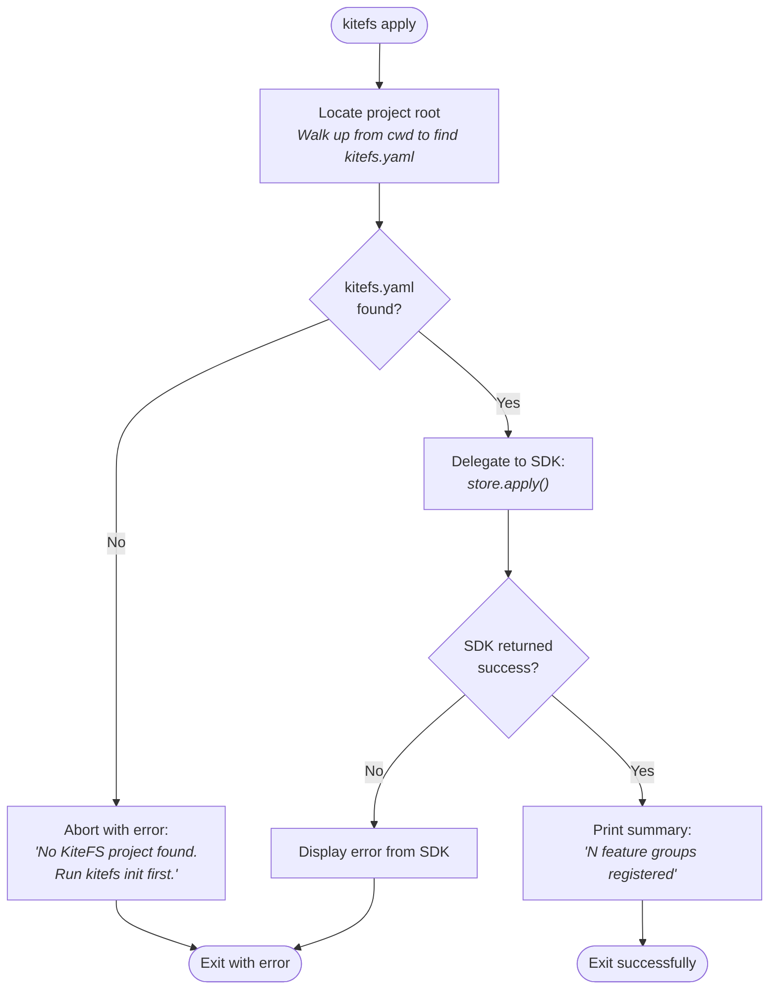
```mermaid
flowchart TD
    START(["kitefs apply"]) --> FIND_ROOT["Locate project root<br><i>Walk up from cwd to find kitefs.yaml</i>"]

    FIND_ROOT --> ROOT_FOUND{"kitefs.yaml<br>found?"}

    ROOT_FOUND -- No --> ABORT_NO_PROJECT["Abort with error:<br><i>'No KiteFS project found.<br>Run kitefs init first.'</i>"]
    ABORT_NO_PROJECT --> END_FAIL(["Exit with error"])

    ROOT_FOUND -- Yes --> DELEGATE["Delegate to SDK:<br><i>store.apply()</i>"]

    DELEGATE --> SDK_RESULT{"SDK returned<br>success?"}

    SDK_RESULT -- No --> SHOW_ERROR["Display error from SDK"]
    SHOW_ERROR --> END_FAIL

    SDK_RESULT -- Yes --> CONFIRM["Print summary:<br><i>'N feature groups registered'</i>"]
    CONFIRM --> END_OK(["Exit successfully"])
```

---

### 1.3. `kitefs materialize`

Accepts an optional feature group name and delegates directly to `store.materialize()`. If no name is given, the SDK will materialize all eligible feature groups.

**Entry point:** `kitefs materialize [feature_group_name]`
**Delegates to:** `store.materialize(feature_group_name)`

#### Flow Chart

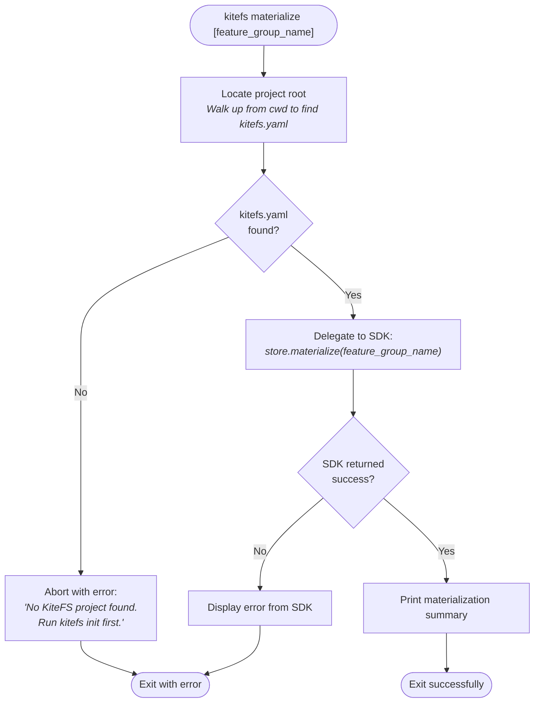
```mermaid
flowchart TD
    START(["kitefs materialize [feature_group_name]"]) --> FIND_ROOT["Locate project root<br><i>Walk up from cwd to find kitefs.yaml</i>"]

    FIND_ROOT --> ROOT_FOUND{"kitefs.yaml<br>found?"}

    ROOT_FOUND -- No --> ABORT_NO_PROJECT["Abort with error:<br><i>'No KiteFS project found.<br>Run kitefs init first.'</i>"]
    ABORT_NO_PROJECT --> END_FAIL(["Exit with error"])

    ROOT_FOUND -- Yes --> DELEGATE["Delegate to SDK:<br><i>store.materialize(feature_group_name)</i>"]

    DELEGATE --> SDK_RESULT{"SDK returned<br>success?"}

    SDK_RESULT -- No --> SHOW_ERROR["Display error from SDK"]
    SHOW_ERROR --> END_FAIL

    SDK_RESULT -- Yes --> CONFIRM["Print materialization summary"]
    CONFIRM --> END_OK(["Exit successfully"])
```

---

### 1.4. `kitefs ingest`

Accepts a feature group name and a file path, then delegates directly to `store.ingest()`. The CLI is responsible only for receiving the arguments and handing them off — all loading, validation, and write logic lives in `ingest()`.

**Entry point:** `kitefs ingest <feature_group_name> <file_path>`
**Delegates to:** `store.ingest(feature_group_name, data)` — the CLI passes `<file_path>` as the SDK's `data` parameter (which also accepts DataFrames in programmatic use)

#### Flow Chart

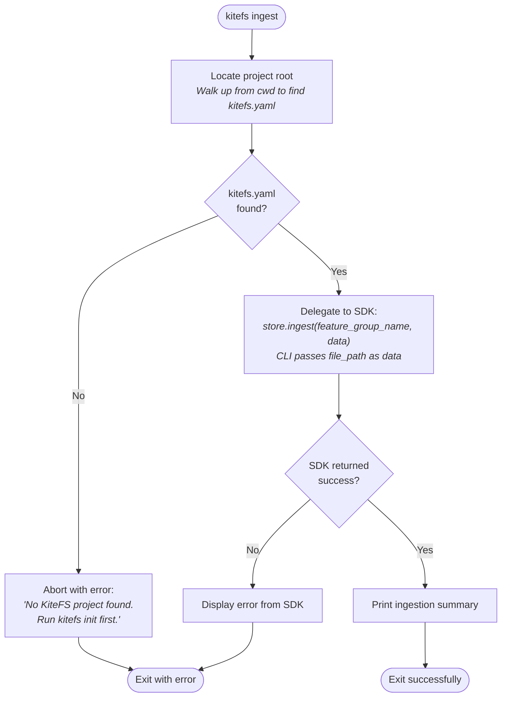
```mermaid
flowchart TD
    START(["kitefs ingest <feature_group_name> <file_path>"]) --> FIND_ROOT["Locate project root<br><i>Walk up from cwd to find kitefs.yaml</i>"]

    FIND_ROOT --> ROOT_FOUND{"kitefs.yaml<br>found?"}

    ROOT_FOUND -- No --> ABORT_NO_PROJECT["Abort with error:<br><i>'No KiteFS project found.<br>Run kitefs init first.'</i>"]
    ABORT_NO_PROJECT --> END_FAIL(["Exit with error"])

    ROOT_FOUND -- Yes --> DELEGATE["Delegate to SDK:<br><i>store.ingest(feature_group_name, data)</i><br><i>CLI passes file_path as data</i>"]

    DELEGATE --> SDK_RESULT{"SDK returned<br>success?"}

    SDK_RESULT -- No --> SHOW_ERROR["Display error from SDK"]
    SHOW_ERROR --> END_FAIL

    SDK_RESULT -- Yes --> CONFIRM["Print ingestion summary"]
    CONFIRM --> END_OK(["Exit successfully"])
```

---

### 1.5. `kitefs list`

Lists all registered feature groups with summary information. The CLI passes optional `--format` and `--target` flags through to the SDK. When `--target` is provided, the SDK writes a JSON file. When `--format json` is provided without a target, the SDK returns a JSON string. Otherwise, the SDK returns structured data (list of dicts) and the CLI renders a human-readable table. The CLI is responsible only for resolving the project root, the empty-state message, and console rendering.

**Entry point:** `kitefs list [--format json] [--target <file_path>]`
**Delegates to:** `store.list_feature_groups(format, target)`

#### Flow Chart

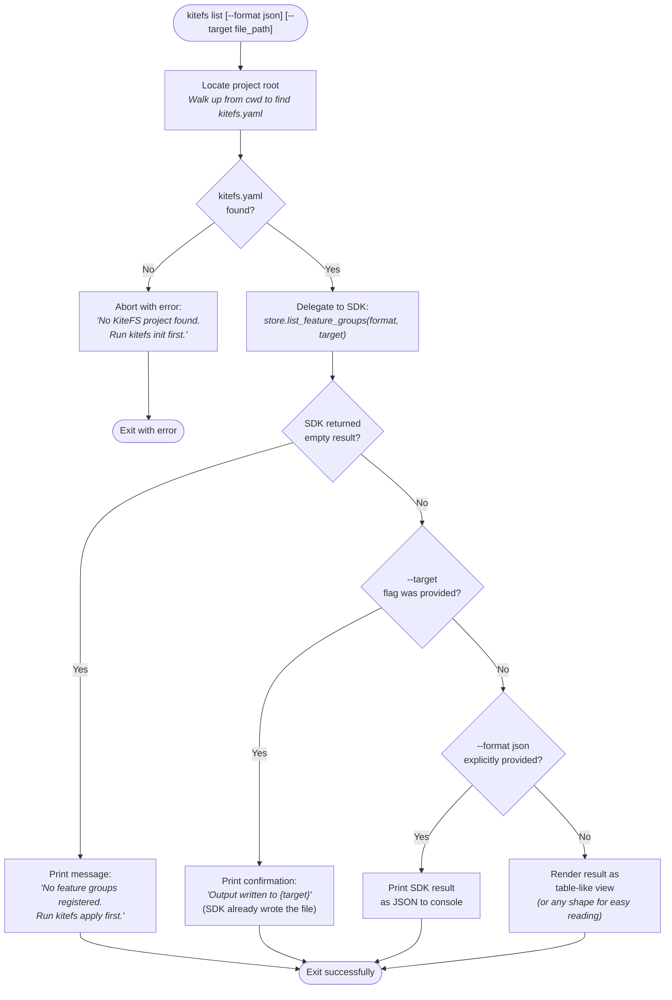
```mermaid
flowchart TD
    START(["kitefs list [--format json] [--target file_path]"]) --> FIND_ROOT["Locate project root<br><i>Walk up from cwd to find kitefs.yaml</i>"]

    FIND_ROOT --> ROOT_FOUND{"kitefs.yaml<br>found?"}

    ROOT_FOUND -- No --> ABORT_NO_PROJECT["Abort with error:<br><i>'No KiteFS project found.<br>Run kitefs init first.'</i>"]
    ABORT_NO_PROJECT --> END_FAIL(["Exit with error"])

    ROOT_FOUND -- Yes --> DELEGATE["Delegate to SDK:<br><i>store.list_feature_groups(format, target)</i>"]

    DELEGATE --> RESULT_EMPTY{"SDK returned<br>empty result?"}

    RESULT_EMPTY -- Yes --> PRINT_EMPTY["Print message:<br><i>'No feature groups registered.<br>Run kitefs apply first.'</i>"]
    PRINT_EMPTY --> END_OK(["Exit successfully"])

    RESULT_EMPTY -- No --> CHECK_TARGET{"--target<br>flag was provided?"}

    CHECK_TARGET -- Yes --> CONFIRM_FILE["Print confirmation:<br><i>'Output written to {target}'</i><br>(SDK already wrote the file)"]
    CONFIRM_FILE --> END_OK

    CHECK_TARGET -- No --> CHECK_FORMAT{"--format json<br>explicitly provided?"}

    CHECK_FORMAT -- Yes --> PRINT_JSON["Print SDK result<br>as JSON to console"]
    CHECK_FORMAT -- No --> RENDER_TABLE["Render result as<br>table-like view<br><i>(or any shape for easy reading)</i>"]

    PRINT_JSON --> END_OK
    RENDER_TABLE --> END_OK
```

#### Key Decisions in This Flow

| Decision | Rationale |
| --- | --- |
| CLI passes `format` and `target` through to SDK | File writing and JSON serialization are data operations handled by the SDK, so notebook and script users get the same export capability. The CLI stays thin — it only handles console rendering. |
| CLI checks `--target` first, then `--format` | When `--target` is provided, the SDK already wrote the file — the CLI only needs to confirm. When there is no target, the CLI decides console output: explicit `--format json` prints the JSON string from the SDK, otherwise the CLI renders structured data as a human-friendly table-like view. |
| Default console output is a table-like view | The SDK returns a list of dicts by default. The CLI renders this as a table-like view (or any shape for easy reading) — the most readable format for scanning multiple feature groups in a terminal. |
| Empty result is not an error | Having zero registered feature groups is a valid state (e.g., right after `kitefs init` before any `apply`). The CLI prints an informational message and exits cleanly rather than failing. |

---

### 1.6. `kitefs describe`

Shows the full definition of a specific registered feature group. The CLI passes optional `--format` and `--target` flags through to the SDK. When `--target` is provided, the SDK writes a JSON file. When `--format json` is provided without a target, the SDK returns a JSON string. Otherwise, the SDK returns structured data (dict) and the CLI renders a human-readable key-value layout. The CLI is responsible only for resolving the project root, console rendering, and the error display.

**Entry point:** `kitefs describe <feature_group_name> [--format json] [--target <file_path>]`
**Delegates to:** `store.describe_feature_group(feature_group_name, format, target)`

#### Flow Chart

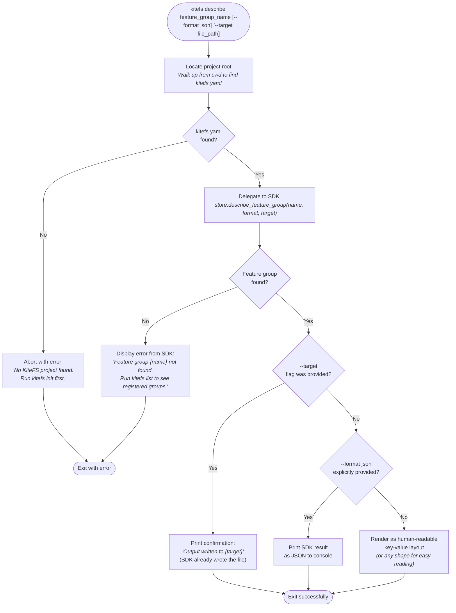
```mermaid
flowchart TD
    START(["kitefs describe feature_group_name [--format json] [--target file_path]"]) --> FIND_ROOT["Locate project root<br><i>Walk up from cwd to find kitefs.yaml</i>"]

    FIND_ROOT --> ROOT_FOUND{"kitefs.yaml<br>found?"}

    ROOT_FOUND -- No --> ABORT_NO_PROJECT["Abort with error:<br><i>'No KiteFS project found.<br>Run kitefs init first.'</i>"]
    ABORT_NO_PROJECT --> END_FAIL(["Exit with error"])

    ROOT_FOUND -- Yes --> DELEGATE["Delegate to SDK:<br><i>store.describe_feature_group(name, format, target)</i>"]

    DELEGATE --> SDK_RESULT{"Feature group<br>found?"}

    SDK_RESULT -- No --> ABORT_MISSING["Display error from SDK:<br><i>'Feature group {name} not found.<br>Run kitefs list to see registered groups.'</i>"]
    ABORT_MISSING --> END_FAIL

    SDK_RESULT -- Yes --> CHECK_TARGET{"--target<br>flag was provided?"}

    CHECK_TARGET -- Yes --> CONFIRM_FILE["Print confirmation:<br><i>'Output written to {target}'</i><br>(SDK already wrote the file)"]
    CONFIRM_FILE --> END_OK(["Exit successfully"])

    CHECK_TARGET -- No --> CHECK_FORMAT{"--format json<br>explicitly provided?"}

    CHECK_FORMAT -- Yes --> PRINT_JSON["Print SDK result<br>as JSON to console"]
    CHECK_FORMAT -- No --> RENDER_READABLE["Render as human-readable<br>key-value layout<br><i>(or any shape for easy reading)</i>"]

    PRINT_JSON --> END_OK
    RENDER_READABLE --> END_OK
```

#### Key Decisions in This Flow

| Decision | Rationale |
| --- | --- |
| CLI passes `format` and `target` through to SDK | Same rationale as `kitefs list` — file writing and JSON serialization are SDK concerns. The CLI stays thin and only handles console rendering. |
| CLI checks `--target` first, then `--format` | Same branching logic as `kitefs list`. When target is provided, SDK already handled the file — CLI confirms. When no target, explicit `--format json` prints the JSON string from the SDK, otherwise the CLI renders structured data as a human-friendly layout. |
| Default console output is a human-readable key-value layout | The SDK returns a dict by default. The CLI renders this as a key-value layout (or any shape for easy reading) with sections (metadata, features, join keys, validation) — more suitable for a single group's details than a table. |
| Error when feature group not found | Consistent with other SDK methods (`ingest`, `materialize`, `get_online_features`) that fail when a referenced feature group does not exist. The error message suggests running `kitefs list` to discover valid names. |
| Command is `describe`, not `desc` | Self-explanatory command naming is a project-wide convention. Clarity over brevity. |

---

### 1.7. `kitefs registry-sync`

Pushes the local `registry.json` to the configured remote storage. This command takes no parameters. The CLI validates the project root and delegates to `store.sync_registry()` — all upload logic lives in the SDK. The only supported remote provider is AWS; the registry is stored on S3.

**Entry point:** `kitefs registry-sync`
**Delegates to:** `store.sync_registry()`

#### Flow Chart

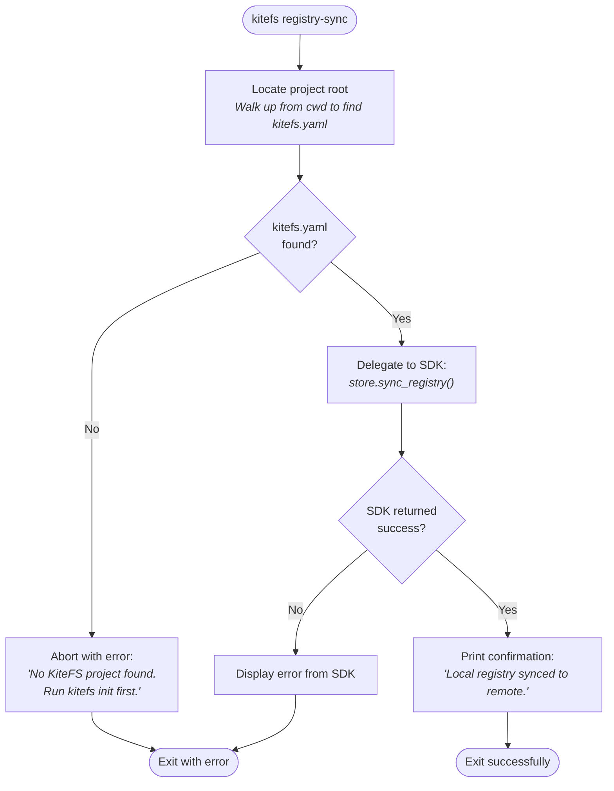
```mermaid
flowchart TD
    START(["kitefs registry-sync"]) --> FIND_ROOT["Locate project root<br><i>Walk up from cwd to find kitefs.yaml</i>"]

    FIND_ROOT --> ROOT_FOUND{"kitefs.yaml<br>found?"}

    ROOT_FOUND -- No --> ABORT_NO_PROJECT["Abort with error:<br><i>'No KiteFS project found.<br>Run kitefs init first.'</i>"]
    ABORT_NO_PROJECT --> END_FAIL(["Exit with error"])

    ROOT_FOUND -- Yes --> DELEGATE["Delegate to SDK:<br><i>store.sync_registry()</i>"]

    DELEGATE --> SDK_RESULT{"SDK returned<br>success?"}

    SDK_RESULT -- No --> SHOW_ERROR["Display error from SDK"]
    SHOW_ERROR --> END_FAIL

    SDK_RESULT -- Yes --> CONFIRM["Print confirmation:<br><i>'Local registry synced to remote.'</i>"]
    CONFIRM --> END_OK(["Exit successfully"])
```

---

### 1.8. `kitefs registry-pull`

Pulls the remote `registry.json` from the configured remote storage and overwrites the local copy. This command takes no parameters. The CLI validates the project root and delegates to `store.pull_registry()` — all download logic lives in the SDK. The only supported remote provider is AWS; the registry is stored on S3.

**Entry point:** `kitefs registry-pull`
**Delegates to:** `store.pull_registry()`

#### Flow Chart

```mermaid
flowchart TD
    START(["kitefs registry-pull"]) --> FIND_ROOT["Locate project root<br><i>Walk up from cwd to find kitefs.yaml</i>"]

    FIND_ROOT --> ROOT_FOUND{"kitefs.yaml<br>found?"}

    ROOT_FOUND -- No --> ABORT_NO_PROJECT["Abort with error:<br><i>'No KiteFS project found.<br>Run kitefs init first.'</i>"]
    ABORT_NO_PROJECT --> END_FAIL(["Exit with error"])

    ROOT_FOUND -- Yes --> DELEGATE["Delegate to SDK:<br><i>store.pull_registry()</i>"]

    DELEGATE --> SDK_RESULT{"SDK returned<br>success?"}

    SDK_RESULT -- No --> SHOW_ERROR["Display error from SDK"]
    SHOW_ERROR --> END_FAIL

    SDK_RESULT -- Yes --> CONFIRM["Print confirmation:<br><i>'Remote registry pulled to local.'</i>"]
    CONFIRM --> END_OK(["Exit successfully"])
```

---

### 1.9. `kitefs mock`

Generates synthetic data for one or all feature groups and writes it to the local offline store. Useful for bootstrapping a local development environment with realistic test data without needing access to a real data source.

**Entry point:** `kitefs mock [feature_group_name] [options]`
**Delegates to:** `store.generate_mock_data(...)`

#### Flow Chart

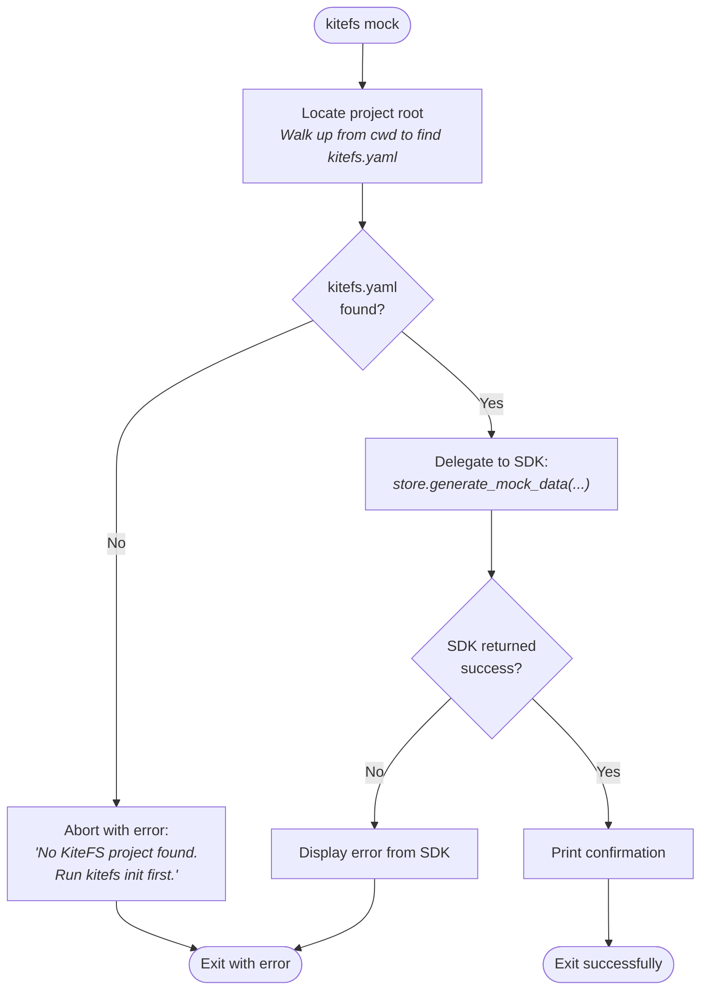
```mermaid
flowchart TD
    START(["kitefs mock"]) --> FIND_ROOT["Locate project root<br><i>Walk up from cwd to find kitefs.yaml</i>"]

    FIND_ROOT --> ROOT_FOUND{"kitefs.yaml<br>found?"}

    ROOT_FOUND -- No --> ABORT_NO_PROJECT["Abort with error:<br><i>'No KiteFS project found.<br>Run kitefs init first.'</i>"]
    ABORT_NO_PROJECT --> END_FAIL(["Exit with error"])

    ROOT_FOUND -- Yes --> DELEGATE["Delegate to SDK:<br><i>store.generate_mock_data(...)</i>"]

    DELEGATE --> SDK_RESULT{"SDK returned<br>success?"}

    SDK_RESULT -- No --> SHOW_ERROR["Display error from SDK"]
    SHOW_ERROR --> END_FAIL

    SDK_RESULT -- Yes --> CONFIRM["Print confirmation"]
    CONFIRM --> END_OK(["Exit successfully"])
```

#### Key Decisions in This Flow

| Decision | Rationale |
| --- | --- |
| Not prioritized for MVP | This is a "Should Have" feature. The full design (parameters, schema-aware generation logic, timestamp strategies) will be defined when this feature is prioritized. Any details discussed earlier are preliminary and subject to change. |

---

### 1.10. `kitefs sample`

Pulls a filtered subset of data from a remote offline store into the local offline store. Useful for working locally with a representative slice of production data without downloading the entire dataset.

**Entry point:** `kitefs sample <feature_group_name> [options]`
**Delegates to:** `store.pull_remote_sample(...)`

#### Flow Chart

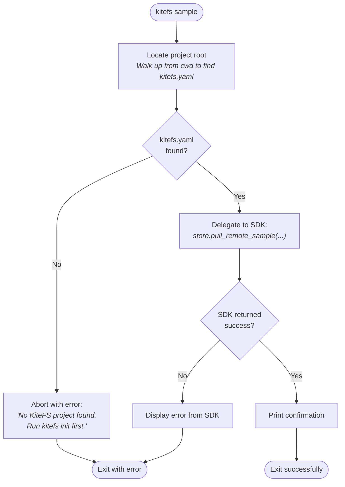
```mermaid
flowchart TD
    START(["kitefs sample"]) --> FIND_ROOT["Locate project root<br><i>Walk up from cwd to find kitefs.yaml</i>"]

    FIND_ROOT --> ROOT_FOUND{"kitefs.yaml<br>found?"}

    ROOT_FOUND -- No --> ABORT_NO_PROJECT["Abort with error:<br><i>'No KiteFS project found.<br>Run kitefs init first.'</i>"]
    ABORT_NO_PROJECT --> END_FAIL(["Exit with error"])

    ROOT_FOUND -- Yes --> DELEGATE["Delegate to SDK:<br><i>store.pull_remote_sample(...)</i>"]

    DELEGATE --> SDK_RESULT{"SDK returned<br>success?"}

    SDK_RESULT -- No --> SHOW_ERROR["Display error from SDK"]
    SHOW_ERROR --> END_FAIL

    SDK_RESULT -- Yes --> CONFIRM["Print confirmation"]
    CONFIRM --> END_OK(["Exit successfully"])
```

#### Key Decisions in This Flow

| Decision | Rationale |
| --- | --- |
| Not prioritized for MVP | This is a "Should Have" feature. The full design (sampling parameters, time range filtering, partition-aware S3 downloads) will be defined when this feature is prioritized. Any details discussed earlier are preliminary and subject to change. |

---

## 2. SDK

### 2.1. `apply()`

Scans the `definitions/` directory, discovers all `FeatureGroup` instances, validates them, and fully regenerates `registry.json`. This is a compile step: source definitions → registry. All-or-nothing — if any definition is invalid, the registry is not updated and all errors are returned.

> **Note:** `apply()` is only invoked from the CLI. It is not intended for programmatic use in notebooks or scripts.

#### Flow Chart

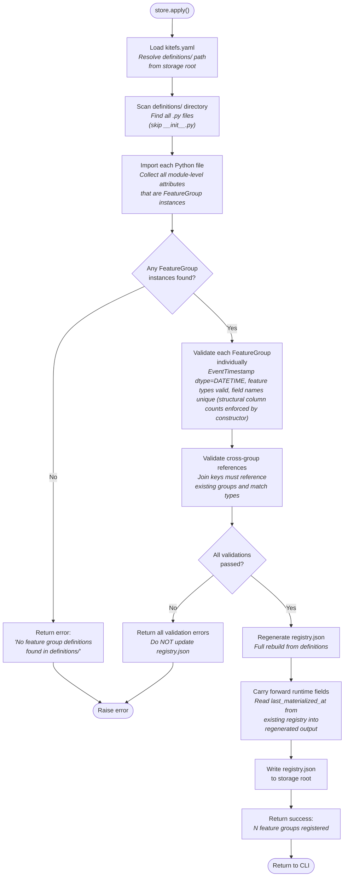
```mermaid
flowchart TD
    START(["store.apply()"]) --> LOAD_CONFIG["Load kitefs.yaml<br><i>Resolve definitions/ path<br>from storage root</i>"]

    LOAD_CONFIG --> SCAN_DEFS["Scan definitions/ directory<br><i>Find all .py files<br>(skip __init__.py)</i>"]

    SCAN_DEFS --> IMPORT_MODULES["Import each Python file<br><i>Collect all module-level attributes<br>that are FeatureGroup instances<br></i>"]

    IMPORT_MODULES --> ANY_FOUND{"Any FeatureGroup<br>instances found?"}

    ANY_FOUND -- No --> ABORT_EMPTY["Return error:<br><i>'No feature group definitions<br>found in definitions/'</i>"]
    ABORT_EMPTY --> END_FAIL(["Raise error"])

    ANY_FOUND -- Yes --> VALIDATE_EACH["Validate each FeatureGroup<br>individually<br><i>EventTimestamp dtype=DATETIME, feature types valid, field names unique (structural column counts enforced by constructor)</i>"]

    VALIDATE_EACH --> VALIDATE_CROSS["Validate cross-group references<br><i>Join keys must reference<br>existing groups and match types</i>"]

    VALIDATE_CROSS --> ALL_VALID{"All validations<br>passed?"}

    ALL_VALID -- No --> REPORT_ERRORS["Return all validation errors<br><i>Do NOT update registry.json</i>"]
    REPORT_ERRORS --> END_FAIL

    ALL_VALID -- Yes --> GENERATE_REGISTRY["Regenerate registry.json<br><i>Full rebuild from definitions</i>"]

    GENERATE_REGISTRY --> CARRY_FORWARD["Carry forward runtime fields<br><i>Read last_materialized_at from<br>existing registry into<br>regenerated output</i>"]

    CARRY_FORWARD --> WRITE_REGISTRY["Write registry.json<br>to storage root"]

    WRITE_REGISTRY --> SUCCESS["Return success:<br><i>N feature groups registered</i>"]

    SUCCESS --> END_OK(["Return to CLI"])
```

#### Key Decisions in This Flow

| Decision                           | Rationale                                                                                                                                                                                                                              |
| ---------------------------------- | -------------------------------------------------------------------------------------------------------------------------------------------------------------------------------------------------------------------------------------- |
| Full regeneration, not incremental | The `definitions/` directory is the single source of truth. Registry is a derived artifact — rebuilt entirely each time. This eliminates drift: if a definition file is deleted, the group disappears from the registry automatically. |
| Only `definitions/` is scanned     | Convention over configuration. A single, well-known location keeps discovery simple and predictable. No configuration needed.                                                                                                          |
| All-or-nothing validation          | If any definition is invalid, the entire apply fails and the registry is unchanged. This prevents a partially valid registry that could cause downstream errors during ingest or query.                                                |
| Discovery via `isinstance` check   | Module-level attributes are inspected for `FeatureGroup` type. No decorators, naming conventions, or registration calls needed — just define the object.                                                                               |
| `apply()` is CLI-only              | Feature group definitions are code artifacts managed in files. Applying them is a project-level operation (like a build), not a runtime SDK call. This keeps the SDK focused on data operations.                                       |
| Skip `__init__.py` during scan     | `__init__.py` is a package marker, not a definition file. Scanning it could cause import side effects or false positives.                                                                                                              |

---

### 2.2. `ingest(feature_group_name, data)`

Ingests data into the offline store for a registered feature group. This flow chart covers the `local` provider only. The `data` argument accepts a Pandas DataFrame, a local CSV file path, or a local Parquet file path. At a high level, `ingest()` loads the feature group definition, resolves the input into a DataFrame, validates it according to the feature group's ingestion validation mode (`ERROR`, `FILTER`, or `NONE`), and appends the accepted records to the local offline store. It does not write to the online store; that is handled later by `materialize()`.

#### Flow Chart

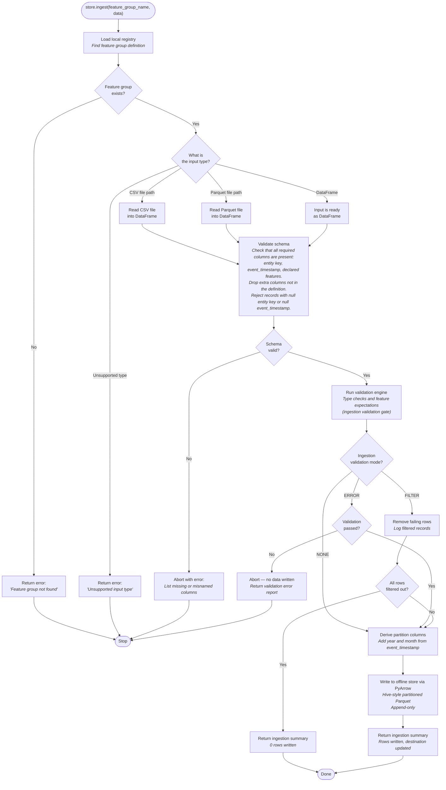
```mermaid
flowchart TD
    START(["store.ingest(feature_group_name, data)"]) --> LOAD_REGISTRY["Load local registry<br><i>Find feature group definition</i>"]

    LOAD_REGISTRY --> FG_FOUND{"Feature group<br>exists?"}

    FG_FOUND -- No --> ABORT_MISSING["Return error:<br><i>'Feature group not found'</i>"]
    ABORT_MISSING --> END_FAIL(["Stop"])

    FG_FOUND -- Yes --> DETECT_INPUT{"What is<br>the input type?"}

    DETECT_INPUT -- "DataFrame" --> READY["Input is ready<br>as DataFrame"]
    DETECT_INPUT -- "CSV file path" --> LOAD_CSV["Read CSV file<br>into DataFrame"]
    DETECT_INPUT -- "Parquet file path" --> LOAD_PARQUET["Read Parquet file<br>into DataFrame"]
    DETECT_INPUT -- "Unsupported type" --> ABORT_TYPE["Return error:<br><i>'Unsupported input type'</i>"]
    ABORT_TYPE --> END_FAIL

    LOAD_CSV --> SCHEMA_CHECK
    LOAD_PARQUET --> SCHEMA_CHECK
    READY --> SCHEMA_CHECK

    SCHEMA_CHECK["Validate schema<br><i>Check that all required columns are present:<br>entity key, event_timestamp, declared features.<br>Drop extra columns not in the definition.<br>Reject records with null entity key or null event_timestamp.</i>"]

    SCHEMA_CHECK --> SCHEMA_VALID{"Schema<br>valid?"}

    SCHEMA_VALID -- No --> ABORT_SCHEMA["Abort with error:<br><i>List missing or misnamed columns</i>"]
    ABORT_SCHEMA --> END_FAIL

    SCHEMA_VALID -- Yes --> VALIDATE_DATA

    VALIDATE_DATA["Run validation engine<br><i>Type checks and feature expectations<br>(ingestion validation gate)</i>"]

    VALIDATE_DATA --> INGEST_MODE{"Ingestion<br>validation mode?"}

    INGEST_MODE -- "NONE" --> DERIVE_PARTITIONS
    INGEST_MODE -- "ERROR" --> ERROR_CHECK{"Validation<br>passed?"}
    INGEST_MODE -- "FILTER" --> FILTER_ROWS["Remove failing rows<br><i>Log filtered records</i>"]

    ERROR_CHECK -- No --> ABORT_ERROR["Abort — no data written<br><i>Return validation error report</i>"]
    ABORT_ERROR --> END_FAIL

    ERROR_CHECK -- Yes --> DERIVE_PARTITIONS

    FILTER_ROWS --> FILTER_EMPTY{"All rows<br>filtered out?"}

    FILTER_EMPTY -- Yes --> RETURN_EMPTY["Return ingestion summary<br><i>0 rows written</i>"]
    RETURN_EMPTY --> END_OK(["Done"])

    FILTER_EMPTY -- No --> DERIVE_PARTITIONS

    DERIVE_PARTITIONS["Derive partition columns<br><i>Add year and month from event_timestamp</i>"]

    DERIVE_PARTITIONS --> WRITE_OFFLINE["Write to offline store via PyArrow<br><i>Hive-style partitioned Parquet<br>Append-only</i>"]

    WRITE_OFFLINE --> SUCCESS["Return ingestion summary<br><i>Rows written, destination updated</i>"]

    SUCCESS --> END_OK
```

#### Key Decisions in This Flow

| Decision                                        | Rationale                                                                                                                                                                                                                                                                                                                                                        |
| ----------------------------------------------- | ---------------------------------------------------------------------------------------------------------------------------------------------------------------------------------------------------------------------------------------------------------------------------------------------------------------------------------------------------------------- |
| Local provider only                             | This chart intentionally covers only the `local` provider path. AWS and other providers are out of scope for now.                                                                                                                                                                                                                                                |
| Accepts DataFrame, CSV, or Parquet              | Users can ingest directly from memory or from files without pre-loading. Input is normalised into a DataFrame before any processing.                                                                                                                                                                                                                             |
| Ingest writes only to the offline store         | Offline ingestion and online serving stay separate. The online store is updated later through `materialize()`.                                                                                                                                                                                                                                                   |
| Validation uses the ingestion validation gate   | The same stateless validation engine used at retrieval runs here. It checks type constraints and feature expectations in a single pass. The ingestion validation mode (`ERROR`, `FILTER`, or `NONE`) determines what happens with the results.                                                                                                                   |
| ERROR mode is the default for ingestion         | Ingestion defaults to `ERROR` — all-or-nothing. If any row fails validation, nothing is written. This keeps the offline store clean by default.                                                                                                                                                                                                  |
| FILTER mode removes failing rows before write   | Invalid rows are discarded; valid rows proceed to write. If all rows are filtered out, the operation completes with 0 rows written rather than raising an error — the user asked to filter, and filtering removed everything.                                                                                                                                    |
| Schema validation always runs before the validation engine | Schema validation (column presence, null structural column values, and column naming) is a structural pre-condition — not a data quality check. It runs unconditionally between input resolution and the validation engine gate, regardless of the ingestion validation mode. This includes rejecting records where `entity_key` or `event_timestamp` is null — these are treated as schema failures, not data quality failures, because null event timestamps cannot be partitioned and `Expect` is not available on structural columns. If schema validation fails for any reason, the operation fails with an error even in `NONE` mode. This prevents writing structurally invalid data to the offline store. |
| Extra columns silently dropped at schema validation | Tolerates common scenarios like helper columns left over from feature engineering or DataFrames with more columns than a single feature group needs. Only columns declared in the definition (entity key, event timestamp, features) proceed past schema validation. Documented in FR-ING-002 and BB-05 (docs-03-02 §2.5). |
| NONE mode skips the validation engine            | For bulk loads of pre-validated data, users can opt out of the validation engine (type checks and feature expectations on `Feature` fields — Phase 2). Schema validation still runs — `NONE` only bypasses Phase 2 data-quality checks, not Phase 1 structural checks. Null `entity_key` or `event_timestamp` values are rejected even in `NONE` mode.                                                                                                                            |
| Offline writes are append-only                  | New ingested data is added to the existing offline dataset rather than replacing prior data.                                                                                                                                                                                                                                                                     |
| PyArrow `write_to_dataset` handles partitioning | PyArrow's `write_to_dataset` with `partition_cols=["year", "month"]` natively creates Hive-style `year=YYYY/month=MM/` directories and generates unique filenames per write, satisfying append-only semantics. No manual directory management needed. The only prerequisite is deriving `year` and `month` columns from `event_timestamp` before the write call. |

---

### 2.3. `get_historical_features(from_, select, where, join)`

Retrieves historical feature data from the local offline store for model training. The base feature group (`from_`) drives the output rows. An optional time-range filter (`where`) narrows which base records are returned. An optional `join` connects additional feature groups using a point-in-time correct strategy: for each base record, only the most recent record from the joined group whose `event_timestamp` is ≤ the base record's `event_timestamp` is used. This prevents data leakage. After reading and filtering each feature group, the requested features are narrowed via `select` before validation — ensuring only the features being returned are validated. Each feature group's selected data is validated independently according to its offline retrieval validation mode (`ERROR`, `FILTER`, or `NONE`) before any joins are attempted. After the join, column name conflicts between the base and joined groups are resolved by prefixing conflicting joined columns with the joined group's name (FR-OFF-010). Returns a Pandas DataFrame.

#### Flow Chart

```mermaid
flowchart TD
    START(["store.get_historical_features(from_, select, where, join)"]) --> LOAD_REGISTRY["Load local registry<br><i>Resolve all referenced feature groups</i>"]

    LOAD_REGISTRY --> VALIDATE_PARAMS["Validate query parameters<br><i>Check from_ exists in registry<br>If join: enforce single-join limit (FR-OFF-009)<br>If join: check joined groups exist<br>If join: check select is a dict<br>If join: check valid join path exists<br>Validate select references<br>Validate where structure</i>"]

    VALIDATE_PARAMS --> PARAMS_VALID{"All checks<br>passed?"}

    PARAMS_VALID -- No --> ABORT_PARAMS["Return error:<br><i>Clear message identifying<br>the invalid parameter</i>"]
    ABORT_PARAMS --> END_FAIL(["Stop"])

    PARAMS_VALID -- Yes --> READ_BASE["Read base feature group<br>from local offline store via PyArrow<br><i>Partition pruning if where provided</i>"]

    READ_BASE --> APPLY_WHERE["Apply row-level where filter<br><i>Narrow by exact event_timestamp<br>within loaded partitions (if provided)</i>"]

    APPLY_WHERE --> BASE_EMPTY{"Base DataFrame<br>empty?"}

    BASE_EMPTY -- Yes --> RETURN_EMPTY["Return empty DataFrame"]
    RETURN_EMPTY --> END_OK(["Done"])

    BASE_EMPTY -- No --> SELECT_BASE["Apply select on base<br><i>Keep entity_key, event_timestamp,<br>join keys + selected base features</i>"]

    SELECT_BASE --> VALIDATE_BASE["Validate base feature group<br><i>Offline retrieval validation gate<br>(selected features only)</i>"]

    VALIDATE_BASE --> BASE_MODE{"Base retrieval<br>validation mode?"}

    BASE_MODE -- "NONE" --> JOIN_CHECK
    BASE_MODE -- "ERROR" --> BASE_ERROR_CHECK{"Base validation<br>passed?"}
    BASE_MODE -- "FILTER" --> BASE_FILTER["Remove failing rows<br><i>Log filtered records</i>"]

    BASE_ERROR_CHECK -- No --> ABORT_ERROR["Abort entire operation<br><i>Return validation error report</i>"]
    ABORT_ERROR --> END_FAIL

    BASE_ERROR_CHECK -- Yes --> JOIN_CHECK

    BASE_FILTER --> BASE_FILTER_EMPTY{"All rows<br>filtered out?"}

    BASE_FILTER_EMPTY -- Yes --> RETURN_EMPTY
    BASE_FILTER_EMPTY -- No --> JOIN_CHECK

    JOIN_CHECK{"join<br>provided?"}

    JOIN_CHECK -- No --> RETURN_DF["Return DataFrame<br><i>Base entity key + event_timestamp<br>+ selected features</i>"]

    JOIN_CHECK -- Yes --> READ_JOINED["Read each joined feature group<br>from local offline store via PyArrow<br><i>Partition pruning using<br>base timestamp upper bound</i>"]

    READ_JOINED --> SELECT_JOINED["Apply select on joined<br><i>Keep join key, event_timestamp<br>+ selected joined features</i>"]

    SELECT_JOINED --> VALIDATE_JOINED["Validate each joined feature group<br><i>Offline retrieval validation gate per group<br>(selected features only)</i>"]

    VALIDATE_JOINED --> JOINED_MODE{"Joined group<br>validation mode?"}

    JOINED_MODE -- "NONE" --> PIT_JOIN
    JOINED_MODE -- "ERROR" --> JOINED_ERROR_CHECK{"Joined validation<br>passed?"}
    JOINED_MODE -- "FILTER" --> JOINED_FILTER["Remove failing rows<br>from joined group<br><i>Log filtered records</i>"]

    JOINED_ERROR_CHECK -- No --> ABORT_ERROR

    JOINED_ERROR_CHECK -- Yes --> PIT_JOIN

    JOINED_FILTER --> PIT_JOIN

    PIT_JOIN["Point-in-time correct join<br><i>For each base record: match the most recent<br>joined record where joined.event_timestamp<br>≤ base.event_timestamp</i>"]

    PIT_JOIN --> FILL_NULLS["Fill nulls where no<br>matching joined record exists"]

    FILL_NULLS --> RESOLVE_COLUMNS["Resolve column name conflicts<br><i>Prefix conflicting joined columns<br>with joined group name (FR-OFF-010)</i>"]

    RESOLVE_COLUMNS --> RETURN_DF

    RETURN_DF --> END_OK
```

#### Key Decisions in This Flow

| Decision                                                  | Rationale                                                                                                                                                                                                                                                                                                                                                                                                                                                                                                                                                                                                                                                                                  |
| --------------------------------------------------------- | ------------------------------------------------------------------------------------------------------------------------------------------------------------------------------------------------------------------------------------------------------------------------------------------------------------------------------------------------------------------------------------------------------------------------------------------------------------------------------------------------------------------------------------------------------------------------------------------------------------------------------------------------------------------------------------------ |
| Local offline store only                                  | Reads Parquet files from `data/offline_store/`. AWS is out of scope for this chart.                                                                                                                                                                                                                                                                                                                                                                                                                                                                                                                                                                                                        |
| Upfront parameter validation                              | All query parameters (group existence, join paths, select shape, where structure) are validated before any data is read. Fail fast, fail cheap. **MVP:** the join parameter is limited to a single feature group (FR-OFF-009); the system rejects calls with more than one joined group. This check is isolated in validation and easy to relax for future multi-join support.                                                                                                                                                                                                                                                                                                                                                                                                                                                                                                                                                                                                                       |
| Partition pruning on read via PyArrow                     | PyArrow's dataset API auto-discovers Hive-style `year=YYYY/month=MM/` partitions and reads only the directories matching a filter. For the base group, the `where` timestamp range is converted to year/month bounds.                                                                                                                                                                                                                                                                                                                                                                                                                                                                      |
| Two-level filtering for base group                        | Coarse partition pruning (month-level) reduces I/O by skipping entire directories. Fine row-level filtering (exact datetime) then ensures precision within the loaded partitions.                                                                                                                                                                                                                                                                                                                                                                                                                                                                                                          |
| Joined group partition pruning via base upper bound (MVP) | The joined group has no `where` clause, but a useful upper bound can be derived from the base data. After the base is loaded and filtered, compute `max(base.event_timestamp)` and use it to prune joined partitions. For example: if the base spans Feb–Dec 2024, then `max = 2024-12-31`. PyArrow reads joined partitions up to `year=2024/month=12` and skips anything after (e.g., `year=2025/*`). There is no lower bound in the MVP — a base record from Feb 2024 might PIT-match a joined record from 2020 if that is the most recent one available. This means the joined group's full history up to the upper bound month is read. This is sufficient for the MVP's data volumes. |
| TTL-based lower bound for joined groups (post-MVP)        | A `ttl` (time-to-live) field on the feature group definition would express "a feature value is only valid for N days after its event_timestamp." With TTL, the lower bound for joined partitions becomes `min(base.event_timestamp) - ttl`, dramatically reducing the read window for long-history joined groups. For example: with TTL=90 days and a base spanning Feb–Dec 2024, joined partitions would be read from Nov 2023 onward instead of from the beginning. Records older than TTL that would otherwise be the best PIT match are treated as expired — joined columns get NULLs. This may be added after the MVP.                                                                |
| Pre-join validation                                       | After narrowing each feature group to only the selected features (plus structural columns), the selected data is validated independently using that group's configured offline retrieval validation mode. The validation engine runs type checks and feature expectations together as a single pass (they are not independently toggleable). Validating only selected features ensures that quality issues in unrequested features cannot block retrieval of valid requested features — ingestion validation is the gate for catching full-dataset quality issues. The validation engine remains stateless and reusable — the same engine used at ingestion is called again at retrieval.                                                                                                                                                                                                                                                                                                                                                                                                                                        |
| ERROR mode aborts the entire query                        | If any feature group (base or joined) has retrieval mode `ERROR` and its data fails validation, the entire `get_historical_features` call is rejected — even if other groups passed. This is consistent with ERROR semantics at ingestion: all-or-nothing. A query that silently joins clean base data with invalid joined data would violate the user's intent.                                                                                                                                                                                                                                                                                                                           |
| FILTER mode: filter-then-join                             | When a joined group's retrieval mode is `FILTER`, invalid rows are removed from that group before the PIT join. The join then operates on the remaining valid records. If the best temporal match for a base row was filtered out, the PIT join naturally finds the next-most-recent valid record — or returns NULLs if none exists. No special logic needed beyond filtering before joining.                                                                                                                                                                                                                                                                                              |
| Point-in-time correct join                                | Prevents data leakage: only features known at the time of each base event are used. Critical for unbiased training data.                                                                                                                                                                                                                                                                                                                                                                                                                                                                                                                                                                   |
| Nulls for unmatched joins                                 | If no matching joined record exists for a base row (or all matches were filtered/expired), joined columns are null rather than dropping the row. All base records are preserved.                                                                                                                                                                                                                                                                                                                                                                                                                                                                                                           |
| `from_` drives output rows                                | The base feature group defines the cardinality and time axis of the result. Joined groups only add columns.                                                                                                                                                                                                                                                                                                                                                                                                                                                                                                                                                                                |
| Column conflict resolution via joined group name prefix    | After the PIT join, any joined column whose name conflicts with a base column is prefixed with `{joined_group_name}_`. Base columns are never renamed; non-conflicting joined columns keep their original names. The joined group's `event_timestamp` always conflicts (both groups have one by definition) and is always prefixed (e.g., `town_market_features_event_timestamp`). The join key column is not duplicated — it appears once from the base group. This convention mirrors SQL's table-qualified column references (`table.column`) and is deterministic from registry metadata. (FR-OFF-010) |

---

### 2.4. `get_online_features(from_, select, where)`

Retrieves the latest feature values for a given entity key from the local online store for low-latency serving at inference time. The feature group must have `storage=OFFLINE_AND_ONLINE` and must have been materialized beforehand. The `where` parameter follows the unified format (`{field: {operator: value}}` — see FR-OFF-007). **MVP restriction:** only the entity key field is accepted as a field name, only the `eq` operator is accepted, and only a single value is allowed (e.g., `where={"town_id": {"eq": 1}}`). Returns `dict | None` — a dict of feature values (including structural columns) if the entity key exists, or `None` if it does not.

#### Flow Chart

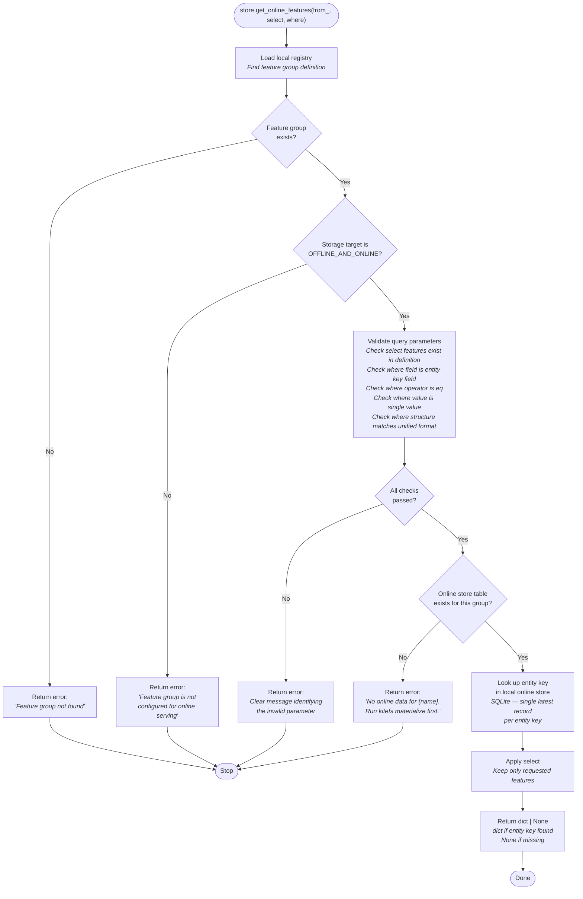
```mermaid
flowchart TD
    START(["store.get_online_features(from_, select, where)"]) --> LOAD_REGISTRY["Load local registry<br><i>Find feature group definition</i>"]

    LOAD_REGISTRY --> FG_FOUND{"Feature group<br>exists?"}

    FG_FOUND -- No --> ABORT_MISSING["Return error:<br><i>'Feature group not found'</i>"]
    ABORT_MISSING --> END_FAIL(["Stop"])

    FG_FOUND -- Yes --> CHECK_STORAGE{"Storage target is<br>OFFLINE_AND_ONLINE?"}

    CHECK_STORAGE -- No --> ABORT_STORAGE["Return error:<br><i>'Feature group is not<br>configured for online serving'</i>"]
    ABORT_STORAGE --> END_FAIL

    CHECK_STORAGE -- Yes --> VALIDATE_PARAMS["Validate query parameters<br><i>Check select features exist in definition<br>Check where field is entity key field<br>Check where operator is eq<br>Check where value is single value<br>Check where structure matches unified format</i>"]

    VALIDATE_PARAMS --> PARAMS_VALID{"All checks<br>passed?"}

    PARAMS_VALID -- No --> ABORT_PARAMS["Return error:<br><i>Clear message identifying<br>the invalid parameter</i>"]
    ABORT_PARAMS --> END_FAIL

    PARAMS_VALID -- Yes --> CHECK_TABLE{"Online store table<br>exists for this group?"}

    CHECK_TABLE -- No --> ABORT_TABLE["Return error:<br><i>'No online data for {name}.<br>Run kitefs materialize first.'</i>"]
    ABORT_TABLE --> END_FAIL

    CHECK_TABLE -- Yes --> LOOKUP_ONLINE["Look up entity key<br>in local online store<br><i>SQLite — single latest record<br>per entity key</i>"]

    LOOKUP_ONLINE --> APPLY_SELECT["Apply select<br><i>Keep only requested features</i>"]

    APPLY_SELECT --> RETURN_RESULT["Return dict | None<br><i>dict if entity key found<br>None if missing</i>"]

    RETURN_RESULT --> END_OK(["Done"])
```

#### Key Decisions in This Flow

| Decision                               | Rationale                                                                                                                        |
| -------------------------------------- | -------------------------------------------------------------------------------------------------------------------------------- |
| Local online store only                | Reads from SQLite in `data/online_store/`. AWS DynamoDB is out of scope for this chart.                                          |
| Must be `OFFLINE_AND_ONLINE`           | Online store only holds groups explicitly configured for serving. Attempting to query a non-materialized group returns an error. |
| Table-not-exists check                 | If the feature group's online store table does not exist (i.e., `materialize()` has never been run), the system returns a clear error with a materialization hint — rather than returning an empty result or raising a cryptic database error. This follows the ORM pattern of distinguishing "no matching rows" from "table not created yet." |
| Upfront parameter validation           | All query parameters (`select` features, `where` field, `where` operator, `where` value) are validated against the unified where format before touching data. MVP enforces entity-key-only field and `eq`-only operator. Consistent with `get_historical_features()` — fail fast, fail cheap. |
| Returns `None` for missing entity keys | Returns `None` (not an exception) when the entity key does not exist in the online store. Allows callers to detect missing entities without exception handling.              |
| Returns latest values only             | The online store holds one record per entity key — the result of the last `materialize()`. No history is available here.         |

---

### 2.5. `materialize(feature_group_name=None)`

Reads offline store data, extracts the latest value per entity key, and writes to the online store. This flow chart covers the `local` provider only — offline store is Parquet files, online store is SQLite. The `feature_group_name` argument is optional: if provided, only that group is materialized; if omitted, all groups configured as `OFFLINE_AND_ONLINE` are materialized.

#### Flow Chart

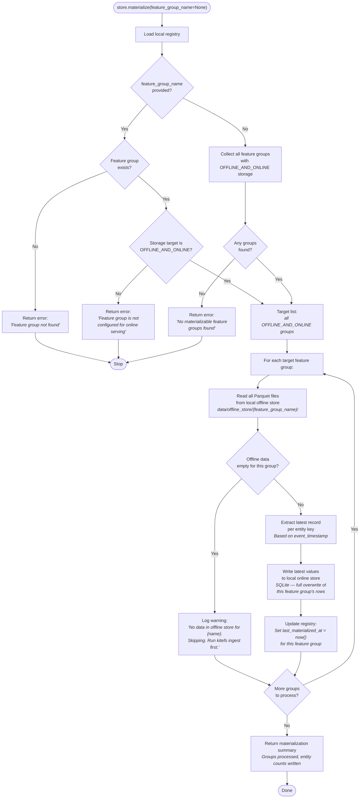
```mermaid
flowchart TD
    START(["store.materialize(feature_group_name=None)"]) --> LOAD_REGISTRY["Load local registry"]

    LOAD_REGISTRY --> NAME_PROVIDED{"feature_group_name<br>provided?"}

    NAME_PROVIDED -- Yes --> FG_FOUND{"Feature group<br>exists?"}

    FG_FOUND -- No --> ABORT_MISSING["Return error:<br><i>'Feature group not found'</i>"]
    ABORT_MISSING --> END_FAIL(["Stop"])

    FG_FOUND -- Yes --> CHECK_STORAGE{"Storage target is<br>OFFLINE_AND_ONLINE?"}

    CHECK_STORAGE -- No --> ABORT_STORAGE["Return error:<br><i>'Feature group is not<br>configured for online serving'</i>"]
    ABORT_STORAGE --> END_FAIL

    CHECK_STORAGE -- Yes --> TARGETS["Target list:<br><i>single feature group</i>"]

    NAME_PROVIDED -- No --> COLLECT_ALL["Collect all feature groups<br>with OFFLINE_AND_ONLINE storage"]

    COLLECT_ALL --> ANY_FOUND{"Any groups<br>found?"}

    ANY_FOUND -- No --> ABORT_NONE["Return error:<br><i>'No materializable feature<br>groups found'</i>"]
    ABORT_NONE --> END_FAIL

    ANY_FOUND -- Yes --> TARGETS["Target list:<br><i>all OFFLINE_AND_ONLINE groups</i>"]

    TARGETS --> FOR_EACH["For each target feature group:"]

    FOR_EACH --> READ_OFFLINE["Read all Parquet files<br>from local offline store<br><i>data/offline_store/{feature_group_name}/</i>"]

    READ_OFFLINE --> OFFLINE_EMPTY{"Offline data<br>empty for this group?"}

    OFFLINE_EMPTY -- Yes --> WARN_SKIP["Log warning:<br><i>'No data in offline store for {name}.<br>Skipping. Run kitefs ingest first.'</i>"]
    WARN_SKIP --> NEXT

    OFFLINE_EMPTY -- No --> EXTRACT_LATEST["Extract latest record<br>per entity key<br><i>Based on event_timestamp</i>"]

    EXTRACT_LATEST --> WRITE_ONLINE["Write latest values<br>to local online store<br><i>SQLite — full overwrite of<br>this feature group's rows</i>"]

    WRITE_ONLINE --> UPDATE_REGISTRY["Update registry:<br><i>Set last_materialized_at = now()<br>for this feature group</i>"]

    UPDATE_REGISTRY --> NEXT{"More groups<br>to process?"}

    NEXT -- Yes --> FOR_EACH
    NEXT -- No --> SUCCESS["Return materialization summary<br><i>Groups processed, entity counts written</i>"]

    SUCCESS --> END_OK(["Done"])
```

#### Key Decisions in This Flow

| Decision                                             | Rationale                                                                                                                |
| ---------------------------------------------------- | ------------------------------------------------------------------------------------------------------------------------ |
| Local provider only                                  | This chart covers only the `local` provider path. Offline store is Parquet; online store is SQLite.                      |
| Optional feature group name                          | Running without a name materializes all eligible groups in one command — useful for a full refresh after bulk ingestion. |
| Only `OFFLINE_AND_ONLINE` groups can be materialized | Groups stored as `OFFLINE` only are not intended for low-latency online serving.                                         |
| Skip with warning when offline store is empty        | If a feature group has no data in the offline store, materializing it would overwrite existing online store rows with nothing. Instead, the group is skipped with a warning guiding the user to ingest data first. This avoids silent data loss and surfaces a likely user error. |
| Latest value per entity key                          | The online store holds a current-state snapshot — one row per entity. All history lives in the offline store.            |
| Full overwrite per group in the online store         | Simplest correct approach for MVP: replaces all existing rows for a feature group with freshly computed latest values.   |
| Registry update after each group                     | After successfully writing to the online store, `last_materialized_at` is set to the current timestamp in the registry entry for that feature group. This provides traceability and supports future incremental materialization. The update happens per group, not at the end — if a multi-group run fails midway, already-materialized groups have accurate timestamps. |

---

### 2.6. `list_feature_groups(format, target)`

Returns a summary of all registered feature groups. Reads from `registry.json` (the compiled output of `apply()`), not from `definitions/`. Returns a list of dicts — one per feature group — containing key metadata. Returns an empty list if no feature groups are registered. By default, the SDK returns structured Python data (list of dicts). When `target` is provided, the SDK serializes as JSON and writes the file. When `format="json"` is provided without a target, the SDK returns a JSON string.

#### Flow Chart

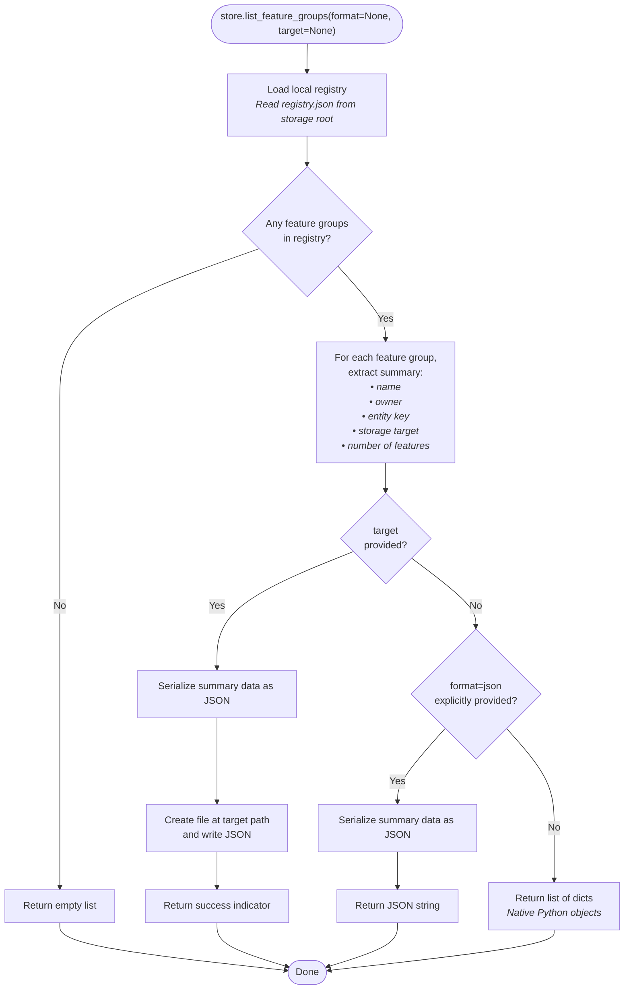
```mermaid
flowchart TD
    START(["store.list_feature_groups(format=None, target=None)"]) --> LOAD_REGISTRY["Load local registry<br><i>Read registry.json from storage root</i>"]

    LOAD_REGISTRY --> ANY_GROUPS{"Any feature groups<br>in registry?"}

    ANY_GROUPS -- No --> RETURN_EMPTY["Return empty list"]
    RETURN_EMPTY --> END_OK(["Done"])

    ANY_GROUPS -- Yes --> EXTRACT_SUMMARIES["For each feature group,<br>extract summary:<br><i>• name<br>• owner<br>• entity key<br>• storage target<br>• number of features</i>"]

    EXTRACT_SUMMARIES --> CHECK_TARGET{"target<br>provided?"}

    CHECK_TARGET -- Yes --> SERIALIZE_FILE["Serialize summary data as JSON"]
    SERIALIZE_FILE --> WRITE_FILE["Create file at target path<br>and write JSON"]
    WRITE_FILE --> RETURN_SUCCESS["Return success indicator"]
    RETURN_SUCCESS --> END_OK

    CHECK_TARGET -- No --> CHECK_FORMAT{"format=json<br>explicitly provided?"}

    CHECK_FORMAT -- Yes --> SERIALIZE_RETURN["Serialize summary data as JSON"]
    SERIALIZE_RETURN --> RETURN_JSON["Return JSON string"]
    RETURN_JSON --> END_OK

    CHECK_FORMAT -- No --> RETURN_STRUCTURED["Return list of dicts<br><i>Native Python objects</i>"]
    RETURN_STRUCTURED --> END_OK
```

#### Key Decisions in This Flow

| Decision | Rationale |
| --- | --- |
| Reads from `registry.json`, not `definitions/` | The registry is the compiled source of truth after `apply()`. Reading definitions would require re-importing Python modules and re-running discovery — that is `apply()`'s job, not `list()`'s. |
| Returns empty list when no groups exist | Zero registered groups is a valid state, not an error. Callers (CLI or notebook) decide how to present this. |
| Summary includes name, owner, entity key, storage target, feature count | These five fields provide enough context to identify a group and its ownership, and decide whether to inspect further with `describe`. Intentionally minimal — full details are available via `describe_feature_group()`. |
| Default return is structured Python data (list of dicts) | Consistent with the ORM-like design philosophy. SDK users in notebooks and scripts get native Python objects they can work with directly — no deserialization needed. The CLI receives structured data and renders it as a human-readable table. |
| `target` provided → serialize JSON, write file, return success | When a target file path is given, the SDK serializes the data as JSON, creates the file, and returns a success indicator. Serialization only happens when file output is explicitly requested. |
| `format="json"` without target → return JSON string | When the user explicitly asks for JSON but provides no file path, the SDK returns a JSON string. This supports scripting and automation use cases where the caller wants serialized output. |
| No target, no format → return native Python objects | The SDK's default behavior is to return structured data. This keeps the SDK simple and idiomatic — callers get objects, not strings. |

---

### 2.7. `describe_feature_group(name, format, target)`

Returns the full definition of a single registered feature group. Reads from `registry.json` and returns all metadata, features with their types, join key declarations, validation modes, and storage configuration. Returns an error if the named group does not exist in the registry. By default, the SDK returns structured Python data (dict). When `target` is provided, the SDK serializes as JSON and writes the file. When `format="json"` is provided without a target, the SDK returns a JSON string.

#### Flow Chart

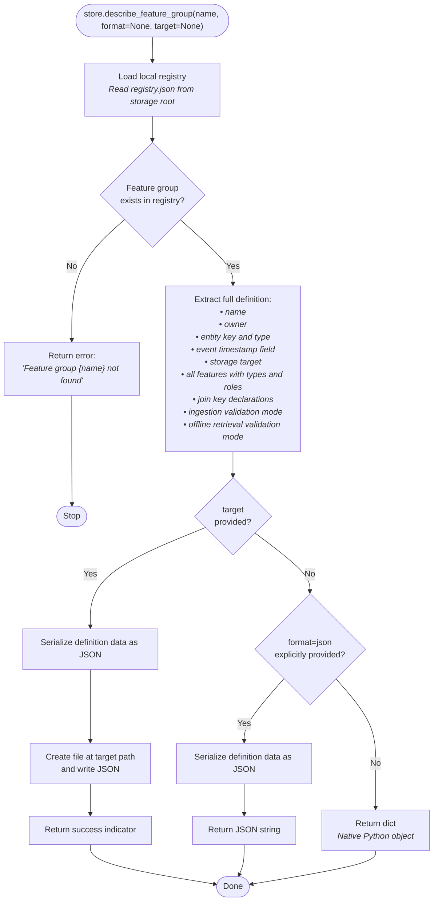
```mermaid
flowchart TD
    START(["store.describe_feature_group(name, format=None, target=None)"]) --> LOAD_REGISTRY["Load local registry<br><i>Read registry.json from storage root</i>"]

    LOAD_REGISTRY --> FG_FOUND{"Feature group<br>exists in registry?"}

    FG_FOUND -- No --> ABORT_MISSING["Return error:<br><i>'Feature group {name} not found'</i>"]
    ABORT_MISSING --> END_FAIL(["Stop"])

    FG_FOUND -- Yes --> EXTRACT_FULL["Extract full definition:<br><i>• name<br>• owner<br>• entity key and type<br>• event timestamp field<br>• storage target<br>• all features with types and roles<br>• join key declarations<br>• ingestion validation mode<br>• offline retrieval validation mode</i>"]

    EXTRACT_FULL --> CHECK_TARGET{"target<br>provided?"}

    CHECK_TARGET -- Yes --> SERIALIZE_FILE["Serialize definition data as JSON"]
    SERIALIZE_FILE --> WRITE_FILE["Create file at target path<br>and write JSON"]
    WRITE_FILE --> RETURN_SUCCESS["Return success indicator"]
    RETURN_SUCCESS --> END_OK(["Done"])

    CHECK_TARGET -- No --> CHECK_FORMAT{"format=json<br>explicitly provided?"}

    CHECK_FORMAT -- Yes --> SERIALIZE_RETURN["Serialize definition data as JSON"]
    SERIALIZE_RETURN --> RETURN_JSON["Return JSON string"]
    RETURN_JSON --> END_OK

    CHECK_FORMAT -- No --> RETURN_STRUCTURED["Return dict<br><i>Native Python object</i>"]
    RETURN_STRUCTURED --> END_OK
```

#### Key Decisions in This Flow

| Decision | Rationale |
| --- | --- |
| Reads from `registry.json`, not `definitions/` | Same rationale as `list_feature_groups()` — the registry is the compiled source of truth. |
| Exact name match, no fuzzy matching | Feature group names are identifiers used programmatically (in `ingest`, `materialize`, `get_historical_features`). Fuzzy matching would introduce ambiguity. If the name does not match exactly, it is an error. |
| Error when group not found | Consistent with `ingest()`, `materialize()`, and `get_online_features()`, which all fail when referencing a non-existent feature group. |
| Returns full registry entry | Includes everything the registry knows about this group: owner, entity key, event timestamp, storage target, all features with types and roles, join keys, and validation modes. |
| Includes validation modes in the output | Validation modes (ingestion and offline retrieval) are important operational metadata — they affect how `ingest()` and `get_historical_features()` behave for this group. Surfacing them in `describe` helps users understand group behavior without reading the definition source code. |
| Format and target logic identical to `list_feature_groups()` | Same pattern: check target first → format only when no target → structured data as default. Consistent SDK interface across both inspection methods. |

---

### 2.8. `sync_registry()`

Uploads the local `registry.json` to the configured remote storage location. For the current implementation, the only remote provider is AWS and the registry is stored on S3. The S3 bucket and key path are read from `kitefs.yaml`. This method takes no parameters.

#### Flow Chart

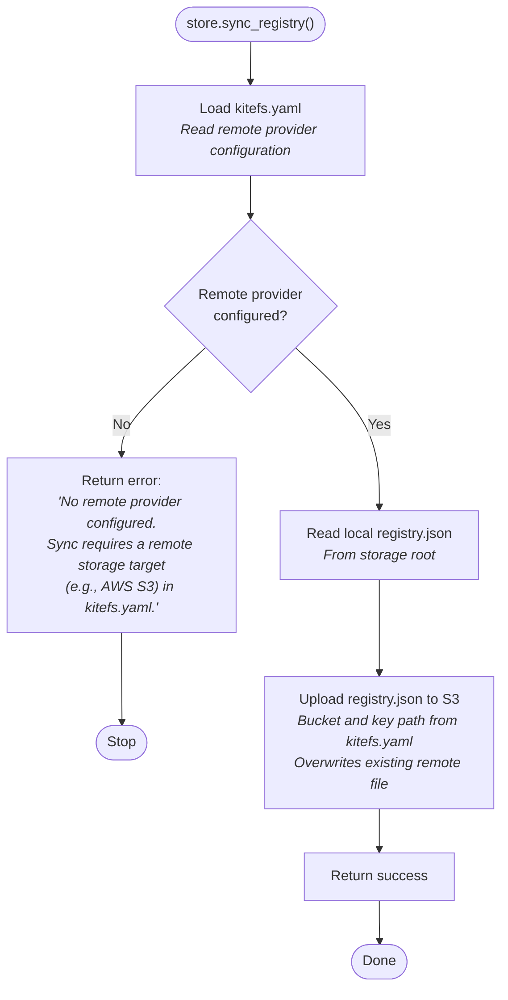
```mermaid
flowchart TD
    START(["store.sync_registry()"]) --> LOAD_CONFIG["Load kitefs.yaml<br><i>Read remote provider configuration</i>"]

    LOAD_CONFIG --> REMOTE_CONFIGURED{"Remote provider<br>configured?"}

    REMOTE_CONFIGURED -- No --> ABORT_NO_REMOTE["Return error:<br><i>'No remote provider configured.<br>Sync requires a remote storage target<br>(e.g., AWS S3) in kitefs.yaml.'</i>"]
    ABORT_NO_REMOTE --> END_FAIL(["Stop"])

    REMOTE_CONFIGURED -- Yes --> READ_LOCAL["Read local registry.json<br><i>From storage root</i>"]

    READ_LOCAL --> UPLOAD_S3["Upload registry.json to S3<br><i>Bucket and key path from kitefs.yaml<br>Overwrites existing remote file</i>"]

    UPLOAD_S3 --> RETURN_SUCCESS["Return success"]
    RETURN_SUCCESS --> END_OK(["Done"])
```

#### Key Decisions in This Flow

| Decision | Rationale |
| --- | --- |
| Remote provider must be configured | Syncing is meaningless in a local-only setup. If `kitefs.yaml` has no remote provider block, the operation fails with a clear message rather than silently doing nothing. |
| AWS S3 is the only remote provider | The MVP supports one remote provider. The flow is S3-specific (bucket + key). Additional providers can be added later behind the same interface. |
| Full overwrite, not a merge | The registry is a derived artifact fully rebuilt by `apply()`. There is no need for merge logic — the local version is the source of truth when syncing outward. |
| No parameters | The sync target is fully determined by `kitefs.yaml` configuration. There is nothing to parameterize. |

---

### 2.9. `pull_registry()`

Downloads `registry.json` from the configured remote storage location and overwrites the local copy. For the current implementation, the only remote provider is AWS and the registry is stored on S3. The S3 bucket and key path are read from `kitefs.yaml`. This method takes no parameters.

#### Flow Chart

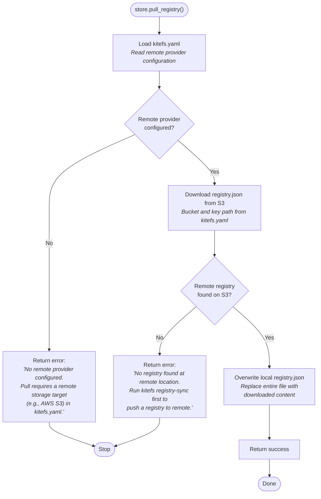
```mermaid
flowchart TD
    START(["store.pull_registry()"]) --> LOAD_CONFIG["Load kitefs.yaml<br><i>Read remote provider configuration</i>"]

    LOAD_CONFIG --> REMOTE_CONFIGURED{"Remote provider<br>configured?"}

    REMOTE_CONFIGURED -- No --> ABORT_NO_REMOTE["Return error:<br><i>'No remote provider configured.<br>Pull requires a remote storage target<br>(e.g., AWS S3) in kitefs.yaml.'</i>"]
    ABORT_NO_REMOTE --> END_FAIL(["Stop"])

    REMOTE_CONFIGURED -- Yes --> DOWNLOAD_S3["Download registry.json from S3<br><i>Bucket and key path from kitefs.yaml</i>"]

    DOWNLOAD_S3 --> REMOTE_EXISTS{"Remote registry<br>found on S3?"}

    REMOTE_EXISTS -- No --> ABORT_NOT_FOUND["Return error:<br><i>'No registry found at remote location.<br>Run kitefs registry-sync first to<br>push a registry to remote.'</i>"]
    ABORT_NOT_FOUND --> END_FAIL

    REMOTE_EXISTS -- Yes --> OVERWRITE_LOCAL["Overwrite local registry.json<br><i>Replace entire file with<br>downloaded content</i>"]

    OVERWRITE_LOCAL --> RETURN_SUCCESS["Return success"]
    RETURN_SUCCESS --> END_OK(["Done"])
```

#### Key Decisions in This Flow

| Decision | Rationale |
| --- | --- |
| Remote provider must be configured | Same rationale as `sync_registry()` — pulling is meaningless without a remote target. |
| AWS S3 is the only remote provider | Same as `sync_registry()`. S3 bucket and key path from `kitefs.yaml`. |
| Error if remote registry does not exist | Unlike an empty local registry (which is a valid state after `init`), a missing remote registry means nothing was ever synced. Failing explicitly guides the user to sync first. |
| Full overwrite of local registry | The remote version is the source of truth when pulling. Local changes (from a recent `apply()`) are lost. This is intentional — pull is a destructive-to-local operation and the user should know that. |
| No parameters | The pull source is fully determined by `kitefs.yaml` configuration. |

---

### 2.10. `generate_mock_data(...)`

Generates synthetic data conforming to a feature group's schema and writes it to the local offline store. The generated data follows the same Hive-style partitioned directory structure as real ingested data, with a `mock_` filename prefix for easy identification and cleanup. Local provider only.

#### Flow Chart

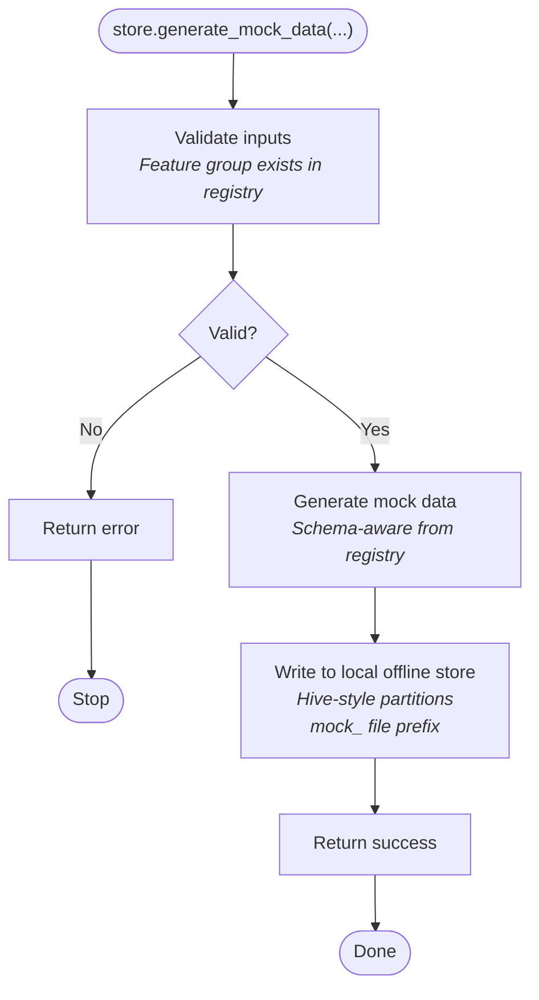
```mermaid
flowchart TD
    START(["store.generate_mock_data(...)"]) --> VALIDATE["Validate inputs<br><i>Feature group exists in registry</i>"]

    VALIDATE --> VALID{"Valid?"}

    VALID -- No --> ABORT["Return error"]
    ABORT --> END_FAIL(["Stop"])

    VALID -- Yes --> GENERATE["Generate mock data<br><i>Schema-aware from registry</i>"]

    GENERATE --> WRITE["Write to local offline store<br><i>Hive-style partitions<br>mock_ file prefix</i>"]

    WRITE --> RETURN_SUCCESS["Return success"]
    RETURN_SUCCESS --> END_OK(["Done"])
```

#### Key Decisions in This Flow

| Decision | Rationale |
| --- | --- |
| Not prioritized for MVP | This is a "Should Have" feature. The full design (parameters, generation logic, timestamp strategies, entity key handling) will be defined when this feature is prioritized. Any details discussed earlier are preliminary and subject to change. |

---

### 2.11. `pull_remote_sample(...)`

Pulls a filtered subset of data from a remote offline store into the local offline store. The downloaded data follows the same Hive-style partitioned directory structure, with a `sample_` filename prefix for easy identification and cleanup. Requires a configured remote provider (AWS S3).

#### Flow Chart

```mermaid
flowchart TD
    START(["store.pull_remote_sample(...)"]) --> VALIDATE["Validate inputs<br><i>Remote provider configured,<br>feature group exists</i>"]

    VALIDATE --> VALID{"Valid?"}

    VALID -- No --> ABORT["Return error"]
    ABORT --> END_FAIL(["Stop"])

    VALID -- Yes --> DOWNLOAD["Download filtered subset<br>from remote offline store<br><i>S3 → local</i>"]

    DOWNLOAD --> WRITE["Write to local offline store<br><i>Hive-style partitions<br>sample_ file prefix</i>"]

    WRITE --> RETURN_SUCCESS["Return success"]
    RETURN_SUCCESS --> END_OK(["Done"])
```

#### Key Decisions in This Flow

| Decision | Rationale |
| --- | --- |
| Not prioritized for MVP | This is a "Should Have" feature. The full design (sampling strategy, time range filtering, partition-aware S3 downloads) will be defined when this feature is prioritized. Any details discussed earlier are preliminary and subject to change. |

---
