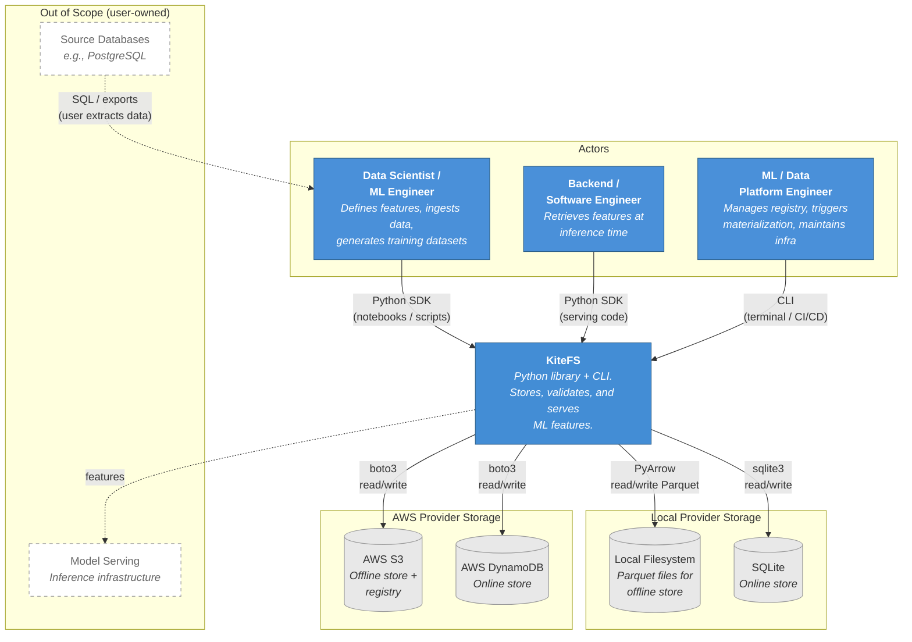
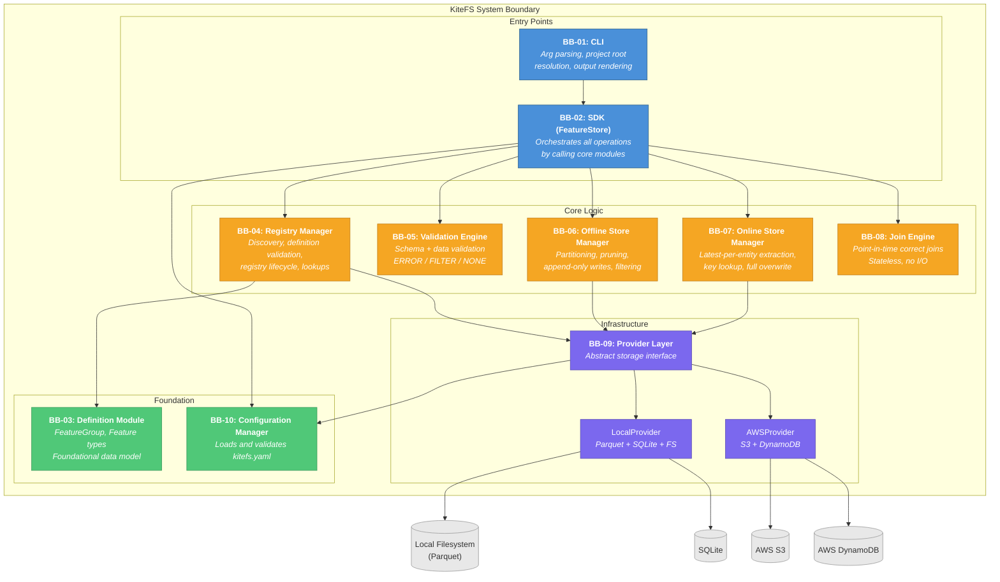
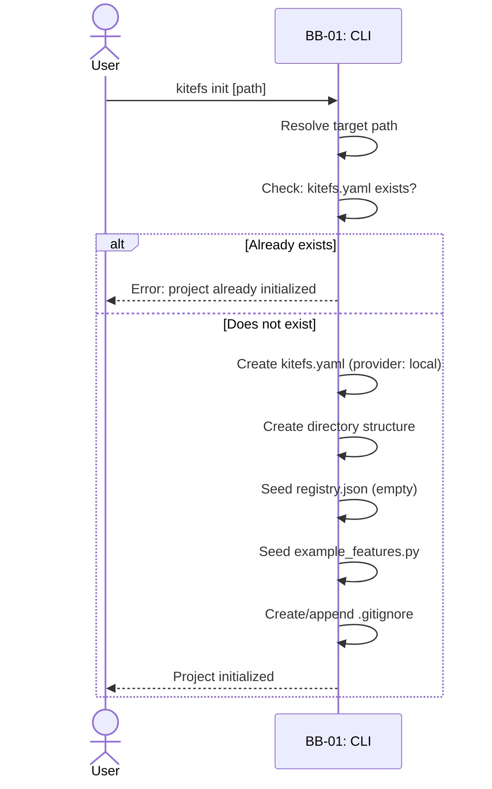
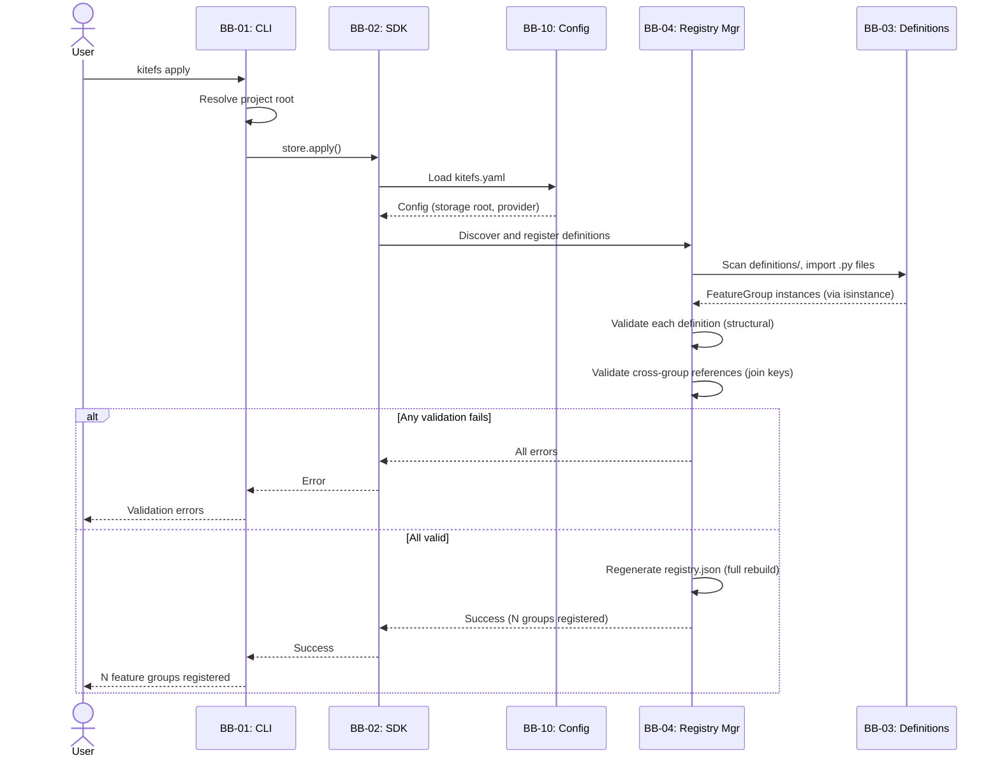
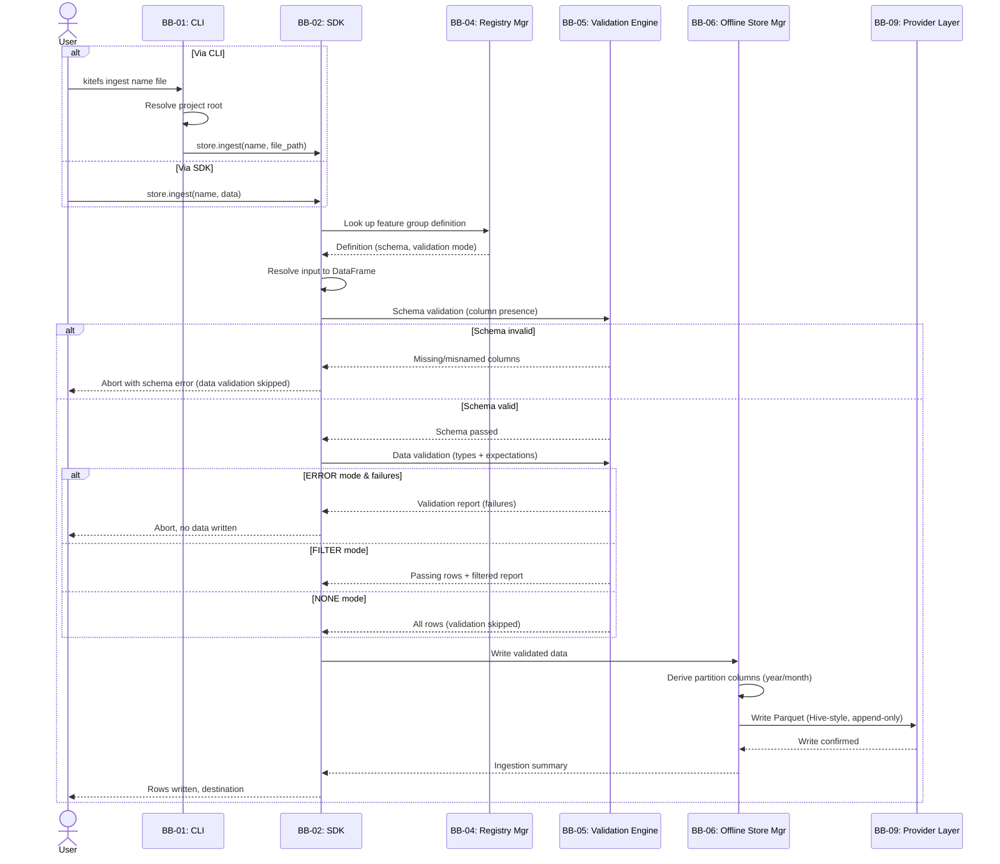
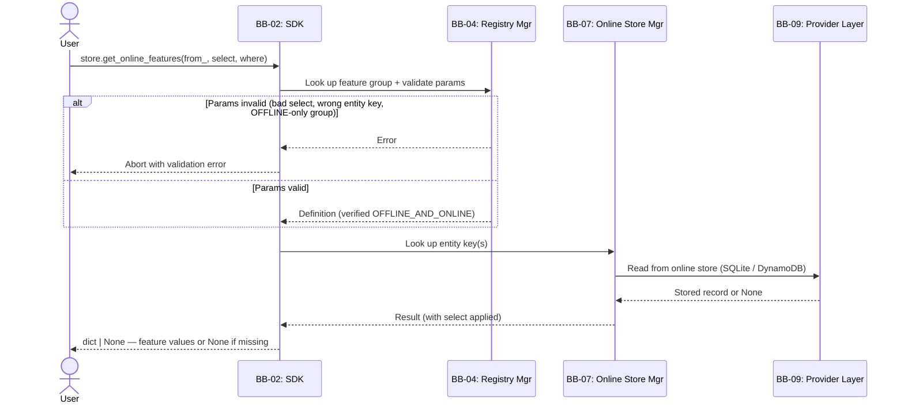
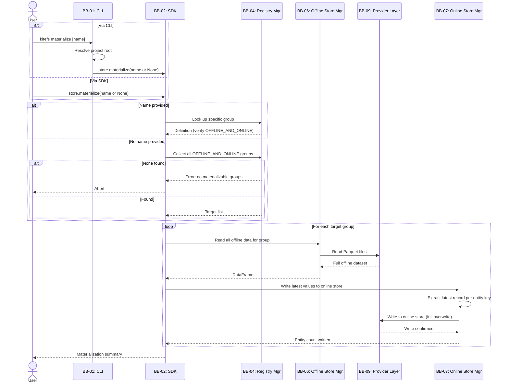
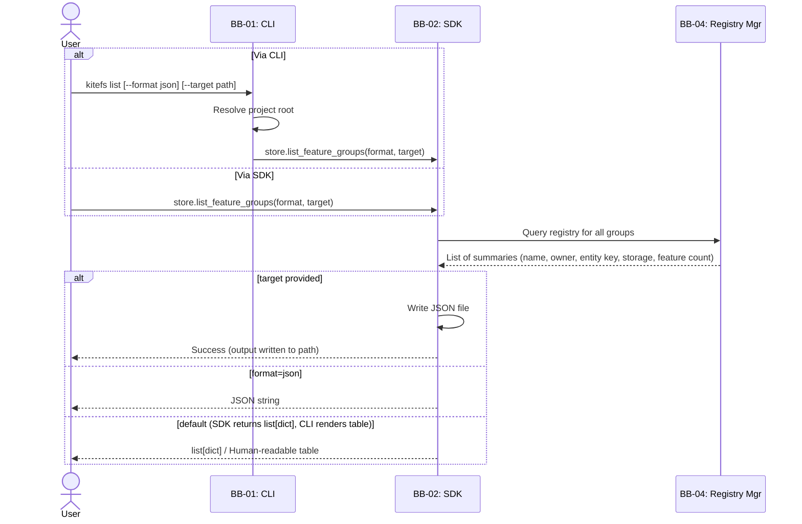
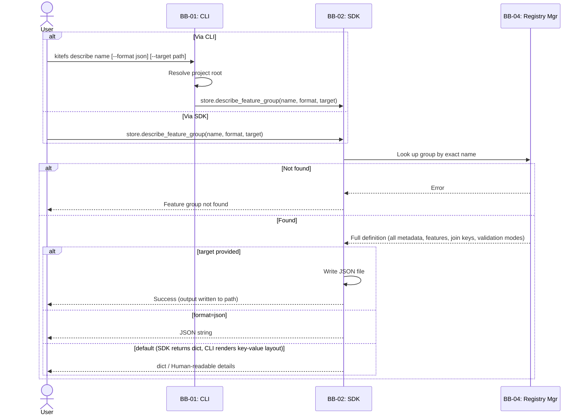

# Kite Feature Store — Architecture Overview

> **Document Purpose:**
> This document describes the architectural design of KiteFS from
> guiding principles down through operational flows. It answers:
> where does the system sit, what are its major parts, and how do
> those parts work together for each operation.
>
> **Structure:**
> - §1 — Design principles that govern all decisions
> - §2 — System context: users, external systems, boundaries (Level 1)
> - §3 — Building blocks: major internal modules and relationships (Level 2)
> - §4 — Operational flows: how building blocks collaborate per operation (Level 3)
> - §5 — Packaging, configuration, and dependencies
>
> **Visualization approach:**
> This document uses a C4-inspired model adapted for the project:
>
> | Level   | Name              | What It Shows                                          | Section |
> | ------- | ----------------- | ------------------------------------------------------ | ------- |
> | Level 1 | System Context    | System as a single box, actors, external systems       | §2      |
> | Level 2 | Building Blocks   | Major internal modules and how they relate             | §3      |
> | Level 3 | Operational Flows | How building blocks collaborate per core operation     | §4      |
>
> **How to read this document:**
> Each section builds on the previous. A reader going top-to-bottom
> gains progressively deeper understanding — from "where does this
> system fit?" to "how do the pieces work together for each operation?"
>
> **Relationship to other documents:**
> - The flow chart document ([docs-00-02](docs-00-02-flow-charts.md))
>   remains the detailed implementation-level reference for every
>   decision branch and error path. This document shows the structural
>   and behavioral design at a higher level. They are complementary,
>   not redundant.
> - The companion document ([docs-03-02](docs-03-02-internals-and-data.md))
>   covers building block internals, architectural decisions per block,
>   and data architecture in detail.
>
> - Built on: [Project Charter (docs-01)](docs-01-project-charter.md), [Requirements (docs-02)](docs-02-project-requirements.md), [Flow Charts (docs-00-02)](docs-00-02-flow-charts.md), [Reference Use Case (docs-00-01)](docs-00-01-reference-use-case.md)
> - Companion: [Internals & Data Architecture (docs-03-02)](docs-03-02-internals-and-data.md)
> - Feeds into: [API Contracts (docs-03-03)](docs-03-03-api-contracts.md), [Implementation Guide (docs-04)](docs-04-implementation-guide.md)
>
> **Owner:** Fedai Paça
> **Last Updated:** 2026-03-31
> **Status:** Draft

---

## 1. Design Principles

Every architectural and implementation decision in KiteFS traces back to one or more of these principles. Each principle is referenced by its ID (AP-X) when justifying choices throughout this document and its companion ([docs-03-02](docs-03-02-internals-and-data.md)).

---

**AP-1: Library-First Distribution**

KiteFS is a pip-installable Python library, not a deployed service.

*Implication:* All operations are in-process function calls (SDK) or local CLI commands. There is no HTTP server, no daemon process, no container to orchestrate. `pip install kitefs` is the only setup step for the local provider. This eliminates deployment complexity and makes the system immediately usable in notebooks, scripts, and CI/CD pipelines without infrastructure provisioning. (Traces to: G-3, CON-002, CON-005)

---

**AP-2: Literal Architecture (Store, Don't Compute)**

The feature store stores and serves features. It does not manage, schedule, or execute feature computation logic.

*Implication:* KiteFS has no transformation engine, no DAG runner, no SQL engine, and no scheduler. Users compute features using their own tools (Pandas, Spark, SQL, dbt — whatever fits their workflow) and write the results to KiteFS via the ingestion API. This keeps the system focused, avoids duplicating existing compute tools, and ensures the codebase stays small enough for a single developer to maintain. (Traces to: NG-1, Charter §2.1 Vision Statement)

---

**AP-3: Provider-Abstracted Storage**

Core logic is decoupled from any specific storage backend via a common interface. Providers are pluggable implementations behind that interface.

*Implication:* No core module, no SDK method, and no CLI command references a provider-specific type (no `import boto3` in core logic). The provider is selected at configuration time and injected. Adding a new backend (e.g., GCP, Azure) requires implementing only the provider interface — zero changes to core logic, SDK, CLI, or feature definitions. The MVP ships with two providers: `local` (filesystem + SQLite) and `aws` (S3 + DynamoDB). (Traces to: G-3, G-4, FR-PROV-001 through FR-PROV-005, NG-4)

---

**AP-4: Definitions as Code, Registry as Derived Artifact**

Feature groups are defined as Python objects in source files. The registry is fully regenerated from those definitions on every `apply()`.

*Implication:* Definitions live under `definitions/` in the project repository and are versioned with Git. The registry (`registry.json`) is never manually edited — it is a compiled output. If a definition file is deleted, the corresponding feature group vanishes from the registry on the next `apply()`. This eliminates registry drift and makes the definitions directory the single source of truth for what features exist. (Traces to: FR-REG-001, FR-REG-002, Charter §3.1)

---

**AP-5: Validate at Every Gate**

A built-in validation engine enforces type constraints and feature expectations at ingestion and retrieval, with configurable strictness per gate.

*Implication:* Data quality is a structural property of the system, not an afterthought requiring external tools. The validation engine runs at two gates: before data enters the offline store (ingestion) and before training data is returned (retrieval). Each gate independently supports three modes — `ERROR` (reject all on any failure), `FILTER` (pass only valid records), `NONE` (skip) — giving users control over strictness without code changes. No separate Great Expectations or Deequ setup needed. (Traces to: G-5, FR-VAL-001 through FR-VAL-009)

---

**AP-6: Point-in-Time Correctness by Default**

Offline store joins are point-in-time correct: each record is matched only with feature values that existed at or before its event timestamp.

*Implication:* The `event_timestamp` convention and the join engine's temporal condition (`joined.event_timestamp ≤ base.event_timestamp`) prevent data leakage without requiring user effort. Users declare join keys in feature group definitions; the system enforces temporal correctness automatically during `get_historical_features()`. This is not an opt-in feature — it is the only join behavior. (Traces to: G-2, PP-4, FR-OFF-003)

---

**AP-7: Single-Developer Sustainability**

Every design choice must be buildable, testable, and maintainable by one person.

*Implication:* This principle acts as a complexity filter on every other decision. It favors: append-only writes over conflict resolution, full overwrites over incremental sync, file-based state (JSON registry, Parquet files, SQLite) over distributed coordination, and explicit user-triggered operations over automatic scheduling. No architecture in KiteFS assumes team-based workflows, dedicated ops roles, or always-on infrastructure. If a design would take a team weeks, it is descoped or simplified. (Traces to: Charter MVP Scope, CON-005, CON-006)

---

## 2. System Context (Level 1)

> _The highest-level view. Shows the system from the outside. A reader
> who knows nothing about the internals should understand:
> who uses it, how they interact with it, what external systems it
> touches, and what is NOT part of it._

### 2.1 System Context Diagram



**Reading the diagram:** KiteFS sits at the center. Three actor roles interact with it via two channels (Python SDK and CLI). Four external storage systems serve as backends — two for the local provider (Local Filesystem + SQLite), two for the AWS provider (S3 + DynamoDB). Source databases and model serving infrastructure (shown with dashed lines in the "Out of Scope" group) are user-owned systems outside the KiteFS boundary; KiteFS does not connect to them directly.

### 2.2 Actors

Actors are derived from the personas defined in the [Project Charter §3.2](docs-01-project-charter.md).

**Data Scientist / ML Engineer**

- **Who:** Practitioner who defines features, computes feature values externally, ingests them into the store, and generates training datasets.
- **Interaction channel:** Python SDK (notebooks, scripts).
- **Primary goals:**
  - Define feature groups as code with validation rules
  - Ingest pre-computed features into the offline store
  - Retrieve point-in-time correct training datasets via `get_historical_features()`
- **Key operations:** `apply()`, `ingest()`, `get_historical_features()`, `list_feature_groups()`, `describe_feature_group()`

**Backend / Software Engineer**

- **Who:** Engineer who integrates KiteFS into the production application's serving path to retrieve features at inference time.
- **Interaction channel:** Python SDK (application code).
- **Primary goals:**
  - Retrieve the latest feature values for a given entity key with low latency
  - Assemble the feature vector for model prediction
- **Key operations:** `get_online_features()`

**ML / Data Platform Engineer**

- **Who:** Engineer who sets up, configures, and maintains the feature store infrastructure, integrates it into CI/CD pipelines, and manages data lifecycle operations.
- **Interaction channel:** CLI (terminal, CI/CD scripts).
- **Primary goals:**
  - Initialize and configure KiteFS projects
  - Trigger materialization to update the online store
  - Sync the registry between local and remote environments
- **Key operations:** `kitefs init`, `kitefs apply`, `kitefs materialize`, `kitefs ingest`, `kitefs registry-sync`, `kitefs registry-pull`, `kitefs list`, `kitefs describe`

### 2.3 External Systems

| System | Role | Integration Method | Required? | Notes |
| --- | --- | --- | --- | --- |
| Local filesystem | Offline store (local provider). Parquet files in Hive-style partitioned directories. | PyArrow `read_table` / `write_to_dataset` | Yes (local provider) | Default after `kitefs init`. Zero external configuration. |
| SQLite | Online store (local provider). Single database file in the storage root. | Python `sqlite3` (standard library) | Yes (local provider) | No installation needed — ships with Python. |
| AWS S3 | Offline store and registry storage (AWS provider). Same Parquet layout as local. | `boto3` S3 client | Yes (AWS provider) | Standard AWS credential chain. Bucket and prefix configured in `kitefs.yaml`. |
| AWS DynamoDB | Online store (AWS provider). One item per entity key per feature group. | `boto3` DynamoDB resource | Yes (AWS provider) | Standard AWS credential chain. Table prefix configured in `kitefs.yaml`. |

### 2.4 System Boundary

**In scope (what KiteFS does):**

- Define feature groups as code with entity keys, types, join keys, validation rules, and metadata (FR-DEF)
- Maintain a feature registry as a deterministic, Git-versionable JSON file (FR-REG)
- Ingest pre-computed feature data into the offline store from DataFrames, CSV, or Parquet (FR-ING)
- Store historical features in a partitioned offline store and serve point-in-time correct training datasets (FR-OFF)
- Materialize latest feature values to a low-latency online store (FR-MAT)
- Serve latest feature values for real-time inference via key-based lookup (FR-ONL)
- Validate feature data at ingestion and retrieval with configurable strictness (FR-VAL)
- Abstract storage behind a provider interface supporting local and AWS backends (FR-PROV)
- Provide a CLI for all project-level operations (FR-CLI)
- Manage project configuration via a YAML file with sensible defaults (FR-CFG)

**Out of scope (what KiteFS does NOT do):**

- **Feature computation or transformation** (NG-1) — users compute features with their own tools (Pandas, Spark, SQL, etc.) and pass results to KiteFS. There is no transformation engine, DAG runner, or scheduler.
- **Streaming ingestion** (NG-2) — the MVP supports batch ingestion only. Stream processing infrastructure (Kafka, Kinesis) is not integrated.
- **Model hosting, training, or serving** (NG-3) — KiteFS provides features to models. Model lifecycle management is handled by separate systems (MLflow, SageMaker, etc.).
- **Multi-cloud provider support beyond AWS** (NG-4) — the provider abstraction enables future GCP/Azure providers, but only `local` and `aws` are implemented in the MVP.
- **Web UI** (NG-5) — feature discovery and registry exploration are via CLI and SDK in the MVP.
- **Authentication and authorization** (NG-6) — cloud access relies on the underlying provider's IAM (e.g., AWS IAM). KiteFS implements no auth layer.
- **Feature drift detection or statistical monitoring** (NG-7) — the validation engine covers type and constraint checks, not statistical distribution monitoring.

---

## 3. Building Blocks (Level 2)

> _Zooms one level into the system box from Level 1. Shows the major
> internal modules that compose the system, their responsibilities
> at a glance, the dependency structure, and interaction patterns._
>
> _After reading this section, a reader should have a mental model
> of the system's internal structure and be able to predict roughly
> how an operation moves through the system._

### 3.1 Building Block Diagram



**Reading the diagram:** Arrows indicate dependency direction (A → B means "A depends on B"). Entry points sit at the top, foundations at the bottom. All storage I/O flows through the Provider Layer (BB-09), which branches into two implementations (AP-3). The Validation Engine (BB-05) and Join Engine (BB-08) have no outgoing arrows — they are stateless leaf modules that receive inputs as function arguments.

### 3.2 Building Block Summary

| ID | Building Block | Responsibility (one sentence) |
| --- | --- | --- |
| BB-01 | CLI | Parses arguments, resolves project root, delegates to SDK (except `init`), and renders console output. |
| BB-02 | SDK (`FeatureStore`) | User-facing Python class that orchestrates every operation by calling core modules in the correct sequence. |
| BB-03 | Definition Module | Provides `FeatureGroup`, `EntityKey`, `EventTimestamp`, `Feature`, `Expect`, and related types that users write in `definitions/` and that all other modules reference for schema metadata. |
| BB-04 | Registry Manager | Manages `registry.json` lifecycle: definition discovery, definition validation, full regeneration, persistence, and lookup queries. |
| BB-05 | Validation Engine | Stateless data validator: schema validation (column presence) and value validation (type checks + feature expectations) with ERROR/FILTER/NONE mode support. |
| BB-06 | Offline Store Manager | Orchestrates offline store operations: partition derivation, partition pruning, file naming, append-only writes, and where-filter application. |
| BB-07 | Online Store Manager | Orchestrates online store operations: latest-value-per-entity extraction (materialization write), entity key lookup (serving read), and full-overwrite semantics. |
| BB-08 | Join Engine | Performs point-in-time correct joins between DataFrames — stateless, no I/O. |
| BB-09 | Provider Layer | Abstract interface for all storage I/O plus two implementations: LocalProvider (Parquet + SQLite + filesystem) and AWSProvider (S3 + DynamoDB). |
| BB-10 | Configuration Manager | Loads, validates, and exposes `kitefs.yaml` settings: active provider, storage root, and provider-specific configuration. |

### 3.3 Building Block Relationships

**Dependency rules:**

- **BB-01 (CLI)** depends only on **BB-02 (SDK)**. The single exception is `kitefs init`, which creates the project scaffold before a `FeatureStore` can be instantiated — this logic is self-contained within BB-01.
- **BB-02 (SDK)** depends on **BB-04, BB-05, BB-06, BB-07, BB-08, BB-10**. It is the integration point that decides which modules to call and in what order. It does not contain domain logic itself.
- **BB-04 (Registry Manager)** depends on **BB-03** (for `FeatureGroup` isinstance checks during definition discovery) and **BB-09** (for registry file I/O via the provider).
- **BB-06 (Offline Store Manager)** depends on **BB-09** (for Parquet read/write via the provider).
- **BB-07 (Online Store Manager)** depends on **BB-09** (for SQLite/DynamoDB read/write via the provider).
- **BB-09 (Provider Layer)** depends on **BB-10** (for provider-specific configuration — bucket names, table prefixes, storage root path).
- **BB-05 (Validation Engine)** has **no module dependencies**. It receives a schema definition and a DataFrame as function arguments and returns a structured validation report. Fully stateless and reusable.
- **BB-08 (Join Engine)** has **no module dependencies**. It receives DataFrames and join metadata as function arguments and returns a merged DataFrame. Fully stateless and reusable.
- **BB-03 (Definition Module)** has **no dependencies**. It is the foundational data model.
- **BB-10 (Configuration Manager)** has **no dependencies**. It is the foundational configuration loader.

**No circular dependencies exist.** Dependencies flow strictly downward through four layers: entry points → core logic → infrastructure → foundation.

**Dependency build tiers** (determines implementation order — feeds into iteration planning):

```
Tier 0 — Foundations (no dependencies, buildable in parallel):
  BB-10  Configuration Manager
  BB-03  Definition Module
  BB-05  Validation Engine
  BB-08  Join Engine

Tier 1 — Infrastructure (depends on Tier 0):
  BB-09  Provider Layer         → depends on BB-10

Tier 2 — Core Modules (depends on Tiers 0–1, buildable in parallel):
  BB-04  Registry Manager       → depends on BB-03, BB-09
  BB-06  Offline Store Manager  → depends on BB-09
  BB-07  Online Store Manager   → depends on BB-09

Tier 3 — Integration:
  BB-02  SDK (FeatureStore)     → depends on BB-04, BB-05, BB-06, BB-07, BB-08, BB-10

Tier 4 — Entry Point:
  BB-01  CLI                    → depends on BB-02
```

**A note on two kinds of validation in this architecture:**

Two distinct validation activities exist, owned by different building blocks:

- **Definition validation** (BB-04, Registry Manager): validates that `FeatureGroup` Python objects are structurally correct during `apply()`. The constructor signature enforces exactly one `EntityKey` and one `EventTimestamp` (structural columns), so BB-04 validates the remaining concerns: `EventTimestamp` dtype must be `DATETIME`, feature types from the supported set, field names unique within group, join keys reference existing groups with matching types. Acts on *Python objects*.
- **Data validation** (BB-05, Validation Engine): validates that DataFrame values conform to the declared schema during `ingest()` and `get_historical_features()`. Checks: column presence, type correctness, feature expectations (min/max/one_of/not_null). Supports ERROR/FILTER/NONE modes. Acts on *DataFrames*.

These are separate responsibilities because they operate on different inputs (Python objects vs. DataFrames), serve different purposes (registration correctness vs. data quality), and trigger at different points in the system. See KTD-5 below.

### 3.4 System-Level Architectural Decisions

These decisions shaped the system's overall structure. Block-internal decisions are documented in the companion document ([docs-03-02](docs-03-02-internals-and-data.md)).

---

**KTD-1: Library, Not a Service**

- **Context:** How should KiteFS be deployed — as a standalone service that users send requests to, or as a library they import?
- **Options considered:**
  - (A) *Standalone HTTP service:* Deploy a server (e.g., FastAPI) that exposes REST endpoints for feature operations. Allows language-agnostic access.
  - (B) *Python library:* Install via pip, import in code, call methods directly. CLI provided as a thin wrapper.
- **Decision:** (B) Python library.
- **Rationale:** AP-1, AP-7. A service requires deployment infrastructure, monitoring, networking, and a separate client library — all of which multiply operational burden. A library eliminates all of that. Since the target users are Python practitioners (data scientists, ML engineers, backend engineers using Python), language-agnostic access is not a requirement for the MVP.
- **Consequences:** All operations are in-process function calls. No network overhead, no container orchestration, no uptime management. `pip install kitefs` is the complete setup for the local provider.
- **Revisit if:** A non-Python consumer needs to access features (e.g., a Java serving layer). At that point, a thin HTTP serving layer could wrap the SDK without changing the core architecture.

---

**KTD-2: Provider Abstraction via Abstract Interface**

- **Context:** KiteFS must support multiple storage backends (local filesystem + SQLite for development, S3 + DynamoDB for production). How should multi-backend support be structured?
- **Options considered:**
  - (A) *Hardcoded providers with if/else branching:* Core logic checks `if provider == "local": ... elif provider == "aws": ...`. Simple initially, but every new provider requires touching core code.
  - (B) *Abstract interface with pluggable implementations:* Define an abstract base class (or Protocol) for storage operations. Each provider implements it. Core logic calls the interface, never a concrete implementation.
- **Decision:** (B) Abstract interface.
- **Rationale:** AP-3, FR-PROV-005. The provider interface is the architectural seam that separates "what to do" (core logic) from "how to store" (provider implementation). This makes the system open for extension (new providers) without modification (core code changes).
- **Consequences:** Core modules never import provider-specific libraries (no `import boto3` in core). The provider is selected at configuration time and injected into modules by the SDK at initialization. Adding a GCP or Azure provider requires implementing only the provider interface.
- **Revisit if:** The interface proves too coarse or too fine for a new provider's capabilities. The interface surface should be evaluated when adding the third provider.

---

**KTD-3: Registry as Full Rebuild, Not Incremental**

- **Context:** When a user runs `apply()`, how should the system update `registry.json` to reflect the current definitions?
- **Options considered:**
  - (A) *Incremental apply:* Diff the current registry against discovered definitions. Add new groups, update changed ones, remove deleted ones.
  - (B) *Full regeneration:* Ignore the current registry entirely. Scan all definitions, validate, and write a brand-new `registry.json` from scratch.
- **Decision:** (B) Full regeneration.
- **Rationale:** AP-4, FR-REG-002. Full regeneration eliminates an entire class of bugs: there is no diffing logic, no migration path, no "registry says X but definition says Y" inconsistency. If a definition file is deleted, the group automatically vanishes from the registry — no explicit removal step needed. The cost (slightly more I/O per apply) is negligible given the expected number of definitions (tens, not thousands).
- **Consequences:** `apply()` is idempotent. Running it twice produces the same registry. There is no concept of "registry migration" or "schema evolution" at this layer.
- **Revisit if:** The number of feature groups grows large enough that full regeneration has noticeable latency (unlikely for this project's scale).

---

**KTD-4: Thin CLI, Fat SDK**

- **Context:** Where should the core operation logic live — in the CLI commands, in the SDK, or split between them?
- **Options considered:**
  - (A) *Logic in CLI:* CLI commands contain business logic directly. The SDK is a thin wrapper or doesn't exist separately.
  - (B) *Logic in SDK:* The SDK (`FeatureStore` class) owns all operation logic. The CLI is a thin delegation layer that resolves the project root, parses arguments, calls the corresponding SDK method, and renders the output.
- **Decision:** (B) Logic in SDK, thin CLI.
- **Rationale:** AP-1. KiteFS is a library first. Notebook and script users must have identical capabilities to CLI users. If logic lived in the CLI, programmatic users would be second-class citizens or logic would need to be duplicated.
- **Consequences:** Every operation (except `init`) is a single SDK method call. The CLI's job is: find `kitefs.yaml`, instantiate `FeatureStore`, call the appropriate method, and format the output for the terminal. The single exception is `kitefs init`, which creates the project scaffold before a `FeatureStore` can exist — this logic is self-contained in the CLI.
- **Revisit if:** Never expected — this is a fundamental design property.

---

**KTD-5: Separate Definition Validation from Data Validation**

- **Context:** Two validation activities exist in the system: (1) structural checks on `FeatureGroup` Python objects during `apply()` (e.g., entity key exists, types are valid, join keys reference real groups), and (2) value checks on DataFrames during `ingest()` and `get_historical_features()` (e.g., column types match, values satisfy min/max constraints, NULL handling). Should one module handle both, or should they be separate?
- **Options considered:**
  - (A) *Single Validation module handles both:* One module that validates Python objects at apply time and DataFrames at data time.
  - (B) *Definition validation in Registry Manager, data validation in a separate Validation Engine:* BB-04 owns structural checks on definitions. BB-05 owns value checks on DataFrames.
- **Decision:** (B) Separate responsibilities.
- **Rationale:** AP-7. These activities operate on different inputs (Python objects vs. DataFrames), serve different purposes (registration correctness vs. data quality), and trigger at different points (apply time vs. data time). A single module handling both would mix two distinct concerns and make testing harder. The separation keeps each module focused and independently testable.
- **Consequences:** BB-04 (Registry Manager) has validation methods for apply-time structural checks. BB-05 (Validation Engine) is a stateless data validator invoked at two gates (ingestion and retrieval). Neither depends on the other.
- **Revisit if:** A third validation concern emerges that doesn't fit either module cleanly.

---

## 4. Operational Flows (Level 3)

> _Shows the building blocks in motion. For each core operation,
> traces how it flows through the building blocks from entry point
> to completion._
>
> _This section bridges the gap between the static building block
> diagram (§3) and the detailed flow charts in
> [docs-00-02](docs-00-02-flow-charts.md). §3 shows the wiring;
> §4 shows the electricity flowing through the wires._

### 4.1 How to Read This Section

Each subsection below covers one core operation and includes:

- **Entry point:** The CLI command and/or SDK method that starts the operation.
- **Flow chart reference:** The corresponding section in [docs-00-02](docs-00-02-flow-charts.md) for full decision-branch coverage.
- **Building blocks involved:** Which BB-XX modules participate.
- **Flow diagram:** An architectural flow diagram showing which blocks participate and in what sequence. These are not implementation flowcharts — they show block-level participation, not every if/else branch. The detailed decision logic lives in [docs-00-02](docs-00-02-flow-charts.md).
- **Key architectural observations:** 1–3 design decisions visible in this flow, tied back to AP-X principles.

**Must Have operations** (§4.2–§4.9) get full treatment. **Should Have / Could Have operations** (§4.10) get a brief summary.

### 4.2 Initialize Project

**Entry point:** `kitefs init [path]`
**Flow chart reference:** [docs-00-02 §1.1](docs-00-02-flow-charts.md)
**Building blocks involved:** BB-01



**Key architectural observations:**

- **This is the only operation that does not use the SDK (AP-1, KTD-4).** `init` creates the project scaffold before a `FeatureStore` can be instantiated — there is no `kitefs.yaml` yet, so the SDK cannot load configuration. This is a deliberate exception to the thin-CLI pattern.
- **The registry is seeded as a deterministic empty JSON file (AP-4).** From the very first commit, `registry.json` is Git-versionable with meaningful diffs.
- **Data directories are created but empty.** Partition structures and the SQLite database are created lazily on first write, not at init time (AP-7 — don't pre-build what isn't needed yet).

### 4.3 Apply Definitions

**Entry point:** `kitefs apply` → `store.apply()`
**Flow chart reference:** [docs-00-02 §1.2, §2.1](docs-00-02-flow-charts.md)
**Building blocks involved:** BB-01, BB-02, BB-10, BB-04, BB-03



**Key architectural observations:**

- **BB-05 (Validation Engine) is NOT involved here.** The validation in `apply()` is *definition validation* — structural checks on Python objects — which is BB-04's responsibility. This is distinct from *data validation* on DataFrames, which is BB-05's domain (KTD-5).
- **Full regeneration, not incremental (AP-4, KTD-3).** The registry is rebuilt entirely from definitions. Deleted definition files automatically vanish from the registry. Although the registry is fully regenerated, runtime-managed fields (`last_materialized_at`) are preserved by reading them from the existing registry before overwriting.
- **All-or-nothing semantics.** If any definition is invalid, the registry is unchanged. No partial application is possible.

### 4.4 Ingest Data

**Entry point:** `kitefs ingest <name> <file>` → `store.ingest(feature_group_name, data)`
**Flow chart reference:** [docs-00-02 §1.4, §2.2](docs-00-02-flow-charts.md)
**Building blocks involved:** BB-01, BB-02, BB-04, BB-05, BB-06, BB-09



**Key architectural observations:**

- **Schema validation is a hard gate before data validation (AP-5).** Schema validation (column presence) runs unconditionally. If it fails, the operation aborts immediately — data validation (type checks, feature expectations) is never reached. This is because data validation cannot run on columns that don't exist. Schema is a structural precondition, not a parallel check.
- **Ingestion writes only to the offline store, never to the online store (AP-2).** The online store is updated later through a separate `materialize()` call. These two operations are intentionally decoupled.
- **The Offline Store Manager (BB-06) delegates physical I/O to the Provider Layer (BB-09) (AP-3).** BB-06 handles partitioning logic; BB-09 handles the actual Parquet write. Switching from local to S3 changes only the provider implementation.

### 4.5 Get Historical Features

**Entry point:** `store.get_historical_features(from_, select, where, join)`
**Flow chart reference:** [docs-00-02 §2.3](docs-00-02-flow-charts.md)
**Building blocks involved:** BB-02, BB-04, BB-05, BB-06, BB-08, BB-09

```mermaid
sequenceDiagram
    actor User
    participant BB02 as BB-02: SDK
    participant BB04 as BB-04: Registry Mgr
    participant BB06 as BB-06: Offline Store Mgr
    participant BB09 as BB-09: Provider Layer
    participant BB05 as BB-05: Validation Engine
    participant BB08 as BB-08: Join Engine

    User->>BB02: store.get_historical_features(...)
    BB02->>BB04: Validate query params (groups, join paths, select, where)
    alt Params invalid
        BB04-->>BB02: Error (identifies invalid parameter)
        BB02-->>User: Abort with validation error
    else Params valid
        BB04-->>BB02: Validated params + definitions
    end

    BB02->>BB06: Read base feature group
    BB06->>BB09: Read Parquet (partition pruning via where)
    BB09-->>BB06: Raw data
    BB06->>BB06: Apply row-level where filter
    BB06-->>BB02: Base DataFrame

    BB02->>BB02: Apply select on base (keep entity_key, event_timestamp, join keys + selected features)

    BB02->>BB05: Validate base data (retrieval gate, selected features only)
    BB05-->>BB02: Validated base (per mode)

    opt join provided
        BB02->>BB06: Read joined feature group
        BB06->>BB09: Read Parquet (pruned by base upper bound)
        BB09-->>BB06: Raw data
        BB06-->>BB02: Joined DataFrame

        BB02->>BB02: Apply select on joined (keep event_timestamp + selected features; entity key not duplicated — it is the join key from base)

        BB02->>BB05: Validate joined data (retrieval gate, selected features only)
        BB05-->>BB02: Validated joined (per mode)

        BB02->>BB08: PIT join (base + joined + join metadata + joined group name)
        BB08->>BB08: Match: joined.event_timestamp ≤ base.event_timestamp
        BB08->>BB08: Fill nulls for unmatched rows
        BB08->>BB08: Resolve column name conflicts (prefix with joined group name)
        BB08-->>BB02: Merged DataFrame
    end

    BB02-->>User: Training-ready DataFrame
```

**Key architectural observations:**

- **Param validation is a hard gate (AP-5).** If any query parameter is invalid (unknown group, bad join path, invalid select references, malformed where), the operation aborts immediately with a clear error identifying the invalid parameter. No data is read.
- **Select narrows columns before validation, not after (AP-5, AP-7).** After reading each feature group, the SDK applies `select` to keep only the requested fields. When `select` is `"*"`, all fields are kept (entity key, event timestamp, and all features). When `select` is a list of specific names, the entity key and event timestamp are always included as structural columns even if not explicitly listed, plus the named fields. For a joined group, `"*"` returns all features plus `event_timestamp`; the joined group's entity key is not separately included because it is the join key already present from the `from_` group. Validation then runs only on these selected fields. This ensures that quality issues in unrequested features cannot block retrieval of valid requested features — ingestion validation is the gate for catching full-dataset quality issues.
- **Column name conflicts are resolved by the Join Engine using group-name prefixing (FR-OFF-010).** After the PIT join, any joined column whose name conflicts with a base column is prefixed with `{joined_group_name}_`. Base columns are never renamed; non-conflicting joined columns keep their original names. The joined group's `event_timestamp` always conflicts and is always prefixed (e.g., `town_market_features_event_timestamp`). The join key column is not duplicated — it appears once from the base group.
- **Point-in-time correctness is enforced by the Join Engine (BB-08), not by the data store (AP-6).** The join is purely computational — BB-08 receives DataFrames and join metadata, applies the temporal condition, and returns results. No storage-level join logic exists.
- **This is the most complex flow in the system.** It involves 6 building blocks and is the only flow that uses BB-08 (Join Engine). The complexity is justified because point-in-time correct historical retrieval is the core differentiator of a feature store (G-2).
- **Partition pruning reduces I/O (AP-7).** The base group is pruned using the `where` time range. The joined group is pruned using the base group's maximum `event_timestamp` as an upper bound.

### 4.6 Get Online Features

**Entry point:** `store.get_online_features(from_, select, where)`
**Flow chart reference:** [docs-00-02 §2.4](docs-00-02-flow-charts.md)
**Building blocks involved:** BB-02, BB-04, BB-07, BB-09



**Key architectural observations:**

- **This is the simplest data retrieval flow — by design (AP-7).** Online serving is a single key-based lookup with no validation, no joins, no filtering beyond select. The online store holds exactly one row per entity key (the latest value from the last materialization), so retrieval is O(1).
- **All param checks are enforced early, before any data access (AP-5).** If any parameter is invalid — the feature group doesn't exist, `select` references unknown features, `where` uses a field other than the entity key, `where` uses an operator other than `eq`, or the group is configured as `OFFLINE` only — the operation fails with a clear error. The `where` parameter follows the unified format (`{field: {operator: value}}` — see FR-OFF-007) with MVP restrictions: only the entity key field and only the `eq` operator are accepted. The system never attempts to read from an online store that was never written to.
- **No validation engine is involved.** Online data was already validated at ingestion. Re-validating on every serving request would add latency to a path optimized for speed.

### 4.7 Materialize

**Entry point:** `kitefs materialize [name]` → `store.materialize(feature_group_name=None)`
**Flow chart reference:** [docs-00-02 §1.3, §2.5](docs-00-02-flow-charts.md)
**Building blocks involved:** BB-01, BB-02, BB-04, BB-06, BB-07, BB-09



**Key architectural observations:**

- **The SDK (BB-02) orchestrates materialization by coordinating two store managers.** BB-06 handles the read side (offline data), BB-07 handles the write side (online store). The latest-per-entity-key extraction is BB-07's responsibility — it enforces the online store's invariant that each entity key has exactly one row.
- **Materialization does not run validation (AP-5, by omission).** Data was already validated at ingestion. Re-validating during materialization would be redundant. The flow chart document ([docs-00-02 §2.5](docs-00-02-flow-charts.md)) explicitly excludes validation from this path.
- **Full overwrite per group is the simplest correct approach (AP-7).** All existing online store rows for the group are replaced with freshly computed latest values. No merge logic, no conflict resolution.

### 4.8 List Feature Groups

**Entry point:** `kitefs list` / `store.list_feature_groups(format, target)`
**Flow chart reference:** [docs-00-02 §1.5, §2.6](docs-00-02-flow-charts.md)
**Building blocks involved:** BB-01 (CLI path only), BB-02, BB-04



**Key architectural observations:**

- **Reads from `registry.json`, not from `definitions/` (AP-4).** The registry is the compiled source of truth. Reading definitions would require re-importing Python modules — that is `apply()`'s job, not `list()`'s.
- **The SDK handles serialization; the CLI handles rendering (KTD-4).** This ensures notebook users can also export to JSON or file via the same SDK parameters.

### 4.9 Describe Feature Group

**Entry point:** `kitefs describe <name>` / `store.describe_feature_group(name, format, target)`
**Flow chart reference:** [docs-00-02 §1.6, §2.7](docs-00-02-flow-charts.md)
**Building blocks involved:** BB-01 (CLI path only), BB-02, BB-04



**Key architectural observations:**

- **Exact name match, no fuzzy matching.** Feature group names are programmatic identifiers used across `ingest()`, `materialize()`, `get_historical_features()`, and `get_online_features()`. Fuzzy matching would introduce ambiguity.
- **Same format/target pattern as `list` (KTD-4).** Consistent SDK interface — both inspection operations support the same output options.

### 4.10 Deferred Operations

These operations are not Must Have for the MVP. Building blocks involved are listed for completeness and to confirm the architecture supports them without structural changes.

> **Shared prerequisite:** Registry Sync, Registry Pull, and Smart Sampling all require a configured and working remote provider implementation (AWS: S3 for offline store and registry, DynamoDB for online store). The exact configuration structure for specifying remote connection details alongside a local active provider will be designed when these features are prioritized.

**Registry Sync (Should Have)**
- Entry point: `kitefs registry-sync` → `store.sync_registry()`
- Flow chart reference: [docs-00-02 §1.7, §2.8](docs-00-02-flow-charts.md)
- Building blocks: BB-01 → BB-02 → BB-04 → BB-09 (upload local `registry.json` to S3)
- Summary: Reads the local registry file and uploads it to the configured remote S3 location. Full overwrite, no merge. Requires a configured remote provider.

**Registry Pull (Should Have)**
- Entry point: `kitefs registry-pull` → `store.pull_registry()`
- Flow chart reference: [docs-00-02 §1.8, §2.9](docs-00-02-flow-charts.md)
- Building blocks: BB-01 → BB-02 → BB-04 → BB-09 (download remote `registry.json` to local)
- Summary: Downloads the remote registry from S3 and overwrites the local copy. Destructive to local — any un-synced `apply()` changes are lost. Requires a configured remote provider.

**Mock Data Generation (Should Have)**
- Entry point: `kitefs mock [name]` → `store.generate_mock_data(...)`
- Flow chart reference: [docs-00-02 §1.9, §2.10](docs-00-02-flow-charts.md)
- Building blocks: BB-02 → BB-04 → BB-06 → BB-09
- Summary: Generates schema-aware synthetic data for a feature group and writes it to the local offline store. Local provider only. Full design deferred.

**Smart Sampling (Should Have)**
- Entry point: `kitefs sample <name>` → `store.pull_remote_sample(...)`
- Flow chart reference: [docs-00-02 §1.10, §2.11](docs-00-02-flow-charts.md)
- Building blocks: BB-02 → BB-04 → BB-06 → BB-09
- Summary: Downloads a filtered subset of data from a remote offline store (S3) into the local offline store. Supports filtering by row count, percentage, or time range. Full design deferred.

---

## 5. Packaging, Configuration & Dependencies

### 5.1 Packaging & Distribution

- **Package name:** `kitefs`
- **Installation:** `pip install kitefs` (core) or `pip install kitefs[aws]` (with AWS provider dependencies)
- **CLI entry point:** The `kitefs` command, registered via `console_scripts` in `pyproject.toml`
- **Python version:** 3.12 or higher (CON-001)
- **Distribution model:** Single pip-installable package. No companion services, no external infrastructure required for the local provider (CON-002, CON-005)

### 5.2 Configuration Model

KiteFS is configured via a `kitefs.yaml` file at the project root. This file is created by `kitefs init` and is the only required configuration artifact.

**Required fields:**

| Field | Description | Default |
| --- | --- | --- |
| `provider` | Active storage provider (`local` or `aws`) | `local` |
| `storage_root` | Path to the directory containing all managed artifacts, relative to project root | `./feature_store/` |

**Provider-specific fields (AWS):**

| Field | Description | Required when |
| --- | --- | --- |
| `aws.s3_bucket` | S3 bucket name for offline store and registry | `provider: aws` |
| `aws.s3_prefix` | Key prefix within the bucket | `provider: aws` |
| `aws.dynamodb_table_prefix` | Prefix for DynamoDB table names | `provider: aws` |

**Example — local provider (default after `kitefs init`):**

```yaml
provider: local
storage_root: ./feature_store
```

**Example — AWS provider:**

```yaml
provider: aws
storage_root: ./feature_store

aws:
  s3_bucket: my-team-feature-store
  s3_prefix: kitefs/
  dynamodb_table_prefix: kitefs_
```

**Configuration behavior:**

- Validated at startup by BB-10 (Configuration Manager). Missing required fields or invalid values produce clear error messages (FR-CFG-003).
- If `kitefs.yaml` is missing, the system returns an error directing the user to run `kitefs init`. If it is present but invalid (e.g. missing required fields, malformed YAML, unsupported provider value etc.), the system returns a specific validation error identifying the issue (FR-CFG-003, FR-CFG-004). Silent defaults are intentionally avoided — data systems must fail loudly on misconfiguration to prevent data being written to unexpected locations.
- Environment variable overrides are supported for CI/CD and containerized environments (FR-CFG-005). The exact variable naming convention is defined in [docs-03-02](docs-03-02-internals-and-data.md).

### 5.3 Project Directory Structure

After `kitefs init` and a complete workflow (define → apply → ingest → materialize), the project directory looks like this:

```
project-root/
├── kitefs.yaml                              ← Project configuration (version-controlled)
├── .gitignore                               ← Includes feature_store/data/
└── feature_store/                           ← Storage root (configurable)
    ├── definitions/                         ← Feature group definitions (version-controlled)
    │   ├── __init__.py
    │   └── example_features.py
    ├── registry.json                        ← Compiled registry (version-controlled)
    └── data/                                ← Runtime data (gitignored)
        ├── offline_store/
        │   └── {feature_group_name}/
        │       └── year=YYYY/month=MM/
        │           └── ing_YYYYMMDDTHHMMSS_abc123.parquet
        └── online_store/
            └── online.db
```

**Version-controlled artifacts:** `kitefs.yaml`, `definitions/`, `registry.json`. These define the feature store's schema and are the source of truth.

**Gitignored artifacts:** `data/` (offline store Parquet files and online store SQLite database). These are runtime data that can be regenerated from source systems.

### 5.4 Dependencies

| Dependency | Required / Optional | Purpose | Notes |
| --- | --- | --- | --- |
| `pandas` | Required | DataFrame interface for ingestion and retrieval (CON-003) | Primary data exchange format across the SDK |
| `pyarrow` | Required | Parquet read/write, Hive-style partitioning, partition pruning | Used by the Offline Store Manager via the Provider Layer |
| `pyyaml` | Required | Parse `kitefs.yaml` configuration files | Lightweight YAML parser |
| `click` | Required | CLI framework | Provides the `kitefs` command entry point and argument parsing |
| `sqlite3` | Required (stdlib) | Online store for the local provider | Python standard library — no installation needed |
| `boto3` | Optional (AWS) | S3 and DynamoDB access for the AWS provider | Only needed when `provider: aws`. Installed via `pip install kitefs[aws]` |

**Dependency strategy:** Core dependencies (`pandas`, `pyarrow`, `pyyaml`, `click`) are always installed. Provider-specific dependencies are optional extras. The AWS provider's `boto3` dependency is installed via `pip install kitefs[aws]`. This keeps the base installation lightweight for users who only need the local provider.

---

## Appendix A: Diagram Index

| Diagram | Level | Section | Shows |
| --- | --- | --- | --- |
| System Context | Level 1 | §2.1 | KiteFS in its environment — actors, external systems, boundaries |
| Building Block Diagram | Level 2 | §3.1 | Internal modules, dependency structure, layering |
| Initialize Project | Level 3 | §4.2 | `kitefs init` — scaffold creation (CLI only) |
| Apply Definitions | Level 3 | §4.3 | `apply()` — definition discovery, validation, registry regeneration |
| Ingest Data | Level 3 | §4.4 | `ingest()` — validation, partitioning, offline write |
| Get Historical Features | Level 3 | §4.5 | `get_historical_features()` — read, validate, PIT join |
| Get Online Features | Level 3 | §4.6 | `get_online_features()` — key-based online lookup |
| Materialize | Level 3 | §4.7 | `materialize()` — offline read, latest extraction, online write |
| List Feature Groups | Level 3 | §4.8 | `list_feature_groups()` — registry query, format/render |
| Describe Feature Group | Level 3 | §4.9 | `describe_feature_group()` — single group lookup, format/render |

---

## Appendix B: Traceability

### B.1 Building Block → Requirements Mapping

| Building Block | Key Requirements | Epic |
| --- | --- | --- |
| BB-01: CLI | FR-CLI-001 through FR-CLI-012 | TBD |
| BB-02: SDK (FeatureStore) | All FR-* (orchestration layer) | TBD |
| BB-03: Definition Module | FR-DEF-001 through FR-DEF-007 | TBD |
| BB-04: Registry Manager | FR-REG-001 through FR-REG-009, FR-DEF-004 (definition validation) | TBD |
| BB-05: Validation Engine | FR-VAL-001 through FR-VAL-009, FR-ING-002, FR-ING-003, FR-OFF-006 | TBD |
| BB-06: Offline Store Manager | FR-ING-004 through FR-ING-007, FR-OFF-001, FR-OFF-002, FR-OFF-007 | TBD |
| BB-07: Online Store Manager | FR-ONL-001, FR-ONL-002, FR-MAT-001 through FR-MAT-005 | TBD |
| BB-08: Join Engine | FR-OFF-003, FR-OFF-004, FR-OFF-005, FR-OFF-008 | TBD |
| BB-09: Provider Layer | FR-PROV-001 through FR-PROV-005, NFR-MAINT-002 | TBD |
| BB-10: Configuration Manager | FR-CFG-001 through FR-CFG-006 | TBD |

### B.2 Dependency Build Order

Derived from the dependency tiers in §3.3. Blocks within the same tier can be built in parallel. Each tier depends on all previous tiers being complete.

| Tier | Blocks | Rationale |
| --- | --- | --- |
| 0 | BB-10, BB-03, BB-05, BB-08 | No dependencies. Foundational types, configuration, and stateless logic. |
| 1 | BB-09 | Depends on BB-10 for configuration. Abstract interface + provider implementations. |
| 2 | BB-04, BB-06, BB-07 | Depend on BB-03/BB-09. Core data management modules. Buildable in parallel. |
| 3 | BB-02 | Depends on all core modules. Integration and orchestration layer. |
| 4 | BB-01 | Depends on BB-02. Thin CLI wrapper. |

---

## Changelog

| Date | Author | Changes |
| --- | --- | --- |
| 2026-03-31 | Fedai Paça | Initial draft |
