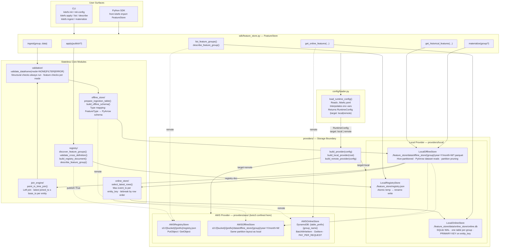

# How to Use KiteFS

KiteFS is a Python feature store library. It manages the full lifecycle of ML features: defining feature groups as Python code, validating and storing historical data as Parquet files, and serving the latest values for real-time predictions. There is no server to run; you install the library, configure it with a YAML file, and use the SDK or CLI.

This guide follows the **Turkish real estate price recommendation** use case end to end. A data science team wants to recommend listing prices for a platform operating in İstanbul and Ankara. The model uses sold listing attributes and a monthly town-level market aggregate. By the end of this guide you will know how to:

1. Set up a producer project (data pipeline / Jupyter notebook)
2. Define, apply, and inspect feature groups
3. Ingest prepared feature data
4. Retrieve a training dataset with a point-in-time join
5. Materialize the online store
6. Retrieve the latest online features from a separate consumer app (e.g. FastAPI)
7. Operate with remote AWS backends (S3 + DynamoDB)

---

## Architecture Overview

The diagram below shows how `/src/kitefs/` is organized and how each user action flows through it.



**Key principle**: `FeatureStore()` reads `./kitefs.yaml` from the current working directory, loads a `RuntimeConfig`, and constructs the appropriate provider (local or AWS). All business logic is storage-agnostic; only the `providers/` layer touches files, S3, or DynamoDB. The `boto3` import is confined to `providers/aws/` so the base package works without AWS credentials installed.

---

## Reference Use Case

The platform has a PostgreSQL application database with the following tables:

**`listings`** (10 rows shown, 3M total)

| id   | town_id | net_area | number_of_rooms | build_year | asking_price | sold_at             |
|------|---------|----------|-----------------|------------|--------------|---------------------|
| 1001 | 2       | 75       | 2               | 2020       | 2250000.00   | 2024-03-15 11:00:00 |
| 1002 | 1       | 130      | 3               | 2015       | 3400000.00   | 2024-04-05 14:00:00 |
| 1003 | 6       | 85       | 2               | 2002       | 1050000.00   | 2024-03-18 14:30:00 |
| 1004 | 4       | 110      | 3               | 2010       | 2100000.00   | 2024-05-22 16:00:00 |
| 1005 | 3       | 140      | 4               | 2008       | 2050000.00   | 2024-06-11 10:15:00 |
| 1006 | 5       | 95       | 2               | 2017       | 1400000.00   | 2024-07-03 13:45:00 |
| 1007 | 2       | 60       | 1               | 2019       | 1850000.00   | 2024-08-20 09:30:00 |
| 1008 | 1       | 105      | 3               | 2000       | 2800000.00   | 2024-09-14 15:00:00 |
| 1009 | 4       | 120      | 3               | 2012       | 2400000.00   | NULL (active)       |
| 1010 | 3       | 90       | 2               | 2016       | 1250000.00   | 2024-01-20 17:00:00 |

**`towns`**: ids 1–6 mapping to Kadıköy, Beşiktaş, Tuzla (İstanbul) and Çankaya, Keçiören, Mamak (Ankara).

**Business rule**: Only *sold* listings (`sold_at IS NOT NULL`) are ingested. Active listing 1009 is excluded. All timestamps are UTC.

KiteFS stores **curated, precomputed features** prepared by your pipeline — not the raw PostgreSQL tables, not trained model artifacts. Two feature groups are used:

| Feature Group          | Storage            | Entity Key   | Event Timestamp                     |
|------------------------|--------------------|--------------|-------------------------------------|
| `listing_features`     | Offline only       | `listing_id` | `sold_at` — when the listing sold   |
| `town_market_features` | Offline and online | `town_id`    | First moment of the next month (UTC) |

The model uses `net_area`, `number_of_rooms`, `build_year`, and `town_market_features_avg_price_per_sqm` as inputs, and `sold_price` as the training label.

---

## 1. Producer Project Setup

### Install KiteFS

```bash
pip install kitefs           # local-only operation
pip install kitefs[aws]      # AWS (S3 + DynamoDB) support
```

Python 3.12+ is required.

### Scaffold the producer project

Run this in an empty directory (or the root of your ML project):

```bash
kitefs init
```

This creates:

```
./kitefs.yaml                                 ← runtime configuration
./feature_store/
    definitions/
        town_market_features.py               ← example definition (replace this)
    registry.json                             ← empty registry {"feature_groups": {}}
    data/
        offline_store/                        ← Parquet files land here
        online_store/                         ← SQLite database lands here
./.gitignore                                  ← appended: feature_store/data/ and registry.json
```

The default `kitefs.yaml` uses `runtime.target: "${KITEFS_RUNTIME_TARGET:-local}"`, so it runs locally until you set the environment variable. All local paths shown above are **fixed and not configurable**; KiteFS always uses the conventional layout.

**Edge case**: `kitefs init` aborts with a clear error if `kitefs.yaml` already exists in the directory.

### The generated `kitefs.yaml`

```yaml
version: 1

project:
  name: "kitefs_featurestore_project"   # rename as needed

runtime:
  target: "${KITEFS_RUNTIME_TARGET:-local}"

remote:                                   # only used when target=remote
  region: "${KITEFS_AWS_REGION:-eu-central-1}"
  registry:
    type: aws_s3
    bucket: "${KITEFS_REMOTE_REGISTRY_S3_BUCKET:-}"
    s3_prefix: "${KITEFS_REMOTE_REGISTRY_S3_PREFIX:-kitefs}"
  offline_store:
    type: aws_s3
    bucket: "${KITEFS_REMOTE_OFFLINE_S3_BUCKET:-}"
    s3_prefix: "${KITEFS_REMOTE_OFFLINE_S3_PREFIX:-kitefs}"
  online_store:
    type: aws_dynamodb
    dynamodb_table_prefix: "${KITEFS_REMOTE_ONLINE_DYNAMODB_TABLE_PREFIX:-kitefs_}"
```

Every `${VAR:-default}` is resolved from environment variables at `FeatureStore()` construction time. You can set these in your shell, `.env`, or CI/CD secrets.

---

## 2. Define Feature Groups

Delete the example `town_market_features.py` scaffold and create two definition files under `feature_store/definitions/`.

### `feature_store/definitions/listing_features.py`

```python
from kitefs import (
    EntityKey, EventTimestamp, Expect,
    Feature, FeatureGroup, FeatureType,
    JoinKey, Metadata, StorageTarget, ValidationMode,
)

listing_features = FeatureGroup(
    name="listing_features",
    storage_target=StorageTarget.OFFLINE,          # training only; not served online
    entity_key=EntityKey(
        name="listing_id",
        dtype=FeatureType.INTEGER,
        description="Unique identifier for each listing",
    ),
    event_timestamp=EventTimestamp(
        name="sold_at",
        description="When the listing was sold",
    ),
    features=[
        Feature(name="net_area",          dtype=FeatureType.INTEGER,
                description="Usable area in sqm",
                expect=Expect().not_null().gt(0)),
        Feature(name="number_of_rooms",   dtype=FeatureType.INTEGER,
                description="Number of rooms",
                expect=Expect().not_null().gt(0)),
        Feature(name="build_year",        dtype=FeatureType.INTEGER,
                description="Year the building was constructed",
                expect=Expect().not_null().gte(1900).lte(2030)),
        Feature(name="sold_price",        dtype=FeatureType.FLOAT,
                description="Sold price in TL — training label",
                expect=Expect().not_null().gt(0)),
    ],
    join_keys=[
        JoinKey(
            name="town_id",
            dtype=FeatureType.INTEGER,
            referenced_group="town_market_features",
            description="Join key to town_market_features",
        ),
    ],
    ingestion_validation=ValidationMode.ERROR,    # reject any bad row on ingest
    offline_retrieval_validation=ValidationMode.NONE,
    metadata=Metadata(
        description="Historical sold listing attributes and prices",
        owner="data-science-team",
        tags={"domain": "real-estate", "cadence": "monthly"},
    ),
)
```

### `feature_store/definitions/town_market_features.py`

```python
from kitefs import (
    EntityKey, EventTimestamp, Expect,
    Feature, FeatureGroup, FeatureType,
    Metadata, StorageTarget, ValidationMode,
)

town_market_features = FeatureGroup(
    name="town_market_features",
    storage_target=StorageTarget.OFFLINE_AND_ONLINE,   # training + real-time serving
    entity_key=EntityKey(
        name="town_id",
        dtype=FeatureType.INTEGER,
        description="Unique town identifier",
    ),
    event_timestamp=EventTimestamp(
        name="event_timestamp",
        description="When this aggregate became available (first moment of the next month)",
    ),
    features=[
        Feature(
            name="avg_price_per_sqm",
            dtype=FeatureType.FLOAT,
            description="Average sold price per sqm — computed from sold listings in the previous calendar month",
            expect=Expect().not_null().gt(0),
        ),
    ],
    ingestion_validation=ValidationMode.ERROR,
    offline_retrieval_validation=ValidationMode.NONE,
    metadata=Metadata(
        description="Monthly town-level market aggregate",
        owner="data-science-team",
        tags={"domain": "real-estate", "cadence": "monthly"},
    ),
)
```

**Key rules when defining groups:**
- `EntityKey.dtype` must be `INTEGER` or `STRING`.
- `JoinKey.referenced_group` must be the exact `name` of another `FeatureGroup` in the same definitions directory.
- Any invalid definition raises `DefinitionError` immediately at construction — before `apply()`.
- There is no `dtype` on `EventTimestamp`; it is always DATETIME.

---

## 3. Apply and Inspect the Registry

The registry is a derived artifact generated from your definition files. Apply compiles all `FeatureGroup` instances found in `feature_store/definitions/*.py`, validates them as a set, and atomically writes `feature_store/registry.json`.

### Apply via SDK

```python
from kitefs import FeatureStore

store = FeatureStore()   # reads ./kitefs.yaml; must run from the project root
result = store.apply()

print(result.registered_groups)  # ['listing_features', 'town_market_features']
print(result.published)          # False
```

### Apply via CLI

```bash
kitefs apply
```

### List and describe registered groups

**SDK:**
```python
summaries = store.list_feature_groups()
for s in summaries:
    print(s.name, s.storage_target, s.feature_count)
# listing_features     StorageTarget.OFFLINE              4
# town_market_features StorageTarget.OFFLINE_AND_ONLINE   1

desc = store.describe_feature_group("town_market_features")
print(desc.entity_key.name)          # town_id
print(desc.features[0].name)         # avg_price_per_sqm
print(desc.features[0].expect)       # [{'type': 'not_null'}, {'type': 'gt', 'value': 0}]
print(desc.last_materialized_at)     # None (not yet materialized)
```

**CLI:**
```bash
kitefs list                                        # human-readable table
kitefs list --format json                          # JSON array
kitefs list --format json --output groups.json     # write to file

kitefs describe town_market_features               # human-readable
kitefs describe town_market_features --format json
```

### Publish the registry to S3 (remote operation)

When consumers run in a separate project (e.g. a FastAPI service) they need to read the registry from a shared location. Use `--publish` to push the same registry JSON to S3:

```bash
# CLI — prompts for confirmation
kitefs apply --publish

# CLI — skip confirmation (for CI/CD)
kitefs apply --publish --no-confirm

# SDK
result = store.apply(publish=True)
print(result.published)   # True
```

**Edge case**: Publish validates the remote config (S3 bucket, prefix, region) *before* any local write. If the remote write fails after the local registry is already updated, a `RegistryWriteError` is raised but the local registry reflects the new state. Re-running `apply --publish` is safe.

**After `kitefs apply`:** the registry is compiled from source. Re-run `apply` every time you modify definitions. The `applied_at` timestamp is updated on each apply. `last_materialized_at` is preserved from the prior registry.

---

## 4. Prepare and Ingest Data

KiteFS does not query your PostgreSQL database. Your pipeline prepares feature rows and hands them to KiteFS. This is always a two-step process: prepare → ingest.

### Data preparation outside KiteFS

**`listing_features` preparation** — query all sold listings:

```sql
SELECT
    l.id              AS listing_id,
    l.town_id         AS town_id,
    l.net_area        AS net_area,
    l.number_of_rooms AS number_of_rooms,
    l.build_year      AS build_year,
    l.asking_price    AS sold_price,
    l.sold_at         AS sold_at
FROM listings l
WHERE l.sold_at IS NOT NULL
```

**`town_market_features` preparation** — aggregate per town per month. The `event_timestamp` is the **first moment of the next month**, not the period start:

```sql
-- January 2024 aggregate
SELECT
    l.town_id                               AS town_id,
    AVG(l.asking_price / l.net_area)        AS avg_price_per_sqm,
    '2024-02-01 00:00:00'::timestamp        AS event_timestamp   -- next month start
FROM listings l
WHERE l.sold_at IS NOT NULL
  AND l.sold_at >= '2024-01-01 00:00:00'
  AND l.sold_at <  '2024-02-01 00:00:00'
GROUP BY l.town_id
```

This convention is critical: the January aggregate becomes available on `2024-02-01T00:00:00Z`. During a point-in-time join, a listing sold on `2024-01-20` cannot see this aggregate because `2024-02-01 > 2024-01-20`.

Sample market rows for 6 towns (first three months):

| town_id | avg_price_per_sqm | event_timestamp     |
|---------|-------------------|---------------------|
| 1       | 24500.00          | 2024-02-01 00:00:00 |
| 2       | 28200.00          | 2024-02-01 00:00:00 |
| 3       | 14100.00          | 2024-02-01 00:00:00 |
| 4       | 18500.00          | 2024-02-01 00:00:00 |
| 5       | 14200.00          | 2024-02-01 00:00:00 |
| 6       | 11800.00          | 2024-02-01 00:00:00 |
| 1       | 25100.00          | 2024-03-01 00:00:00 |
| 1       | 25400.00          | 2024-04-01 00:00:00 |
| ...     | ...               | ...                 |

### Ingest via SDK

Pass a `pandas.DataFrame` or a path to a `.csv`/`.parquet` file:

```python
import pandas as pd
from datetime import datetime, timezone
from kitefs import FeatureStore

store = FeatureStore()

# Bootstrap: first run with all 12 months of market aggregates
store.ingest("town_market_features", historical_market_df)

# Bootstrap: all sold listings from 2024
result = store.ingest("listing_features", sold_listing_df)
print(result.accepted_rows)      # e.g. 1999999
print(result.rejected_rows)      # 0  (all passed ERROR-mode validation)
print(result.written_files)      # ['feature_store/data/offline_store/listing_features/year=2024/month=01/ing_...parquet', ...]
print(result.validation_report)  # ValidationReport(pass_count=1999999, fail_count=0, failures=[])
```

### Ingest via CLI

The CLI accepts `.csv` and `.parquet` files only (no DataFrame):

```bash
kitefs ingest town_market_features data/market_2024.parquet
kitefs ingest listing_features     data/listings_2024.csv
kitefs ingest town_market_features data/market_2024.parquet --format json   # JSON output
```

### How validation works

Both groups use `ingestion_validation=ValidationMode.ERROR`. KiteFS runs two tiers of checks:

1. **Structural checks** (always run in all modes):
   - Required columns present: entity key, event timestamp, join keys, all declared feature columns.
   - Entity key, event timestamp, join key values cannot be null.
   - Types must be compatible with declared `FeatureType`.
   - DATETIME columns must be naive (treated as UTC) or UTC-aware; non-UTC tz-aware datetimes are rejected.

2. **Feature checks** (controlled by `ingestion_validation`):
   - `NONE` — skip all feature checks; return all rows unchanged.
   - `ERROR` — raise `ValidationError` with a full `ValidationReport` if any row fails any expectation.
   - `FILTER` — silently drop rows that fail any expectation; return passing rows and a report.

Any structural failure raises immediately, regardless of mode.

**Missing column example:**
```python
# listing_features requires: listing_id, sold_at, town_id, net_area, number_of_rooms, build_year, sold_price
bad_df = pd.DataFrame({"listing_id": [1], "sold_at": [datetime.now()], "net_area": [100]})
store.ingest("listing_features", bad_df)
# → IngestionShapeError: missing columns: town_id, number_of_rooms, build_year, sold_price
```

**String timestamps from CSV:**
KiteFS automatically parses ISO-8601 string timestamps from CSV inputs before validation. Both `"2024-04-05 14:00:00"` (naive, treated as UTC) and `"2024-04-05T14:00:00+00:00"` (UTC-aware) are accepted.

### What gets stored

Accepted rows are written to Hive-partitioned Parquet under the offline store:

```
feature_store/data/offline_store/
├── listing_features/
│   └── year=2024/
│       ├── month=01/
│       │   └── ing_20250101T090000_abc123.parquet
│       ├── month=03/
│       │   └── ing_20250101T090000_def456.parquet
│       └── month=04/ ...
└── town_market_features/
    └── year=2024/
        ├── month=02/
        │   └── ing_20250101T091500_ghi789.parquet   ← Jan aggregate (next-month ts)
        ├── month=03/ ...
        └── ...
```

The offline store is **append-only**. Re-ingesting the same rows creates an additional Parquet file; deduplication is not automatic.

---

## 5. Build a Training Dataset (Producer Notebook)

Use `get_historical_features()` to read historical data. The method returns a `pandas.DataFrame`.

### Simple retrieval — single group, no join

Retrieve listing features for a time window:

```python
from datetime import datetime, timezone

# All listing features sold between Feb and Dec 2024
df = store.get_historical_features(
    from_="listing_features",
    select=["net_area", "number_of_rooms", "build_year", "sold_price"],
    where={
        "sold_at": {
            "gte": datetime(2024, 2, 1, tzinfo=timezone.utc),
            "lte": datetime(2024, 12, 31, 23, 59, 59, tzinfo=timezone.utc),
        }
    },
)
```

The `select` list names only feature fields. Structural columns — entity key (`listing_id`), event timestamp (`sold_at`), and join keys (`town_id`) — are always included automatically.

Returned columns: `listing_id`, `sold_at`, `town_id`, `net_area`, `number_of_rooms`, `build_year`, `sold_price`.

```python
# Select all declared features using wildcard
df = store.get_historical_features(
    from_="listing_features",
    select=["*"],     # wildcard must be a list; bare "*" is rejected
)
```

```python
# No time filter — return every ingested row
df = store.get_historical_features(
    from_="listing_features",
    select=["net_area", "sold_price"],
    where=None,       # None is the default; omit entirely for the same result
)
```

**`where` constraints:**
- The filter key must be the group's declared event timestamp column name (`"sold_at"` for `listing_features`, `"event_timestamp"` for `town_market_features`).
- Supported operators: `gt`, `gte`, `lt`, `lte`. Only datetime values are accepted.
- Filtering on any other column (`town_id`, `net_area`, etc.) raises `RetrievalParameterError` before any read.
- Pass timezone-naive datetimes (treated as UTC) or `timezone.utc`-aware datetimes. Non-UTC tz-aware datetimes are rejected.

### Point-in-time joined retrieval — building the training set

To prevent data leakage, market features for a listing must come from a market snapshot that was already available when the listing sold. Use `join` to attach `town_market_features` to each listing row:

```python
training_df = store.get_historical_features(
    from_="listing_features",
    join=["town_market_features"],
    select={
        "listing_features":     ["net_area", "number_of_rooms", "build_year", "sold_price"],
        "town_market_features": ["avg_price_per_sqm"],
    },
    where={
        "sold_at": {
            "gte": datetime(2024, 2, 1, tzinfo=timezone.utc),
            "lte": datetime(2024, 12, 31, 23, 59, 59, tzinfo=timezone.utc),
        }
    },
)
```

**With `join`, `select` must be a dict** keyed by both group names. Without `join`, `select` is a list.

**How the join works (point-in-time correctness):**

For each base listing row, KiteFS finds the latest market row where:
1. `town_market_features.town_id == listing_features.town_id`
2. `town_market_features.event_timestamp <= listing_features.sold_at`

Worked example for listing 1002 (sold `2024-04-05`, town 1):

| Candidate market row         | event_timestamp     | Outcome               |
|------------------------------|---------------------|-----------------------|
| town 1, Feb snapshot         | 2024-02-01 00:00:00 | Match — selected?     |
| town 1, Mar snapshot         | 2024-03-01 00:00:00 | Match — selected?     |
| town 1, Apr snapshot         | **2024-04-01 00:00:00** | **Latest ≤ sold_at — selected** |
| town 1, May snapshot         | 2024-05-01 00:00:00 | Excluded — future     |

Result: listing 1002 gets `town_market_features_avg_price_per_sqm = 25400.00`.

**The returned DataFrame** includes base structural columns, selected base features, and all joined group columns prefixed with `town_market_features_`:

| listing_id | sold_at             | town_id | net_area | number_of_rooms | build_year | sold_price | town_market_features_town_id | town_market_features_event_timestamp | town_market_features_avg_price_per_sqm |
|-----------|---------------------|---------|----------|-----------------|------------|------------|------------------------------|--------------------------------------|----------------------------------------|
| 1001      | 2024-03-15 11:00:00 | 2       | 75       | 2               | 2020       | 2250000.00 | 2                            | 2024-03-01 00:00:00                  | 28800.00                               |
| 1002      | 2024-04-05 14:00:00 | 1       | 130      | 3               | 2015       | 3400000.00 | 1                            | 2024-04-01 00:00:00                  | 25400.00                               |
| 1004      | 2024-05-22 16:00:00 | 4       | 110      | 3               | 2010       | 2100000.00 | 4                            | 2024-05-01 00:00:00                  | 19000.00                               |
| ...       | ...                 | ...     | ...      | ...             | ...        | ...        | ...                          | ...                                  | ...                                    |

**Boundary case — listing 1010 (sold Jan 20, 2024):**
The earliest market snapshot is `2024-02-01T00:00:00Z` (January sales, published Feb 1). Because `2024-02-01 > 2024-01-20`, listing 1010 has no matching market row. KiteFS keeps the row but fills joined columns with `NULL` (pandas `NA`). This is why the example `where` filter starts at `2024-02-01` — January listings can be excluded from the first training run or handled with a fallback outside KiteFS.

### Train the model

```python
feature_columns = [
    "net_area",
    "number_of_rooms",
    "build_year",
    "town_market_features_avg_price_per_sqm",
]
label_column = "sold_price"

# Drop rows with NULL joined features (e.g. listing 1010 if included)
clean_df = training_df.dropna(subset=feature_columns)

X = clean_df[feature_columns]
y = clean_df[label_column]
model.fit(X, y)
```

The feature names used during training must match those used during serving. Note that `town_market_features_avg_price_per_sqm` (the full prefixed name from joined retrieval) is the column, but at serving time you build the input dict yourself from the online lookup result.

---

## 6. Monthly Retraining Workflow

On `2025-02-01` the January 2025 batch job completes:

```python
# 1. Ingest newly sold listings (January 2025)
store.ingest("listing_features", jan_2025_listings_df)

# 2. Ingest January 2025 market aggregate (event_timestamp = 2025-02-01)
store.ingest("town_market_features", jan_2025_market_df)  # 6 rows, one per town

# 3. Refresh online store (important — consumers get stale values until this runs)
store.materialize("town_market_features")

# 4. Retrain on rolling 12-month window
training_df = store.get_historical_features(
    from_="listing_features",
    join=["town_market_features"],
    select={
        "listing_features":     ["net_area", "number_of_rooms", "build_year", "sold_price"],
        "town_market_features": ["avg_price_per_sqm"],
    },
    where={
        "sold_at": {
            "gte": datetime(2024, 2, 1, tzinfo=timezone.utc),
            "lte": datetime(2025, 1, 31, 23, 59, 59, tzinfo=timezone.utc),
        }
    },
)
```

After the initial bootstrap the source database is no longer involved in building training datasets; the offline store contains the needed history.

---

## 7. Materialize the Online Store

Materialization copies the **latest row per entity key** from the offline store into the online store. Only groups with `storage_target=StorageTarget.OFFLINE_AND_ONLINE` can be materialized.

```python
# Materialize a specific group
result = store.materialize("town_market_features")
print(result.succeeded)   # ['town_market_features']
print(result.skipped)     # [] (SkippedGroup if no offline data)
print(result.failed)      # [] (FailedGroup with error_message on failure)

# Materialize all online-capable groups
result = store.materialize()   # no argument
```

**CLI:**
```bash
kitefs materialize town_market_features    # specific group
kitefs materialize                         # all eligible groups
kitefs materialize --format json           # JSON output
```

The CLI exits with code 1 if any group fails.

### How "latest row" is selected

For `town_market_features`, the offline store has 12 rows per town (one per month). `select_latest_rows()` picks the row with the maximum `event_timestamp` per `town_id`. After materializing with December 2024 data:

| town_id | avg_price_per_sqm | event_timestamp     |
|---------|-------------------|---------------------|
| 1       | 27200.00          | 2025-01-01 00:00:00 |
| 2       | 31500.00          | 2025-01-01 00:00:00 |
| 3       | 15800.00          | 2025-01-01 00:00:00 |
| 4       | 19200.00          | 2025-01-01 00:00:00 |
| 5       | 14800.00          | 2025-01-01 00:00:00 |
| 6       | 12100.00          | 2025-01-01 00:00:00 |

Each materialization atomically replaces all rows in the local SQLite table (DELETE + INSERT in a single transaction). The `last_materialized_at` timestamp in `registry.json` is updated on success. If this final registry write fails, the group appears in `result.failed` — but the online data is already refreshed and a retry is safe.

**Edge case**: Materializing a group with no offline rows produces a `SkippedGroup` entry; no online table is created.

**Edge case**: Attempting `store.materialize("listing_features")` raises `FeatureGroupNotMaterializableError` because `listing_features` has `storage_target=StorageTarget.OFFLINE`.

---

## 8. Consumer App Online Retrieval

A consumer project — for example, a FastAPI prediction service — reads the latest feature values without having definitions or offline data. It only needs `kitefs.yaml` and the SDK.

### Set up the consumer project

Run in the FastAPI project root:

```bash
kitefs init-config
```

This creates only `kitefs.yaml` (the consumer template). No definitions directory, no registry.json, no data directories are created.

The default consumer config sets `runtime.target: "${KITEFS_RUNTIME_TARGET:-remote}"` — it defaults to remote because consumers typically read from a shared AWS registry. Override to `local` during development to read from a local copy.

### Online feature retrieval

```python
# consumer_app/main.py (FastAPI example)
from fastapi import FastAPI
from kitefs import FeatureStore

app = FastAPI()
store = FeatureStore()   # reads ./kitefs.yaml; run the app from the project root

@app.post("/recommend-price")
def recommend_price(listing_id: int, town_id: int, net_area: int, number_of_rooms: int, build_year: int):
    # Fetch the latest market aggregate for this town from KiteFS
    result = store.get_online_features(
        from_="town_market_features",
        select=["avg_price_per_sqm"],
        where={"town_id": {"eq": town_id}},
    )

    if not result:
        # {} means the group was never materialized or this town_id has no data
        return {"error": "no market data available for this town"}

    # result contains entity key + event_timestamp + selected features
    # {"town_id": 1, "event_timestamp": datetime(2025, 6, 1, tzinfo=UTC), "avg_price_per_sqm": 27800.0}
    avg_price = result["avg_price_per_sqm"]

    features = {
        "net_area":                              net_area,
        "number_of_rooms":                       number_of_rooms,
        "build_year":                            build_year,
        "town_market_features_avg_price_per_sqm": avg_price,
    }
    price = model.predict([list(features.values())])[0]
    return {"recommended_price": round(price, 0)}
```

### `get_online_features` semantics

```python
# Hit
result = store.get_online_features(
    from_="town_market_features",
    select=["avg_price_per_sqm"],
    where={"town_id": {"eq": 1}},
)
# → {"town_id": 1, "event_timestamp": datetime(2025, 6, 1, 0, 0, tzinfo=UTC), "avg_price_per_sqm": 27800.0}

# Miss — town_id 999 was never ingested
result = store.get_online_features(
    from_="town_market_features",
    select=["avg_price_per_sqm"],
    where={"town_id": {"eq": 999}},
)
# → {}  (always a dict; empty on miss or table not yet materialized)
```

**`where` constraints for online retrieval:**
- Must be `{entity_key_name: {"eq": value}}`. Only the declared entity key is accepted.
- Only the `eq` operator is supported; `gt`, `gte`, etc. are not.
- The value must be type-compatible with the entity key dtype (`int` for INTEGER, `str` for STRING).

**`select` works the same as for historical retrieval**: a list of feature field names or `["*"]`. Structural fields (entity key, event timestamp, join keys) are always returned even if not listed.

**No CLI command for online retrieval**: `get_online_features` is SDK-only. There is currently no `kitefs get-online` command.

**No validation on the serving path**: KiteFS does not run feature expectations on the data returned by `get_online_features`. The data was already validated at ingest time.

---

## 9. Remote (AWS) Operation

For production deployments, the producer publishes to S3 and DynamoDB; consumers read from the same backends.

### Configure and enable remote mode

Set environment variables before running any KiteFS command or constructing `FeatureStore()`:

```bash
export KITEFS_RUNTIME_TARGET=remote
export KITEFS_AWS_REGION=eu-central-1
export KITEFS_REMOTE_REGISTRY_S3_BUCKET=company-ml
export KITEFS_REMOTE_REGISTRY_S3_PREFIX=kitefs
export KITEFS_REMOTE_OFFLINE_S3_BUCKET=company-ml
export KITEFS_REMOTE_OFFLINE_S3_PREFIX=kitefs
export KITEFS_REMOTE_ONLINE_DYNAMODB_TABLE_PREFIX=kitefs_
```

### Producer workflow (remote)

```bash
# Compile definitions locally and push registry to S3
kitefs apply --publish --no-confirm

# Ingest market data → Parquet objects on S3
kitefs ingest town_market_features data/market_2025_02.parquet

# Materialize → DynamoDB table kitefs_town_market_features
kitefs materialize town_market_features
```

### S3 storage layout

```
s3://company-ml/
└── kitefs/
    ├── registry.json                          ← published registry
    └── data/offline_store/
        ├── listing_features/
        │   └── year=2024/month=04/
        │       └── ing_20250101T090000_abc123.parquet
        └── town_market_features/
            └── year=2024/month=02/
                └── ing_20250101T091500_def456.parquet
```

The partition layout is identical to local. PyArrow partition pruning by `year`/`month` applies on both local and S3 reads.

### DynamoDB online table

One table is created per online-capable group:

```
kitefs_town_market_features (DynamoDB table)
  Partition key: town_id (N — integer)
  Billing:       PAY_PER_REQUEST
  Items:         one per town_id — always the latest materialized row
```

Table names follow `{dynamodb_table_prefix}{group_name}`. The table is created automatically on first `materialize` if it does not exist. On subsequent materializations KiteFS validates that the partition key name and type match the registered entity key before writing.

### AWS credentials and permissions

KiteFS uses the standard boto3 credential chain (environment variables, `~/.aws/credentials`, instance roles, container roles, etc.). It never reads, stores, or prompts for credentials.

Required IAM actions for the producer:
- `s3:PutObject`, `s3:GetObject` on the registry and offline store buckets
- `dynamodb:DescribeTable`, `dynamodb:CreateTable`, `dynamodb:BatchWriteItem` on `{table_prefix}*` tables

Required for the consumer (read-only):
- `s3:GetObject` on the registry bucket
- `dynamodb:GetItem` on `{table_prefix}*` tables

Install the AWS extra to enable boto3:
```bash
pip install kitefs[aws]
```

### Consumer workflow (remote)

The consumer's `kitefs.yaml` (generated by `kitefs init-config`) defaults to `runtime.target: remote`. Set the same env vars and call:

```python
from kitefs import FeatureStore

store = FeatureStore()   # reads registry from S3

# List groups from the remote registry
groups = store.list_feature_groups()

# Serve online features from DynamoDB
result = store.get_online_features(
    from_="town_market_features",
    select=["avg_price_per_sqm"],
    where={"town_id": {"eq": 5}},
)
```

---

## 10. MVP Edge Cases and Limits

| Situation | Behavior |
|-----------|----------|
| `FeatureStore()` must run from the project root | It reads `./kitefs.yaml` from the current working directory. All local paths are relative to that directory. |
| Local paths are fixed | `feature_store/`, `feature_store/data/offline_store/`, `feature_store/data/online_store/online.db` are not configurable. |
| `kitefs init` aborts if `kitefs.yaml` exists | Run from an empty directory or remove the existing file first. |
| `kitefs init-config` creates only `kitefs.yaml` | No definitions directory, no registry, no data directories. It is a lightweight consumer-only config. |
| Active listings must be excluded before ingest | KiteFS stores what you give it. Filter `WHERE sold_at IS NOT NULL` in your preparation SQL. |
| Naive datetimes are treated as UTC | `datetime(2024, 2, 1)` and `datetime(2024, 2, 1, tzinfo=timezone.utc)` are equivalent. |
| Non-UTC tz-aware datetimes are rejected | `datetime(2024, 2, 1, tzinfo=timezone(timedelta(hours=3)))` raises `ValidationError` on any structural datetime column. No timezone conversion is performed. |
| `select` is required for both retrieval methods | Omitting `select` raises `RetrievalParameterError` before any storage read. |
| Wildcard must be `["*"]` (a list) | `select="*"` and `select=["*", "net_area"]` both raise `RetrievalParameterError`. |
| `where` filters only the base event timestamp | You cannot filter on `town_id`, `net_area`, or other non-timestamp columns. Attempting to do so raises `RetrievalParameterError`. |
| Online `where` only accepts `eq` on the entity key | `where={"avg_price_per_sqm": {"gt": 0}}` raises `RetrievalParameterError`. Only `{entity_key_name: {"eq": value}}` is accepted. |
| At most one joined group per historical retrieval | `join=["group_a", "group_b"]` raises `JoinError`. Run separate retrievals and merge in pandas if needed. |
| Unmatched join rows get `NULL` joined columns | Listing 1010 (sold Jan 2024) has no market snapshot available at that time. Its joined columns are `pandas.NA`. |
| `get_online_features` returns `{}` on miss | Returns an empty dict — never `None` and never raises — when the item is absent or the group was never materialized. |
| No row-level validation on the serving path | `get_online_features` does not run feature expectations. Only ingest and retrieval are validated. |
| Offline store is append-only | There is no built-in deduplication, TTL, or cleanup. Re-ingesting the same period creates additional Parquet files; `select_latest_rows` will still pick the correct row at materialization time. |
| Empty offline data skips materialization | `result.skipped` contains the group name if no Parquet files exist for it yet. |
| S3 same-second tie-break limitation | S3 `LastModified` has second precision. Two ingest files for the same entity and event timestamp written within the same second may not preserve strict later-write-wins ordering. This edge case does not affect typical monthly batch ingestion. |
| DynamoDB unprocessed items retry once | If `BatchWriteItem` returns unprocessed items, KiteFS retries once after a 200ms delay. Any items still unprocessed become an `OnlineStoreWriteError` and the group appears in `result.failed`. |
| Remote publish fails after local registry write | `RegistryWriteError` is raised, but the local `registry.json` already reflects the new definitions. Re-running `apply --publish` is safe. |

---

## 11. Troubleshooting

| Error / Symptom | Cause | Fix |
|-----------------|-------|-----|
| `ConfigurationError: kitefs.yaml not found` | `FeatureStore()` was constructed from the wrong directory | `cd` to the project root before running the SDK or CLI |
| `RegistryReadError: registry file missing` | `apply()` was never run after `init` | Run `kitefs apply` or `store.apply()` |
| `FeatureGroupNotFoundError: listing_features` | Group not in registry | Run `apply()` after defining the group; check the spelling of the group name |
| `IngestionShapeError: unsupported file extension` | CLI `ingest` called with `.xlsx`, `.json`, etc. | Convert to `.csv` or `.parquet` first |
| `IngestionShapeError: missing columns` | Required structural or feature column absent from the DataFrame | Add the missing column(s); check the `describe_feature_group` output for the expected schema |
| `ValidationError` with `ValidationReport` | A row failed an `Expect` constraint during `ERROR`-mode ingestion | Fix the data, or switch to `ValidationMode.FILTER` in the definition if dropping bad rows is acceptable |
| `FeatureGroupNotMaterializableError` | `materialize("listing_features")` — group is `OFFLINE` only | Materialize only groups with `StorageTarget.OFFLINE_AND_ONLINE` |
| `get_online_features` returns `{}` | Group was never materialized, or the entity key value has no stored row | Run `store.materialize("town_market_features")` first; check the entity key value |
| `ProviderError: boto3 not installed` | `runtime.target=remote` but `kitefs[aws]` not installed | `pip install kitefs[aws]` |
| `ProviderError: AWS credentials missing` | boto3 credential chain found no credentials | Set `AWS_ACCESS_KEY_ID` / `AWS_SECRET_ACCESS_KEY` or configure an instance role |
| `ConfigurationError: remote.registry.bucket ... not configured` | Bucket env var is unset or empty | Set `KITEFS_REMOTE_REGISTRY_S3_BUCKET` (and similarly for other stores) |
| `OnlineStoreWriteError: existing DynamoDB table partition key does not match` | The DynamoDB table exists from a prior definition with a different entity key | Drop or rename the table, then re-run `materialize` |
| `RetrievalParameterError: join must be a list` | `join="town_market_features"` passed as a bare string | Use `join=["town_market_features"]` |
| `JoinError: supports at most one joined feature group` | `join=["group_a", "group_b"]` passed | Split into two retrieval calls |
